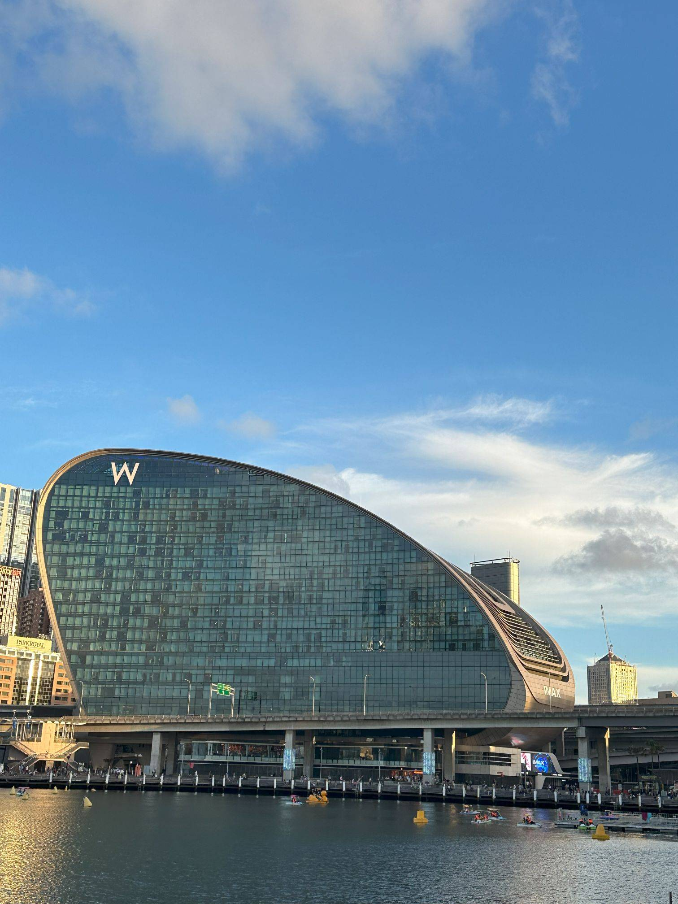

+++
author = "Sathyajith Bhat"
categories = ["Life"]
tags = ["weekly-notes", "gaming"]
places = "Sydney"
type = "post"
series = ["Weekly notes"]
url = "/weekly-notes-01-2024/"
title = "Weekly notes 01/2024"
date = 2024-01-07T12:00:00Z
summary = "Week 01 summary - slow start to the new year and an computer upgrade."
images = ["/weekly-notes-01-2024/thumb-w-hotel-imax.jpg"]
+++

_Thumbnail image: The [W Hotel](https://www.darlingharbour.com/stay/w-sydney) in Darling Harbour, Sydney has a funky design._ 

Welcome to the first weekly notes of 2024! For those who read my weekly notes on my [blog](https://sathyabh.at), I made a small change to my blog URL and dropped the date and month from the URL. I'm not making changes to the older posts. If I do consider making the change, I'll add them as an alias instead of breaking the old URLs as I link back to my old posts quite frequently.

### What's been happening

* It's been a slow week. It seems like much of Sydney is still in vacation mode as seen by empty roads. Many cafes/restaurants have holiday notices. Many of my teammates are on holiday and are expected to return to work on Jan 8th. 
* We resumed our house hunt, given that our house lease expires in Feb. We've been looking at North Sydney and we liked a house and have an application submitted for a rental.
* Another long pending item I had been putting off - I've finally booked a slot for my Driver Knowledge Test (DKT) - the first step towards applying for and getting my NSW Drivers' License. I've been learning the Drivers' Handbook and doing some mock tests to prepare for the DKT. 
* I bought a new processor - an [AMD Ryzen 7 5700x](https://www.amd.com/en/products/cpu/amd-ryzen-7-5700x) as an upgrade over my existing Ryzen 5 3600. I did some benchmarks and found the processor's running a lot cooler, and seems to consume lesser power based on my smart plug measurements. This processor should give a pretty decent boost to my computer and I should be able to run this platform for my gaming/other work for another couple of years at least, without needing an upgrade. I posted a [thread on Twitter](https://twitter.com/SathyaBhat/status/1742436577421427107) on how I removed the old CPU, cleaned up the thermal compound, and installed the new processor. You can read about my [setup here](/setup).

  

  
  
  
  
  

* Finally, after a lot of struggles, I managed to defeat Uber Lilith. I think the Uber Lilith fight is one of the most difficult and poorly designed fights. Despite cheesing with the Ball Lightning sorcerer, I couldn't deal enough damage to skip her first phase waves consistently, and those killed me the most as touching the wave just a bit is an insta-death scenario.
After about 200 or so attempts, I finally understood the patterns, the ways to cheese the waves (Flame Shield immunity FTW) and force generation of them to make it easier for me to move around, and after another 50 or so attempts of phase two, I finally managed to defeat Uber Lilith and complete the season journey. Here's a [clip of](https://www.youtube.com/watch?v=Vu6lExnqQ7E) some of my attempts

  

### Music of the Week

I came across [this video](https://www.youtube.com/watch?v=xyJZH2UPifo) of Michael J Fox joining Coldplay in playing Earth Angel and Johnny B Goode, two of Michael J Fox's most popular songs from Back to the Future. Amazing to see this, especially since he's been diagnosed with Parkinson's disease. 



### Link of the week

### Subscribe to my posts

Till next week. If you enjoyed reading this post, please consider sharing it via the links below and subscribing to the blog. You can subscribe via email using [Substack](https://sathyabhat.substack.com/). If you prefer RSS/news readers, you can [click here](https://sathyabh.at/index.xml) for the feed link. If you prefer to follow only my weekly notes, here's [the RSS feed](https://sathyabh.at/series/weekly-notes/index.xml) for the Weekly Notes series. 