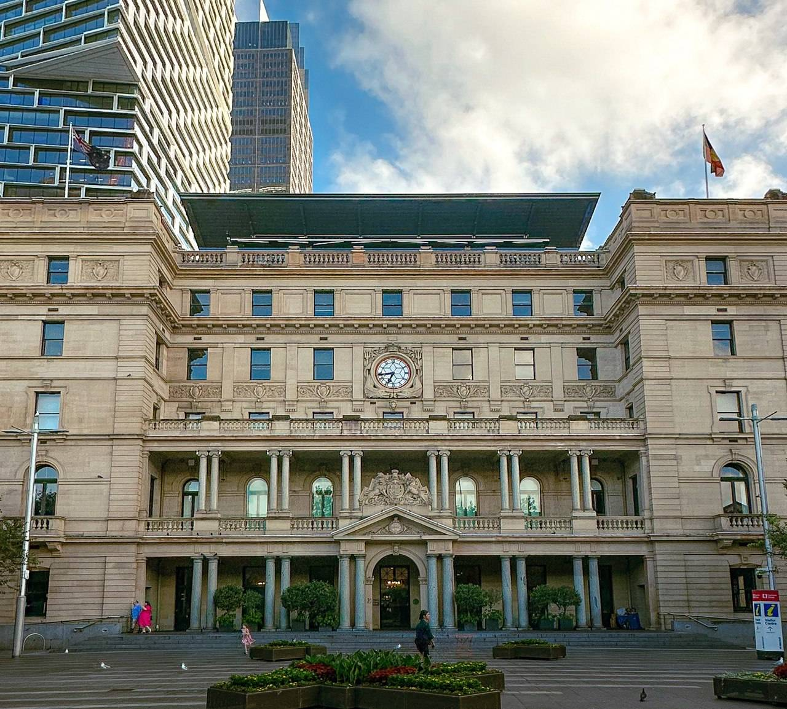

+++
author = "Sathyajith Bhat"
categories = ["Life"]
tags = ["weekly-notes", "concert"]
places = "Sydney"
type = "post"
series = ["Weekly notes"]
url = "/weekly-notes-02-2024/"
title = "Weekly notes 02/2024"
date = 2024-01-14T06:00:00Z
summary = "Week 02 summary - first concert of the year."
images = ["/weekly-notes-02-2024/thumb-customs-house.jpg"]
+++

_Thumbnail image: Customs House, Sydney is a heritage-listed building located in the Circular Quay. The building served as a customs house and is the site of the [First Fleet landing](https://digital-classroom.nma.gov.au/defining-moments/first-fleet-arrives-sydney-cove)._

### What's been happening

* Last week I mentioned our house hunt and how we [liked a house](/weekly-notes-01-2024/) and submitted an application. Well, we heard back from the agent stating the application was approved. So yay, we're moving out from Surry Hills and shifting to North Sydney in mid-February. 
    * We need to start planning the shifting - here in Sydney, utilities like Electricity, Gas, Internet, etc are the tenant's responsibilities. We'll also need to hire some removalists (as packers/movers are known here) to move our appliances (unlike in Romania where houses were fully furnished, unfurnished are more common over in Sydney).
* With the upcoming move, we'll be a bit further away from Bondi and Jo wanted to head to the beach. So we did a mid-week Bondi Beach visit. Being in the Southern Hemisphere, while the world is still under the influence of Winter, it's nice and warm (and in the past week, pretty hot) here. With sunset at 8 pm, we had enough time to finish off work, head to Bondi (a 40-minute bus ride), and spend a couple of hours here.

  
  
  

* Another long pending item I managed to finish off this week was to apply for skills assessment. Skills assessment is a process to test a person's qualifications and work experience and is a mandatory step as part of permanent residency visas. I learned how complicated skills assessment can be, how much paperwork is required, and probably worth another separate post in itself.

* We also went to our first concert of the year! [Anoushka Shankar and Quintet](https://content.sydneyfestivalcdn.org.au/2024/site/Daybills/SF24_Anoushka_Shankar_Program.pdf) (Arun Ghosh on Clarinet, Sarathy Korwar on the drums, Pirashanna Thevararajah for Carnatic percussions, and Tom Farme on the Bass) played at the Opera House as part of the Sydney Festival, and I enjoyed the performance more than I thought I would!

* Finally, we went over to Darling Harbour to catch the weekly fireworks. My attempts to take a couple of pictures failed miserably, so take it from me, they were great.

### Music of the Week

I heard this song at the Anoushka Shankar concert and loved it. Earlier today when I was searching for it, I found it was called Traces of You and I had no idea this was a song by her and Norah Jones. I thought it was the best song of the entire performance, thus an inclusion here. I've added an [instrumental version](https://youtu.be/TZwPFimpBlM?t=2099) as well as the [original song](https://youtu.be/TZwPFimpBlM). Enjoy. 





### Link of the week

Fossil shared this [cool website](https://literature-clock.jenevoldsen.com) which tells the current time via a quote from a book.

### Subscribe to my posts

Till next week. If you enjoyed reading this post, please consider sharing it via the links below and subscribing to the blog. You can subscribe via email using [Substack](https://sathyabhat.substack.com/). If you prefer RSS/news readers, you can [click here](https://sathyabh.at/index.xml) for the feed link. If you prefer to follow only my weekly notes, here's [the RSS feed](https://sathyabh.at/series/weekly-notes/index.xml) for the Weekly Notes series. 