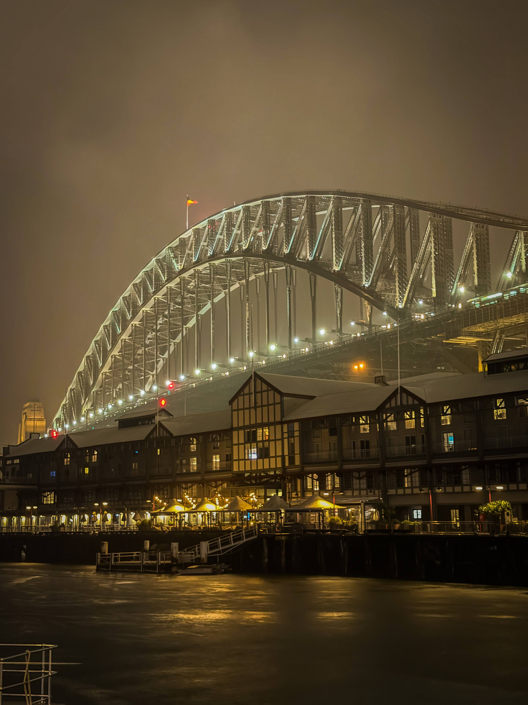

+++
author = "Sathyajith Bhat"
categories = ["Life"]
tags = ["weekly-notes", "gaming", "concert", "Diablo III"]
places = "Sydney"
type = "post"
series = ["Weekly notes"]
url = "/weekly-notes-03-2024/"
title = "Weekly notes 03/2024"
date = 2024-01-21T12:00:00Z
summary = "Week 03 summary - a failed test, another concert and locked out of the house."
images = ["/weekly-notes-03-2024/thumb-harbour-bridge.jpg"]
+++

_Thumbnail image: [Walsh Bay](https://walshbayhistory.net/) is the docks zone where British colonists anchored their First Fleet. Picture courtesy [Jo](https://joshenoy.me)._ 

### What's been happening

* I had my driver knowledge this week and embarrassingly enough, I failed it. I'd been doing plenty of mock tests from third-party tests - they let you do the whole test and give you a score indicating whether you've passed or not. This score, however, gives you a false sense of confidence. The actual test is a lot stricter and you can get up to 3 questions wrong in the first section of 15 questions, only one wrong question in the next section of 30 questions and terminates automatically if you cross these thresholds. I should have done the mock tests on the [NSW](https://www.nsw.gov.au/driving-boating-and-transport/driver-and-rider-licences/driver-licences/driver-licence-tests/driver-knowledge-test) site, which gives more accurate feedback. I've rescheduled it for the upcoming Thursday and hope to learn more and do better in the upcoming test. 

* We went to our second concert of the year! Peter Cat Recording Co., performed at the Australian Chamber Orchestra Pier 2/3 stage. The stage/venue was quite small, allowing people to be quite close to the artist. Peter Cat Recording Co. were quite awesome, with their band members juggling with other instruments and swapping them out. I would highly recommend checking them out if they're playing in your town. 

  

  

  

  

* Diablo 3's Season 30 started last week, and I've been playing a bit of it. This season is the first of the rotate-old-seasons theme, as Blizzard has effectively sunset and put Diablo 3 into maintenance mode. This season is also likely to be the last I'd play of Diablo 3. I've had a blast playing the game over the past decade+ and a big thank you to Diablo 3 team members for fixing what was a bad game at launch and shaping it into an amazing game. 

* I'll be heading to Seattle next week for a week-long visit to The Trade Desk's signature all-company event, the Palooza. The Palooza is a great way to meet, talk, and network with all of the company and usually has some interesting insights into the company, upcoming themes in AdTech and I look forward to meeting up with many of my colleagues with whom I've been interacting over Slack.

* Finally, a big shout out and thanks to [Amrita & Sathya](https://www.youtube.com/c/AmritaandSathya) for hosting us over the weekend. I mentioned meeting [them earlier last year](/2023/05/22/weekly-notes-20-2023/) and since then, they have moved to a new house and kindly invited us over to stay at their place. We had a great time talking about a lot of different things (and with me asking a lot about their YouTube journey and their vlogging methods and tips). 

* Just as I was about to publish this post, we decided to head out for lunch. Jo was waiting and as I stepped out and closed the door, I realized I didn't have the keys.. and looking at each other, we had a sinking feeling of despair knowing we got locked out. We found a nearby locksmith (thanks to Google Maps!), gave them a call and they said they would send someone over. And thus, 45 minutes later, we're back in and out $200. At least the lock wasn't damaged.

### Music of the Week

1000 musicians play together [Knights of Cydonia](https://www.youtube.com/watch?v=_V89eIbxSK0) - and they do an amazing job. However, nothing still beats Muse' [live at Wembley](https://www.youtube.com/watch?v=j8WP7aOD_9Q) in 2007. 





### Link of the week

Interesting article about how [Uniqlo built](https://archive.is/ms1ke#selection-4453.57-4453.60) their self-checkout machines and how they improved the customer experience.

### Subscribe to my posts

Till next week. If you enjoyed reading this post, please consider sharing it via the links below and subscribing to the blog. You can subscribe via email using [Substack](https://sathyabhat.substack.com/). If you prefer RSS/news readers, you can [click here](https://sathyabh.at/index.xml) for the feed link. If you prefer to follow only my weekly notes, here's [the RSS feed](https://sathyabh.at/series/weekly-notes/index.xml) for the Weekly Notes series. 