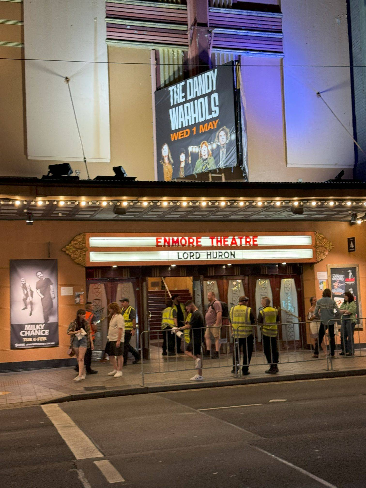

+++
author = "Sathyajith Bhat"
categories = ["Life"]
tags = ["weekly-notes", "gaming", "concert"]
places = "Sydney"
type = "post"
series = ["Weekly notes"]
url = "/weekly-notes-04-2024/"
title = "Weekly notes 04/2024"
date = 2024-01-27T12:00:00Z
summary = "Week 04 summary - a new concert, a passed test, and a new experiment."
images = ["/weekly-notes-04-2024/thumb-enmore-theatre.jpg"]
+++

_Thumbnail image: The Enmore Theatre is a theatre and entertainment venue built in 1908, located in the Enmore suburb of Sydney. Enmore Theatre is the longest-running live theatre in Sydney and the only theatre in Sydney from the Art Deco movement in its original condition._ 

### What's been happening

* Last week, I mentioned taking my driver knowledge test and failing it. Well, I took it upon myself to prepare and read more and gave the test again - and I passed :) What's next? I'll have to do the driving test before I can get my NSW Driving license. I'll be out the upcoming week, heading to Seattle, and once back, we'll have to plan for our move to the new house, so I'm looking at possibly next month's end for my driving test. Before the test, I'll probably take a couple of driving classes - I've already driven more than a thousand kilometers here in Australia from my previous [Byron Bay](https://sathyabh.at/2023/01/07/a-look-back-at-2022/), [Bathurst](/2023/05/22/weekly-notes-20-2023/), [Newcastle](/2023/03/20/weekly-notes-11-2023/), [Blue Mountains](/2023/05/07/blue-mountains-day-trip-travelogue/), and a few more trips, but a little reinforcement learning always helps. 

* Another concert this week - this time, [Lord Huron](https://www.last.fm/music/Lord+Huron). This booking was a funny one - Jo saw that they were playing and asked if I wanted to go for their performance. I thought she wanted to go for their performance and was telling me let's go - in the end, we thought we were going for each other. That said, booking their tickets worked very well for us. I'd listened to a [few of their songs in the past few years](https://www.last.fm/user/sathyabhat/library/music/Lord+Huron?date_preset=ALL) and knew I'd like them, however, their performance was above and beyond our expectations. Enmore Theatre also seemed to have quite a bit of their fans, as the cheers for them were deafening. I don't know if that encouraged them even more, but boy - it was probably the best live act I've seen, arguably even better than Foo Fighters - although I'd say Foo Fighters had better crowd control at a stadium, no less. When the band's having fun, playing, dancing along with everyone - you know it's a good show. The best part of the show was probably seeing a theremin played live by Miguel Briseño. I've added a clip from the concert on [my Mastodon page](https://mastodon.social/@Sathyabhat/111826908539172919).

  <iframe src="https://mastodon.social/@Sathyabhat/111826908539172919/embed" class="mastodon-embed" style="max-width: 100%; border: 0" width="400" allowfullscreen="allowfullscreen"></iframe>

* I'd been looking for a way to export my photos from iCloud to my [NAS](https://sathyabh.at/nas) for a while now and till now, I'd been [using Syncthing](/2023/02/12/weekly-notes-06-2023/) to ship the entire photos directory from my Mac to the NAS. The problem was that this setup needed the originals to be present on the Mac, and with my iCloud library now over 200GB, I needed a better way to handle this as I was running out of space on my hard disk and wasn't comfortable with my personal data on my work device. From a little bit of research and knowing Ninad also set it up, I bought the [PhotoSync App](https://www.photosync-app.com/home). The app now runs on my iPad and automatically transfers any new images/videos to the NAS. I'm still experimenting with the rename settings, it will take a bit of time to get it right but for now seems like the app is backing up images as expected.

*  Jo & I are trying out creating small quiet vlogs, chronicling our lives as a visual diary. We don't have any set posting schedule, but it's been interesting taking the videos, putting them together, editing, slicing, and adding music. Give it a [view](https://www.youtube.com/watch?v=CFG5fWvxF3Y).



* I'll be out the upcoming week for my first visit to Seattle. I don't have plans for any sightseeing but do intend to meet a few old friends. Expect a delayed post for next week!

### Music of the Week

Royel Otis, a guitar-pop group from Sydney did a cover of Sophie Ellis-Bextor's Murder on the Dancefloor that is quite pleasing to listen to. Give it a [listen](https://www.youtube.com/watch?v=sQyL3mUVDWA). 



### Link of the week

Josh Revell [does a tribute video](https://www.youtube.com/watch?v=0QsWX6q6D4s) to Jules Bianchi. Highly recommend watching this video for Formula 1/motorsports fans - new or old. 



### Subscribe to my posts

Till next week. If you enjoyed reading this post, please consider sharing it via the links below and subscribing to the blog. You can subscribe via email using [Substack](https://sathyabhat.substack.com/). If you prefer RSS/news readers, you can [click here](https://sathyabh.at/index.xml) for the feed link. If you prefer to follow only my weekly notes, here's [the RSS feed](https://sathyabh.at/series/weekly-notes/index.xml) for the Weekly Notes series. 