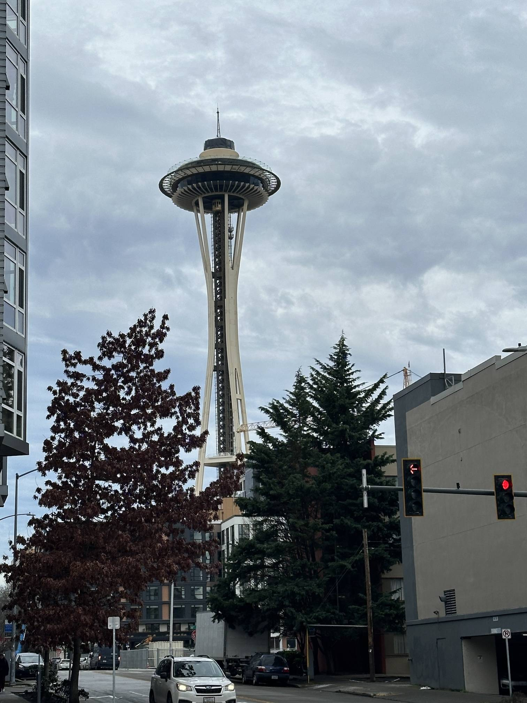

+++
author = "Sathyajith Bhat"
categories = ["Life"]
tags = ["weekly-notes", "travel", "conference"]
places = "Seattle"
type = "post"
series = ["Weekly notes"]
url = "/weekly-notes-05-2024/"
title = "Weekly notes 05/2024"
date = 2024-02-06T12:00:00Z
summary = "Week 05 summary - a weeek in Seattle."
images = ["/weekly-notes-05-2024/thumb-space-needle.jpg"]
+++

_Thumbnail image: The Seattle Space Needle._ 

### What's been happening

This weeek's weekly notes is delayed because of my flight back from Seattle.. which went fine. I thought I'll write the notes on Monday evening (I can never get anything done on a flight) but we had a concert to go to. Be warned, lots of images in this post! 

* So yeah, I was in Seattle all week for my all-company event called "Palooza". The Trade Desk has been organizing a Palooza every year and it was announce that next year's event will be in Denver. Woo!
* Palooza is also a great place to meet so many Trade Deskers that we usually see on Slack/Zoom. A few people saw me walking by, recognized me from my slack picture and were graciously thankful for my help during code/architecture reviews. It feels really good to be recognized like that!
  
  

* While in Seattle, I did a little bit of sightseeing. 
    * The first place that I visited was of course, the Space Needle. The Space Needle's been an iconic sight for me, especially having seen it on Frasier so many times that I had to see. 

    
    
    
    

    * Vinayak provided a few suggestions to visit which included the Chihuly Garden and Glass, an exhibit showcasing some of the amazing glass art of [Dale Chihuly](https://en.wikipedia.org/wiki/Dale_Chihuly).

    
    
    
    

    * I walked to Pike Place Market, checking out the farmer's market there and then walked by the ~~~first~~~ second Starbucks shop. However, there was a huge queue outside this place and given that there was no place to sit, I wasn't inclined to stay for long and just continued on my shoreside walk.

    
    
    
    

* While I met a lot of colleagues at Seattle, I had also planned to meet some really old friends. Many know that most of my friends circle is via early Twitter, but the folks I met were from my [forum days](/2008/03/21/1-year-at-chip-forums/). Here's a few folks that I met:
    * [Cole](https://twitter.com/jcolebrand): I'd known Cole for over 14 years, from Stack Overflow private beta days. We spent many hours talking about software and shit on IRC, Jabber, Tavern on the meta, and now on Slack. Despite knowing him for that long, I never met him. When I mentioning I'll be over at Seattle, Cole made plans to take couple days off and come over to Seattle to meet me. 
    * [Rob](https://twitter.com/robcube): Rob is a fellow [AWS Hero](https://aws.amazon.com/developer/community/heroes/robert-koch/) and all round nice person and had to meet when I was in Seattle. Rob also took a [nice photo of me](https://twitter.com/robcube/status/1752782780440944867).

    
    
    * Karthik: Karthik is an old friend from my Chip forum days.

    * Gowtham: [Gowtham's](hacktohell) a fellow SRE and friend from a new-defunct Developers & Hackers slack.

    * [Reetesh](https://twitter.com/Reetesh/) & [Manan](https://twitter.com/manan/): Another couple of friends from my forum days. I remember meeting Reetesh [the first time](/2008/01/12/when-2-mods-meet/) when I was in Chennai, working on Christmas day while Reetesh came over to Chennai on holiday. Manan's another friend from the forum days, albeit "the rival" Digit forum v/s the Chip forum I would hang out at. All feels childish now. [Manan and a few others](08/11/22/experience-of-a-lifetime-the-mumbai-austin-flight/) came all the way the Mumbai International airport during my first-ever international flight (when I was moving to Austin), and we've also worked a bit together on techie-buzz as fellow writers. Funnily enough, the meet with Reetesh almost didn't happen as Reetesh had to travel for work on the week that I would be in Seattle. Thankfully, he was able to return by Friday, and since I had a couple of hours in the morning to kill time, Reetesh devised a nice tour of Seattle, picking up Manan, Gowtham and me, and then starting the sightseeing tour starting with coffee and stop by the KEXP Radio Station (cool place, can see the RJ at work while having your cuppa), Kerry Park, The Fremont Troll and then dropping me back to the hotel while having some great conversations on all things gaming, tech, and life. Thanks to Reetesh for this tour, it was amazing.

    
    
    
    
    

* While I didn't have any problems with the flights, we did have a small scare when departing Seattle. The departure to Sydney from Seattle was via a connection at Los Angeles. Boarding was completed on time, however, after leaving the gates the aircraft was stationary. After about a half an hour wait on the tarmac, we were informed by the cabin crew that the engines weren't starting and will need to be looked at by maintenance! With a slim 2-hour layover window, we (there were a few Trade Deskers on the return flight) weren't sure if we would make it to Los Angeles in time for the connection. Thankfully, within the next 30 minutes, the maintenance crew were able to take a look and correct whatever was plaguing and we reached Los Angeles in time, with just under an hour to go for departure. 

* Now that I am back in Sydney, we will be moving to our new rental house in North Sydney this weekend, so the next weekly notes will be delayed as well! But hope to set up things soon. We've got a lot to pack...

    

### Music of the Week

I've been looking for some new genres of music to listen to and one of the genres that has resonated with is chill house since it goes so well at any time, for nearly any mood. Here's one of my recent earworks - [Ghost by Mogli (Fejká remix)](https://www.youtube.com/watch?v=FCOnrD05t78)



### Link of the week

Preshit [shared this](https://nuclearbits.com/in-loving-memory-of-square-checkbox/) nice post about [how square checkboxes are not the same](https://tonsky.me/blog/checkbox/?ref=nuclearbits) anymore. Great screenshots in the post!

### Subscribe to my posts

Till next week. If you enjoyed reading this post, please consider sharing it via the links below and subscribing to the blog. You can subscribe via email using [Substack](https://sathyabhat.substack.com/). If you prefer RSS/news readers, you can [click here](https://sathyabh.at/index.xml) for the feed link. If you prefer to follow only my weekly notes, here's [the RSS feed](https://sathyabh.at/series/weekly-notes/index.xml) for the Weekly Notes series. 