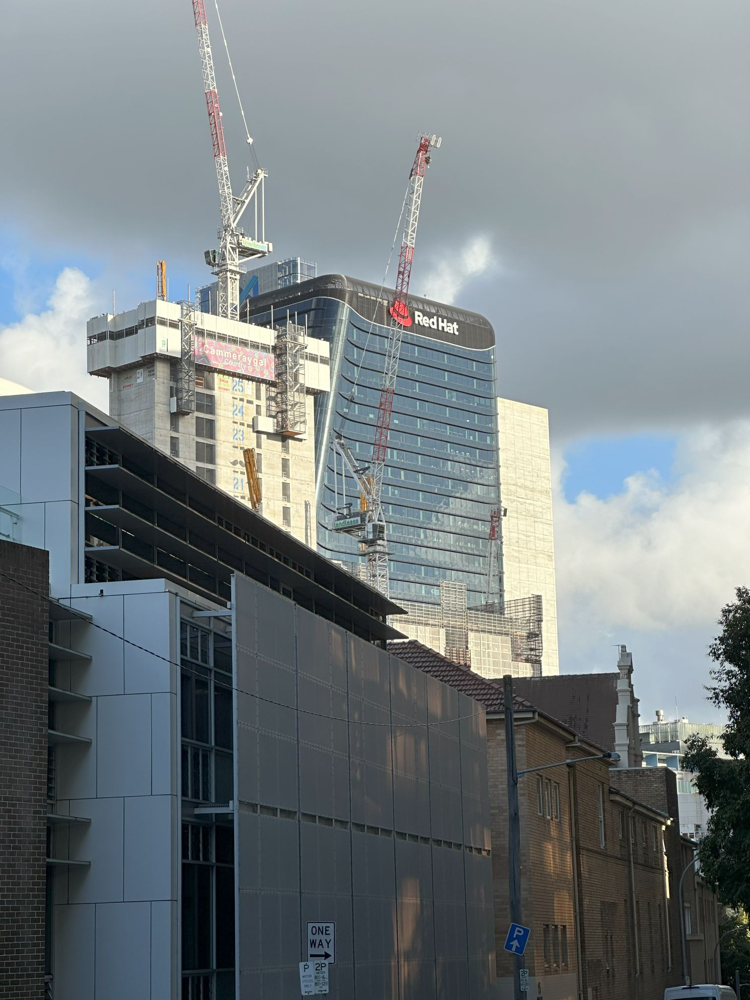

+++
author = "Sathyajith Bhat"
categories = ["Life"]
tags = ["weekly-notes", "moving", "concert"]
places = "Sydney"
type = "post"
series = ["Weekly notes"]
url = "/weekly-notes-06-2024/"
title = "Weekly notes 06/2024"
date = 2024-02-11T12:00:00Z
summary = "Week 06 summary - moving week."
images = ["/weekly-notes-06-2024/thumb-red-hat.jpg"]
+++

_Thumbnail image: Red Hat seems to have this rather huge building for their office in North Sydney._ 

### What's been happening

* I'm back in Sydney from my [Seattle visit](/weekly-notes-05-2024/), and on the same evening, we went for our fourth concert of the year. Ludovico Einaudi was performing, and Jo was excited about this. The performance was a fabulous two-hour set. You know the performance is stellar when the audience gives multiple standing ovations. 

  

  

  

  

* We were busy with the moving setup for most of the week. Jo had booked [Men That Move](https://menthatmove.com/prices/) for their removal services, and as part of the package we got 50 moving boxes that are rented out to us for 14 days. Initially, we thought 50 boxes/crates would be way too much but it turns out we had a surprisingly large number of ~~~crap~~~ items. 
    

* Since we had booked only the removal service, we had to do most of the packing. By we, I mean Jo did most of the stuff. I pitched in a little bit.
* Packing and shifting:
    * We made good use of the crates that Men that Move provided. For some fragile items such as plates, glasses, etc, - we wrapped each item in paper (to prevent scratches) as well as bubble wrap and put the items in the crates. Each crate was labeled with a brief of contents written with a sharpie on a masking tape.
    * For some of the items that we wanted to move by ourselves - such as both our desktops, the fridge magnets, the plants, and a few more - we rented a GoGet, put the items into the car, and moved the stuff there a few days before the move.
    * Large appliances such as the fridge, washing machine, and microwave were packed and moved by Men That Move folks.
    * We had some large furniture such as our couch, bed which can be disassembled and the Men that Move folks did so as it wasn't possible to move them as-is through the narrow corridors.
    * We were hoping that all our items could be packed and moved in a single trip. Sadly some of our tables/sideboards were a bit too wide and they couldn't move all the items in a single trip. 
    * As with most moves, nothing was perfect - as the removalists were moving the bed, they ended up smashing a lampshade to pieces. We informed the REA of the house, since they had a few inspections planned for the next day, and now I wonder how much we will be charged for this.

    

        
    
* In our new house in North Sydney, we've unpacked most of the crates and arranged/rearranged a few items around. My gaming/WFH setup is ready. Jo spent a lot of time tying the cables together with cable ties. We will probably get a sleeve to cover the cables coming from the desktop. 

    
    
* North Sydney seems to be an interesting area. A highway goes by the frontside of our apartment and it is quite busy & noisy. The noise insulation is quite extraordinary and you barely hear anything inside. There are a couple of specialty coffee shops for our morning coffee/breakfast kicks as well as a Saravana Bhavan nearby for whenever the idly/vada/dosa craving kicks in. Look forward to exploring North Sydney more! 

    

    

    

    

    
* I had a fun Saturday evening, spending a couple of hours tending to my favorite pastime - [yak](https://seths.blog/2005/03/dont_shave_that/) shaving](https://seths.blog/2005/03/dont_shave_that/). Here's a [long thread](https://threadreaderapp.com/thread/1756319858340544861.html) of what I was trying to do.  

  
### Music of the Week

After the concert, it's only natural for us to return and listen to more of the artist - and thus I found the NPR Tiny Desk Concert [with Ludovico Einaudi](https://www.youtube.com/watch?v=2oyZ9OM-neM)



### Link of the week

> I’ve led infrastructure at a startup for the past 4 years that has had to scale quickly. From the beginning I made some core decisions that the company has had to stick to, for better or worse, these past four years. This post will list some of the major decisions made and if I endorse them for your startup, or if I regret them and advise you to pick something else.

It's a long read and I largely agree with most of them. This is a great write-up that not only talks about what tool was selected but also the why. Check out the [post by Jack Lindamood](https://cep.dev/posts/every-infrastructure-decision-i-endorse-or-regret-after-4-years-running-infrastructure-at-a-startup/)

### Subscribe to my posts

Till next week. If you enjoyed reading this post, please consider sharing it via the links below and subscribing to the blog. You can subscribe via email using [Substack](https://sathyabhat.substack.com/). If you prefer RSS/news readers, you can [click here](https://sathyabh.at/index.xml) for the feed link. If you prefer to follow only my weekly notes, here's [the RSS feed](https://sathyabh.at/series/weekly-notes/index.xml) for the Weekly Notes series. 