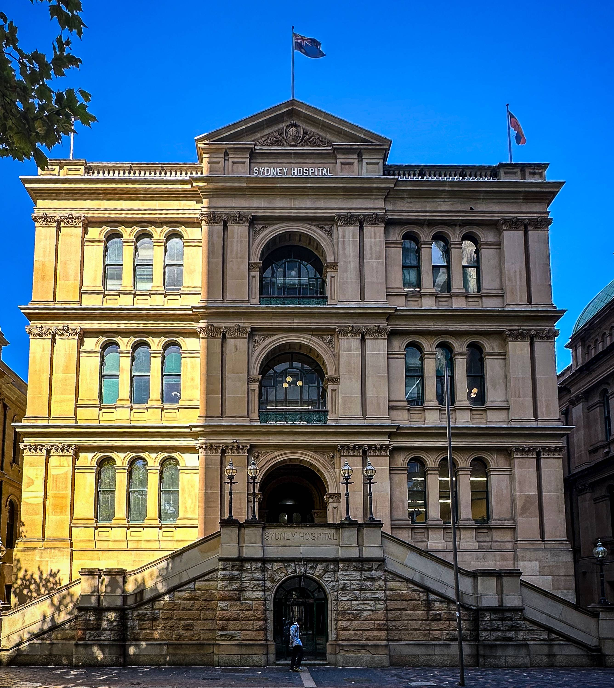

+++
author = "Sathyajith Bhat"
categories = ["Life"]
tags = ["weekly-notes", "gaming"]
places = "Sydney"
type = "post"
series = ["Weekly notes"]
url = "/weekly-notes-07-2024/"
title = "Weekly notes 07/2024"
date = 2024-02-18T12:00:00Z
summary = "Week 07 summary - the calm after the storm!"
images = ["/weekly-notes-07-2024/thumb-sydney-hospital.jpg"]
+++

_Thumbnail image: Sydney Hospital is the oldest hospital in Australia, dating back to 1788, and has been at its current location since 1811._ 

### What's been happening

* After the whirlwind [that was last week](/weekly-notes-06-2024/), this week has been more relaxed. We've gotten nearly everything unpacked and kept in their right places. We still have some more organizing to do, but they are minor stuff.
* With the new house, my commute to the office is now a bus (or train) ride while previously I used to walk to the office. The good thing is that it's not just one route that I can take - there are multiple routes, and all of them take nearly the same time (~15 minutes) and the buses are quite frequent (at a 10-minute schedule). The Metro station's also not too far away and when it opens later in the year, that should make the office commute a lot faster.
* Even though we had moved over to our new house, we still had some pending work on the old house - we had to change the lamp shade that broke, plus had to return the keys. That took some extra tips to my house, but we finally returned the keys to my old unit and submitted a deposit refund for our rental bond.
* We went over to the [Stanton Library](https://www.northsydney.nsw.gov.au/library) and joined the library there. Since we're no longer within the limits of the City of Sydney, we aren't eligible to make use of the Darling Harbour Library.  The Stanton library is nearby (~5 min walk), and has a lot of books, and magazines. We can use online apps like Libby to read magazines online. I rented out a few graphic novels - two on The Witcher and one on Thor. 
  
* We nearly had a major electrical issue in the house. Some water from the nightstand spilled over to the power strip below the nightstand and caused a short. The power strip, my HyperJuice 100W GaN charger, and a USB cable attached to the spike strip all burned out. This also tripped the fuse in my home. Thankfully nothing else was affected.

### Media watch

I've been watching [Clarkson's Farm](https://www.imdb.com/title/tt10541088/) recently and thoroughly loving it. The series features Jeremy's attempts at running his farm known as "Didly Squat" and all the challenges, trials, and tribulations around it. More than Jeremy himself, I enjoyed the supporting cast - Kaleb, Gerald, and "Cheerful" Charlie among others and make for a great watch. 

### Music of the Week

Donovan Woods performing "Portland, Maine" to an empty Roy Thomson Hall is a spooky reminder of Covud times. Love the [song though](https://www.youtube.com/watch?v=1qVQhkPMjc0).



### Link of the week

Great post by Brian Krebs on [how searching for software](https://krebsonsecurity.com/2024/01/using-google-search-to-find-software-can-be-risky/) on Google Search is now fraught with links to malicious programs (and often hoisted by ads). If you look at Reddit, you'll find such scams on a lot of Google Maps listings as well.

### Subscribe to my posts

Till next week. If you enjoyed reading this post, please consider sharing it via the links below and subscribing to the blog. You can subscribe via email using [Substack](https://sathyabhat.substack.com/). If you prefer RSS/news readers, you can [click here](https://sathyabh.at/index.xml) for the feed link. If you prefer to follow only my weekly notes, here's [the RSS feed](https://sathyabh.at/series/weekly-notes/index.xml) for the Weekly Notes series. 