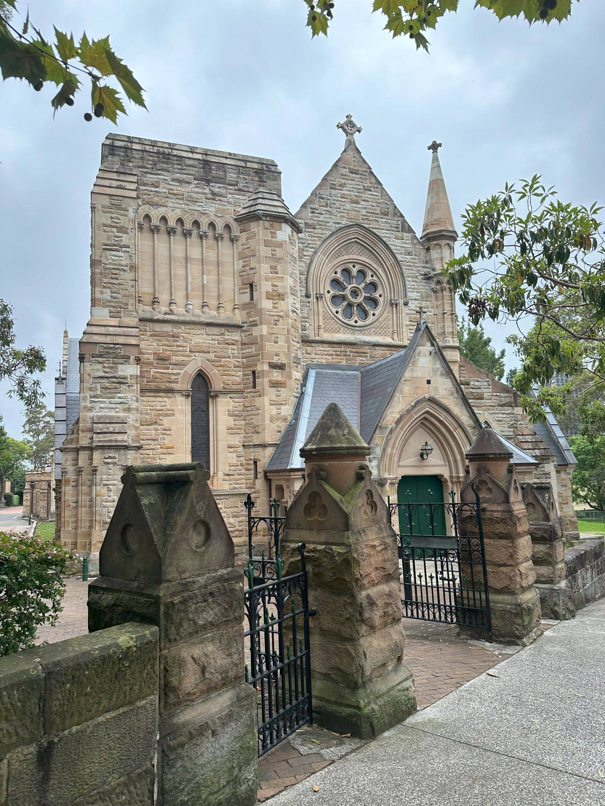

+++
author = "Sathyajith Bhat"
categories = ["Life"]
tags = ["weekly-notes", "concert", "formula1"]
places = "Sydney"
type = "post"
series = ["Weekly notes"]
url = "/weekly-notes-09-2024/"
title = "Weekly notes 09/2024"
date = 2024-03-03T12:00:00Z
summary = "Week 09 summary - a fabulous concert, packing starts again."
images = ["/weekly-notes-09-2024/thumb-st-thomas-church.jpg"]

+++

_Thumbnail image: St Thomas Anglican Church._ 

### What's been happening

* It's nearly a month since we moved and we're happy with everything. The last pending bit of getting the electricity account shifted was done, and the old account is now disconnected. 
* Having barely recovered from my visit to [Seattle](/weekly-notes-05-2024/) for Palooza, I'll be flying back to the US, this time over to the neighboring city of Bellevue for a work trip. I'll fly out this upcoming Sunday and be back by the weekend. Looking forward to some meaningful conversations!
* The Formula 1 2024 season has started and looks like Max Verstappen is unlikely to be troubled again. We'll have to see how the second-place fight goes, and if Aston can keep up with the rest of the pack. Melbourne Grand Prix is coming soon and I'm excited to attend it in person just as I get back from Bellevue! It's been a dream for me to watch F1 live since I started watching it back in 1998 and I look forward to it. 
    * On a related note, Connor Moore's F1 [intro music](https://www.youtube.com/watch?v=oMxKkDDL4N8) is so on point :D 

    

* There's a Twilight Food Fair happening every other Friday evening till the end of the month, and we went to check it out. The food fair was in a large open park. There was a nice band playing some good songs plenty of people having picnics and some food vendors around. The food wasn't that great, but it was a pleasant evening so had fun.

  
  
  
  

* Following up on the food fair was the Northside Produce market which brings some fresh seasonal fruits, veggies, bread, and meats from local farmers and producers. We bought a bunch of food from the market, enough to tide us over till the next date for the market (which happens usually every fortnight).

  
  
  
  
  

* We went to our 5th concert of the year - Thaikkudam Bridge was performing at the Roundhouse. We wanted to watch Thaikkudam Bridge live back in 2018 in Bangalore, but that didn't happen. But this time around, we weren't letting it go. And what a performance it was! Loved the energy levels of the band and got the audience pumped up. Not limited to their originals, they also added in a bit of Kailash Kher, some Ilaiyaraaja, and A R Rahman tributes. 

  
  
  
  
  

### Music of the Week

An [electronic-rock version](https://www.youtube.com/watch?v=qMbiRjjTWj0) of Taylor Swift's song performed by legendary Drum & Bass band Pendulum. "Anti Hero" Like a Version is all sorts of awesome.

  

### Link of the week

Another Formula 1 link, but given that the season is starting, and that Lollipopman Comics doesn't make long-ish videos, it's worth mentioning this hilarious 2024 [season trailer](https://www.youtube.com/watch?v=ipAkWmW61pQ). Enjoy.

  

### Subscribe to my posts

Till next week. If you enjoyed reading this post, please consider sharing it via the links below and subscribing to the blog. You can subscribe via email using [Substack](https://sathyabhat.substack.com/). If you prefer RSS/news readers, you can [click here](https://sathyabh.at/index.xml) for the feed link. If you prefer to follow only my weekly notes, here's [the RSS feed](https://sathyabh.at/series/weekly-notes/index.xml) for the Weekly Notes series. 