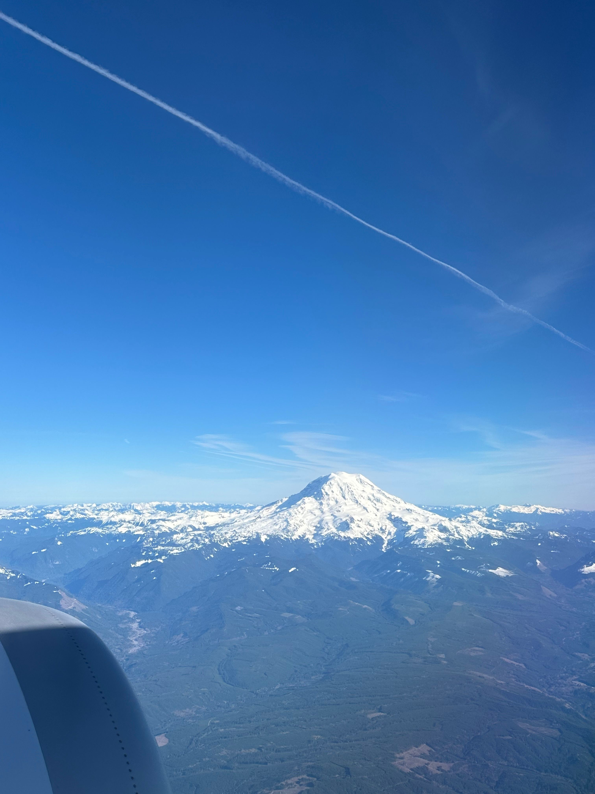

+++
author = "Sathyajith Bhat"
categories = ["Life"]
tags = ["weekly-notes", "travel"]
places = "Bellevue"
type = "post"
series = ["Weekly notes"]
url = "/weekly-notes-11-2024/"
title = "Weekly notes 11/2024"
date = 2024-03-18T12:00:00Z
summary = "Week 11 summary - lots of meetings in Bellevue"
images = ["/weekly-notes-11-2024/thumb-mt-rainier.jpg.jpg"]
+++

_Thumbnail image: Mount Rainier, captured as I was departing Seattle for Los Angeles and then to Sydney._ 

### What's been happening

* It's been a long week here at Bellevue, particularly due to the nature of work. Unlike my other work offsite/meetup trips, this week has been a architecture/design workshop week, where we've been talking about all things required to move our applications to [Kubernetes](https://kubernetes.io/) and the supporting infrastructure required for it. There'll be some POC work for me to validate some of the designs I put forward, and I look forward to experimenting with more Networking & Load Balancing in AWS.

  
  
  
  

* I didn't get to explore a lot of Bellevue since most of my days were occupied with the meetings and most evenings I went for dinner with my colleagues.
* Bellevue is only about 10 miles away from Seattle but has different vibe from Seattle. It feels more suburban, with many high rises being constructed. You'll also see many, many, many Microsoft buildings. Bellevue also feels a lot safer than Seattle. 
* I had couple of chance meetings with a few people while I was in Bellevue
    * Met with Karthik again and thanks to Karthik & his wife A. I had some nice puris for dinner thanks to A! I knew Karthik was in India and wasn't sure if he'd be back in Bellevue when I'd be visiting. Karthik messaged me and asked me to come over to his house.
    * Met with [Nishant](https://twitter.com/nishantmodak) from Last9 - this was a chance meet. Turns out that Nishant knows Karthik and he found out I was in town via him. I didn't get much time to talk to Nishant since he had to rush to the airport but it was nice to talk to him.
    
      
      

    * I also met with Gowtham, another friend from the now-defunct Devs & Hackers Slack. I went for lunch with him and my team mate to Madras Dosa Corner in Issaquah and loved the food! 

      
      
      

* I've been experimenting with [Arc browser](https://arc.net/gift/c3cb3d4b) (disclosure: referral link) in the past couple of weeks and been pretty pleased with it. Arc's got some  nice features I haven't seen in other browsers: 
    * Spaces - Spaces is like a weird mix of Bookmarks and grouped browsing area. You can have separates spaces such as Work and Personal and have an automated way of routing the specific sites to distinct spaces. 
    * Little Arc - a small popup that shows a preview of the link and that can be nicely re-opened in the main browser in the right space
    * Split view - you can drag a tab to an existing tab and Arc will nicely tile the tabs within the same window - making it easy to reference and write documents, for example. 
    * Whether I will continue to use Arc or fallback to Firefox remains to be seen but so far I've been pretty happy with it. 
* I'll be back in Sydney on Monday morning, working for a couple of days before taking off to Melbourne for the Australian Grand Prix. I can't wait! I've asked Jo to get some earprotectors - while the F1 cars themselves aren't that loud anymore, the supporting races (F2, Porsche Carrera Cup, SuperCars) are known to have loud cars. 

### Music of the Week

Possibly made famous by inclusion of this song in American Pie movie, Tonic is an amazing alternate rock band that I listened to many years after the movie and didn't make the connection till last week when [this song popped](https://www.youtube.com/watch?v=z04VDnr5k4I) up in my YouTube feed.



### Link of the week

> And now, ~4 years later, Hackintosh hits a brick wall of no easy WiFi options available, at all. Given how much of the macOS useful features is dependent on presence of particular WiFi chips.

While I never dabbled in to Hackintosh, a fair few of my friends on Twitter did and it was interesting to see their progress. It seems now Hackintosh is [nearly dead](https://aplus.rs/2024/hackintosh-almost-dead/).

### Subscribe to my posts

Till next week. If you enjoyed reading this post, please consider sharing it via the links below and subscribing to the blog. You can subscribe via email using [Substack](https://sathyabhat.substack.com/). If you prefer RSS/news readers, you can [click here](https://sathyabh.at/index.xml) for the feed link. If you prefer to follow only my weekly notes, here's [the RSS feed](https://sathyabh.at/series/weekly-notes/index.xml) for the Weekly Notes series. 