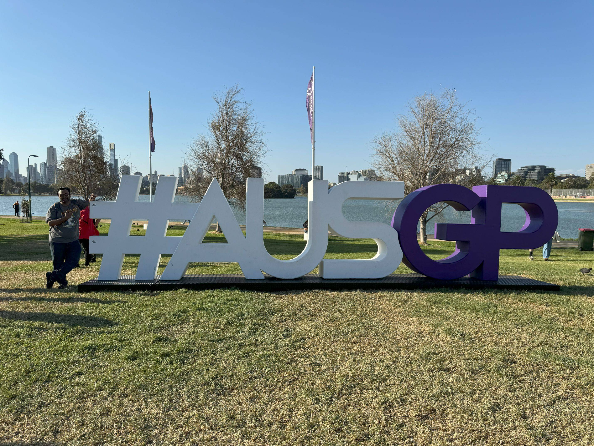

+++
author = "Sathyajith Bhat"
categories = ["Life"]
tags = ["weekly-notes", "travel", "formula-1", "Diablo IV"]
places = "Melbourne"
type = "post"
series = ["Weekly notes"]
url = "/weekly-notes-12-2024/"
title = "Weekly notes 12/2024"
date = 2024-03-26T12:00:00Z
summary = "Week 12 summary - a long, not so quiet holiday weekend in Melbourne"
images = ["/weekly-notes-12-2024/thumb-ausgp.jpg"]
+++

_Thumbnail image: #ausgp - The 2024 Australian Grand Prix at Albert Park, Melbourne._ 

Another delayed weekly note as we got back from a long weekend out in Melbourne. Lots of pictures in this week's notes!

### What's been happening

* We flew to Melbourne on Wednesday night as I had bought the Grand Stand Tickets for the Australian GrandPrix in Melbourne. This was Jo's and my first long holiday together for quite some time - we didn't do much over Christmas/Weekend as Jo didn't have many holidays then. 
* Both Jo and I thoroughly enjoyed the Grand Prix in Melbourne. I'll have another separate blog post talking about this. Given a chance to return next year, I think both of us will grab the chance and go back to Albert Park.

  
  
  
  
  
  
  
  

* In between the grand prix madness, Jo found out one of the Thai alternative rock bands she enjoys - Tilly Birds was playing in Melbourne when we'd be there. She wanted to buy tickets for those but they were available only at select Thai grocery stores (talk about being select!). I thought she wouldn't be able to get the tickets for the concert but before we went to Albert Park, Jo called the grocer and asked them if they still had the tickets to avoid an unnecessary trip - surprisingly they did have, and Jo ended up buying two tickets. 
    * Of course, on the day of the concert, I ended up not going (since I was tired from Day 3 of the race and didn't feel like heading to a concert at midnight). Jo went by herself to the concert and enjoyed it. I'm happy she got to enjoy the show.
* Melbourne is an interesting city. The first thing that stands out from Sydney is how many highrises Melbourne has. Melbourne also seems to be designed more for motor vehicle traffic as footpaths were consistently narrower and the pedestrian signal wait was significantly longer. Melbourne has a free tram zone where journeys within the zone are free. But the travel fare deduction/validation system infuriatingly inconsistent about how you're supposed to tap on/tap off at the start or end of the journey. In Sydney, you always tap on at the start of the journey and tap off once you're done and you get charged accordingly (free/discounted/full fare). Melbourne has these weird conditionals about when to do them, I'm not sure why it is not designed like how it works in Sydney. Melbourne also requires you to buy a public transport card ("Myki") to validate/pay for fares, while in Sydney you can just use your regular debit/credit cards. I tap on/off using my Apple watch in Sydney which is very convenient as I don't have to get the phone out and unlock, but I can't do this in Melbourne. There's an ongoing trial to implement this but won't be ready for another couple of years.
* Since most of the days were spent at Albert Park, we didn't get to explore much of Melbourne, apart from some time at [Federation Square](https://fedsquare.com/), [St. Paul's Cathedral](https://cathedral.org.au/), Hosier Lane/AC/DC Lane for some fabulous street art, the [NGV](https://www.ngv.vic.gov.au/). I'll publish more pictures on my gallery [site](https://pics.sathyabh.at/) in a couple of weeks.

  
  
  
  

  
  
  
  
  
  
  
  
  
  
  

* This weekend will be another long weekend as I have holidays on Friday & Monday for Easter Weekend. Jo's cousin and aunt are coming over to Sydney and we'll be doing a road trip to Bowral and Kangaroo Valley. Looking forward to it!
* Blizzard gave a [preview of some](https://www.wowhead.com/diablo-4/news/diablo-4-ptr-overview-season-4-preview-and-itemization-rework-campfire-chat-338169) of the changes coming in Season 4 and I'm looking forward to seeing the changes come to fruition soon. While the PTR is coming relatively soon, the actual patch won't be out for a while.

### Music of the Week

Another Martin Miller composition of a classic masterpiece - [David Bowie's Let's Dance](https://www.youtube.com/watch?v=2wUdXrBn2aw) featuring Mateus Asato.



### Link of the week

Williams has been on an upward swing since James Vowels took over the Team Principal role of the classic team. [This article](https://www.the-race.com/formula-1/shocking-details-behind-painful-williams-f1-revolution/) talks about the challenges they faced, including

>  its car builds were handled using Microsoft Excel, with a list of around 20,000 individual components and parts [...] The Excel list was a joke. Impossible to navigate and impossible to update.

### Subscribe to my posts

Till next week. If you enjoyed reading this post, please consider sharing it via the links below and subscribing to the blog. You can subscribe via email using [Substack](https://sathyabhat.substack.com/). If you prefer RSS/news readers, you can [click here](https://sathyabh.at/index.xml) for the feed link. If you prefer to follow only my weekly notes, here's [the RSS feed](https://sathyabh.at/series/weekly-notes/index.xml) for the Weekly Notes series. 