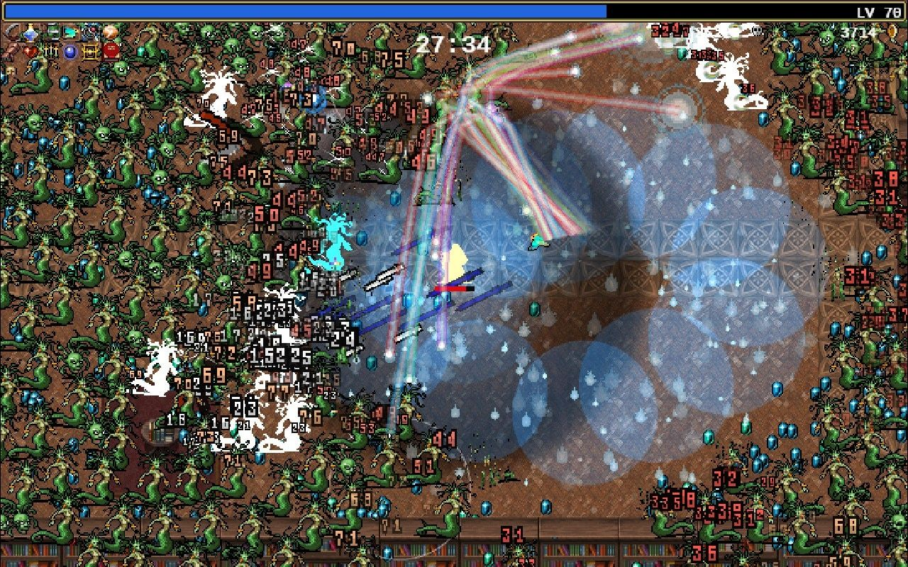
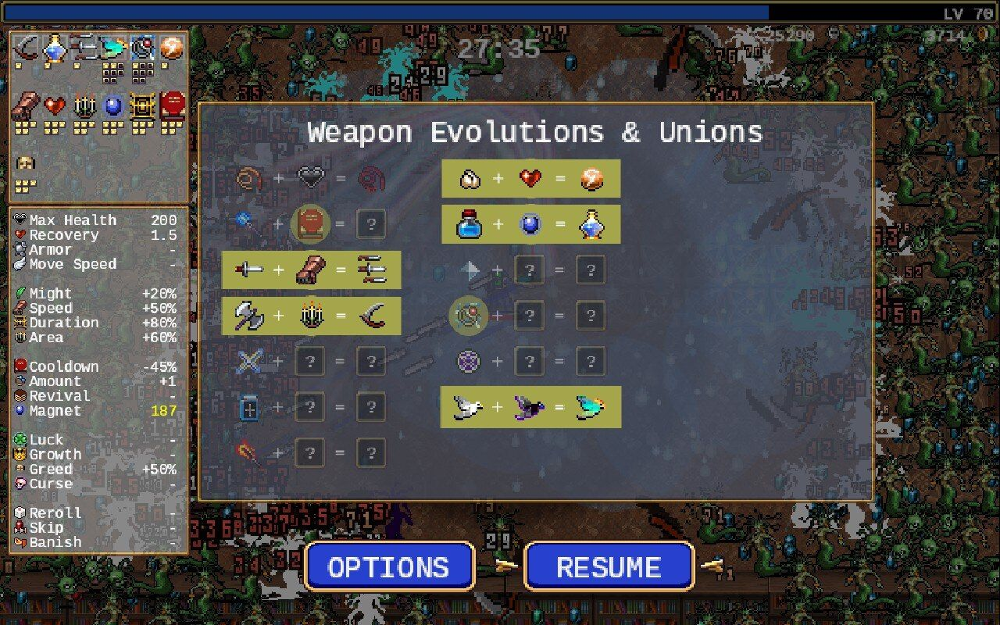

+++
author = "Sathyajith Bhat"
categories = ["Life"]
tags = ["weekly-notes",  "gaming"]
places = "Sydney"
type = "post"
series = ["Weekly notes"]
url = "/2023/04/02/weekly-notes-13-2023/"
title = "Weekly notes 13/2023"
date = 2023-04-02T12:00:00Z
summary = "Week 13 summary - a fresh coat of paint, going back to the past, some heavy rains and more"
images = ["/2023/04/02/weekly-notes-13-2023/thumb-downtown.jpg"]
+++

### What's been happening

* If you're reading this from [my blog](https://sathyabh.at), you'd have noticed that there's a fresh new coat of paint on the blog. I've been using the zzo theme for quite some time now, but I was forever annoyed that the photos that were not taken in landscape maode were getting stretched and looked hideously bad, especially on the [travel posts](https://sathyabh.at/categories/travel/). I'd been meaning to change the theme for a while and after a lot of searching, I found [Congo theme](https://jpanther.github.io/congo/) by [James Panther](https://github.com/jpanther). I liked the theme quite a bit. Along the way, I used this to clean up some old pages and decided to disable comments on the blog. I usually get more feedback about a post on [Twitter](https://twitter.com/sathyabhat/) or [Mastodon](https://mastodon.social/@sathyabhat), and the Disqus comment section has been a ghost town for a while, so disabling this reduces the number of resources the page needs and it should load quicker. 
* Australia finally traveled time today, and we're back in Austral East Standard Time (AEST, UTC +10). This meant that we traveled back in time by an hour and I got an extra hour of sleep. Since moving to Australia, the time difference has been one of the most painful things. With a 4.5-hour difference between India (5.5 hours, during daylight savings time), it effectively killed any means of co-op gaming with some of my friends that I used to do.
* The Steam Deck continues to be a blast. I've been playing more Vampire Survivors and picked up Olli Olli again.
    * With Vampire Survivors, I've cleared three stages with various characters, managing to find evolutions for 5 of the weapons. The game really ramps up as you get to the higher levels and seeing screenfull of enemies just being mowed down is supremely satisfying.

    
    
    

    * When I played Olli Olli first back in 2015 (thanks to [Varun](https://twitter.com/blurr_warun) for the gift), I got frustrated very early on due to the 'tap button before land' feature. The very first level needs you to nail this before it lets you proceed further and this made it even more frustrating. Surprise, surprise the same happened when I played again this week, but because I was playing on the Steam Deck, I was able to practice longer, and made it easier to land the tricks. I'm not getting it right all the time, but having the controller has definitely made it easier and more fun to play.
* It's been a dull, grey rainy week. Jo & I stepped out yesterday to grab some groceries and were surprised by how much it was raining. 
    <iframe src="https://mastodon.social/@Sathyabhat/110120660586843775/embed" class="mastodon-embed" style="max-width: 100%; border: 0" width="400" allowfullscreen="allowfullscreen"></iframe>

### Link of the week

Last week's [post I ranted](/2023/03/26/weekly-notes-12-2023/) about the Sydney trains, giving an impression that it sucks. I actually like Sydney's public transport system and this YouTube video talks about why I like them so much. Give it a watch



### Like & Subscribe! 

Till next week. If you liked reading this post, do consider sharing the post via the links below and subscribing to the blog. You can subscribe via email using [Substack](https://sathyabhat.substack.com/). If you prefer RSS/news readers, you can [click here](https://sathyabh.at/index.xml) for the feed link.