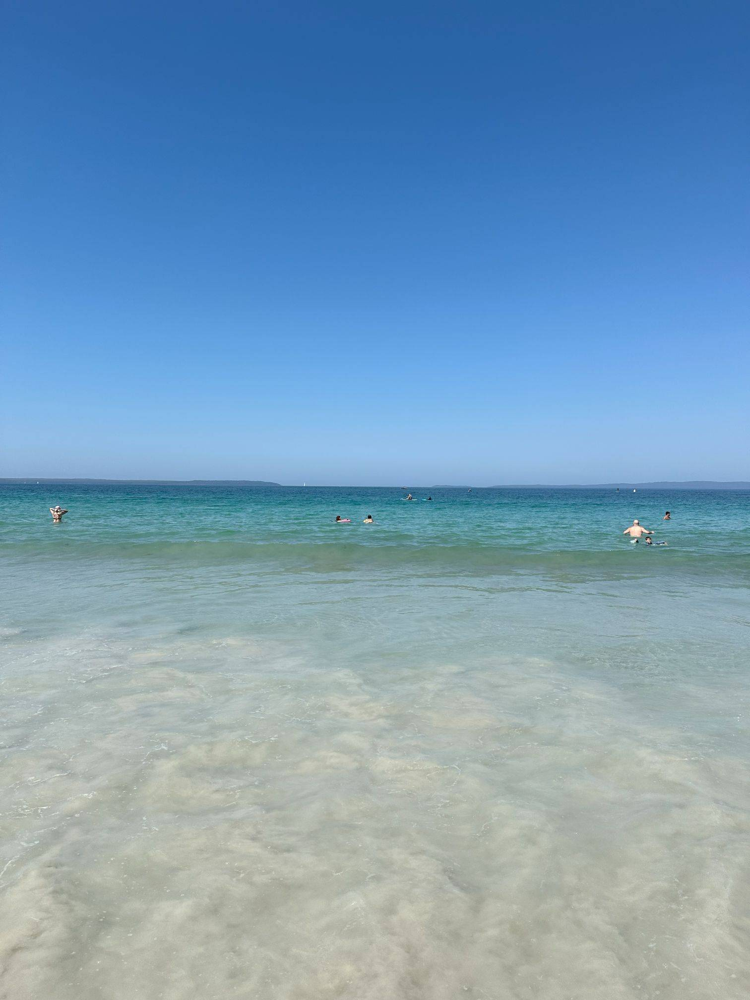

+++
author = "Sathyajith Bhat"
categories = ["Life"]
tags = ["weekly-notes", "gaming"]
places = ["Bowral", "Kiama", "Jervis Bay", "Sydney"]
type = "post"
series = ["Weekly notes"]
url = "/weekly-notes-13-2024/"
title = "Weekly notes 13/2024"
date = 2024-03-31T12:00:00Z
summary = "Week 13 summary - a long weekend, guests from home and a nice road trip."
images = ["/weekly-notes-13-2024/thumb-callala-beach.jpg"]
+++

_Thumbnail image: Callala Beach is a small town on the South Coast with brilliant white sand and aqua-blue waters._

### What's been happening

It's a long weekend here thanks to the Easter holidays. Barely back [from our Melbourne trip](/weekly-notes-12-2024/), I was looking forward to this week as it was another long weekend with a road trip! 

* Jo's cousins and aunt flew in from India/Brisbane over to Sydney on Thursday morning. I took an off for Thursday and went exploring a bit of Sydney. Since we were heading towards Barangaroo Wharf from North Sydney, instead of taking a bus or train, I decided to give them a tour via Sydney's ferries. 
  * The first stop was McMahon's Point ferry wharf which we got to via a short bus ride. I [love McMahon's Point Wharf](https://sathyabh.at/weekly-notes-10-2024/) because it has such an awesome view of *both* the Harbour Bridge and the Opera House. 

    
 
    

  * From there, we went over to Sealife Aquarium. The aquarium's pretty small in comparison to others and you can cover it in about an hour but is good for a one-time visit. I particularly liked the shark and penguin sections.

    

    

    

  * I'd also planned for a Sunset Dinner Cruise experience via Captain Cook Cruises. You can read my previous [post](/2023/09/17/captain-cook-sydney-harbour-sunset-dinner-cruise) for a review - a year later, the experience still holds up well. However, since we're still in late summer/early autumn, the timeslot we had chosen meant we didn't get to see the city skyline at night.  

  

  

  

  

  

  

  * The cruise has a drop-off point at Circular Quay, so we got down there and went over to catch a glimpse of the Sydney Opera House.

  

* For the next couple of days, we had a road trip planned to head over to Bowral and nearby places. Given there were 6 of us, I booked a people mover since most of the other SUVs were designed for seating 5 people. This meant I got to drive a Kia Carnival. I'm used to driving hatchbacks and small SUVs, never such a large vehicle, but it was quite easy to drive, especially with modern driving aids such as reverse parking cameras and adaptive cruise control. Over two days, we drove 440 kilometers covering popular spots such as Bowral, Cambewarra Mountain lookout, and Callala Beach at Jervis Bay, returning to Sydney via the scenic Grand Pacific Drive route.
  * We had an overnight halt at an Airbnb at Bowral, where Jo's cousins made good use of the available firepit and made a nice campfire. We had a nice time chilling by the fire and having a few drinks.

     

     

     

     

    

    

    

    

    

    

  * I do need to finish off my driving test to get my NSW Driving License and not have to rely on my Indian Driving License.
* I've embedded a map of our road trip below

<iframe src="https://www.google.com/maps/d/u/0/embed?mid=1tx6IZ7Kim_04lcpehuahdXo-RmBiep8&ehbc=2E312F&noprof=1" width="640" height="480"></iframe>

### Music of the Week

I originally heard this song when [playing Grand Theft Auto](https://sathyasays.com/2016/02/04/some-thoughts-on-grand-theft-auto/), Oliver Cheatham's [Get Down Saturday Night](https://www.youtube.com/watch?v=uUqcBwQjj4k) is a brilliant track to get you dancing. Why am I reminded of a 1983 song? A cover of this popped up in my chill playlist and of course, I had to share the original by Oliver Cheatham as well as [the cover by Rules](https://www.youtube.com/watch?v=riPfuF-VNAM).





### Link of the week

It's the talk of the week, and this story just broke over the weekend. There was an attempt to backdoor xz, a library that is used in many lossless compression utilities. [Andres Freund found this exploit](https://mastodon.social/@AndresFreundTec/112180083704606941) when he was benchmarking Postgres changes and found remote access to some machines via ssh was taking about 500ms slower than others. Check out the detailed description in this [FAQ here](https://gist.github.com/thesamesam/223949d5a074ebc3dce9ee78baad9e27) and the original [message sent](https://www.openwall.com/lists/oss-security/2024/03/29/4) by Andres.

### Subscribe to my posts

Till next week. If you enjoyed reading this post, please consider sharing it via the links below and subscribing to the blog. You can subscribe via email using [Substack](https://sathyabhat.substack.com/). If you prefer RSS/news readers, you can [click here](https://sathyabh.at/index.xml) for the feed link. If you prefer to follow only my weekly notes, here's [the RSS feed](https://sathyabh.at/series/weekly-notes/index.xml) for the Weekly Notes series. 
