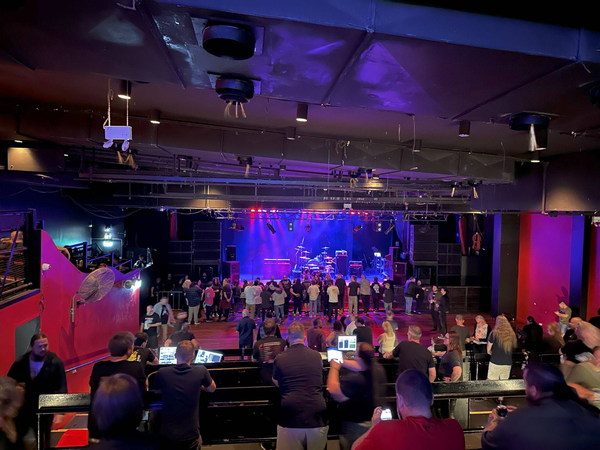

+++
author = "Sathyajith Bhat"
categories = ["Life"]
tags = ["weekly-notes", "gaming", "Diablo IV", "concert"]
places = "Sydney"
type = "post"
series = ["Weekly notes"]
url = "/weekly-notes-14-2024/"
title = "Weekly notes 14/2024"
date = 2024-04-07T12:00:00Z
summary = "Week 14 summary - heavy rains, a concert and more."
images = ["/weekly-notes-14-2024/thumb-metro-theatre.jpg"]
+++

_Thumbnail image: The Metro Theatre is a music venue located on George Street, in the city centre of Sydney, Australia._

### What's been happening

- It's been a weird week, weather-wise. It started well and by mid-week, Australia had a reoccurrence of a phenomenon called the [Black nor'easter](https://en.wikipedia.org/wiki/Black_nor%27easter), where a rapid build-up of dense black clouds brings heavy rainfall and strong winds across the east coast of Australia. To say it was raining heavily would be an understatement, we had a month's worth of rain dumped on us in a day. We were mostly indoors and didn't face any problems, that said there was severe flooding across many parts of Australia. The next day, we had clear sunny skies like the rain never happened. For someone who grew up in Coastal India and would see monsoon season and rains/clouds for weeks, if not months, it is indeed quite strange.

  

- I've been testing Diablo IV on Blizzard's PTR(public test realm) server and I'm pretty excited about the sweeping changes that are coming to the game, especially to the crafting systems. The Season 4 changes have been long awaited since Blizzard mentioned a huge upgrade to the itemization and the changes do not disappoint. I look forward to the higher density of monsters, the changes to the Helltide mechanic, and "The Pit" - a mode very similar to Diablo 3's Great Rifts mechanic. Here's a [small clip of me](https://www.youtube.com/watch?v=1TrU9XsjpLI) running through The Pit in Diablo IV with a Frozen Orb Sorcerer.
  
- We went for our 6th concert of the year - [Filter](https://open.spotify.com/artist/01WjpKiWVNurV5hjIadB8C?si=3Czf1Mn4QKaqQummBgRMjQ) supported by [Black Smoke Trigger](https://open.spotify.com/artist/03wlbBjw4kk1C88fFz47Cg?si=tLm9DUPqTWO33SrUiHazeA) who were performing at the Metro Theatre. I enjoyed it more than I thought I would given that I’m not huge into grunge/industrial rock/hard rock that Filter is known for and thought I’ll try them anyway. Jo enjoyed it more than me for sure. That said, I have no regrets about going to the gig. The crowd was awesome and I enjoyed a beer when listening to the music. On to the next!
  
  
  
  

- We turned back time today - Australia goes back to standard time, from daylight savings time. This means we're now even further away from others, in terms of all things that need coordination (such as meetings, calling home, etc).
- And just as I was about to publish this, the fire alarms in our apartment got triggered. We picked up our passports, the house keys, phone and rushed out of the house. The fire and rescue unit arrived pretty fast, had a look, and cleared for us to head back in. We'll never know what triggered it, but glad to know all ok.
  

### Media Watch

- The Amazing Race - Season 36: Season 36 of The Amazing Race is a bit of an odd one - it was recorded before the previous season but is being shown now. Since this was recorded during the later stages of the pandemic, we see things that were modified for the show such as staggered starts, and chartered flights for the teams but it feels so weird to see this, especially since the previous season we had back to the regular style of racing. We'll have to wait and see how the season shapes up.
- 3 Body Problem - We started watching this and has captured my attention enough to watch with interest.

### Music of the Week

"We can do whatever we want!". Worthy of [a listen](https://www.youtube.com/watch?v=RPWA1xYtg2Q).



### Link of the week

- [My learnings at Google](https://blog.100rabh.com/2024/03/my-learnings-at-google.html) - great post from Saurabh about his 7.5-year stint at Google. Saurabh is one of the smartest and humblest persons I've known, would highly recommend giving it a read.
- [14 LLMs fought 314 Street Fighter matches. Here's who won](https://community.aws/content/2dbNlQiqKvUtTBV15mHBqivckmo/14-llms-fought-314-street-fighter-matches-here-s-who-won) - I don't read a lot of articles about LLMs but this post by Banjo Obayomi is fantastic - they use Diambra, an emulator to run Street Fighter III with the state of the game is fed into LLMs via a prompt and using [Amazon Bedrock API](https://aws.amazon.com/bedrock/) and the result of the LLM being fed back into the game. Great read!

### Subscribe to my posts

Till next week. If you enjoyed reading this post, please consider sharing it via the links below and subscribing to the blog. You can subscribe via email using [Substack](https://sathyabhat.substack.com/). If you prefer RSS/news readers, you can [click here](https://sathyabh.at/index.xml) for the feed link. If you prefer to follow only my weekly notes, here's [the RSS feed](https://sathyabh.at/series/weekly-notes/index.xml) for the Weekly Notes series.

