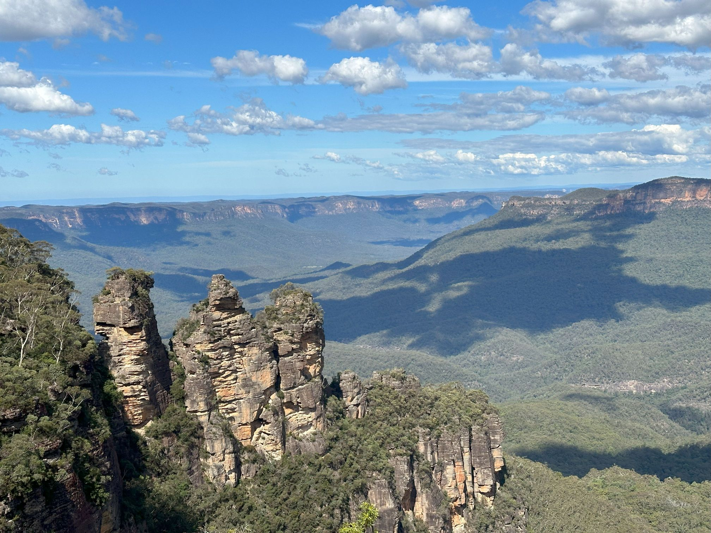
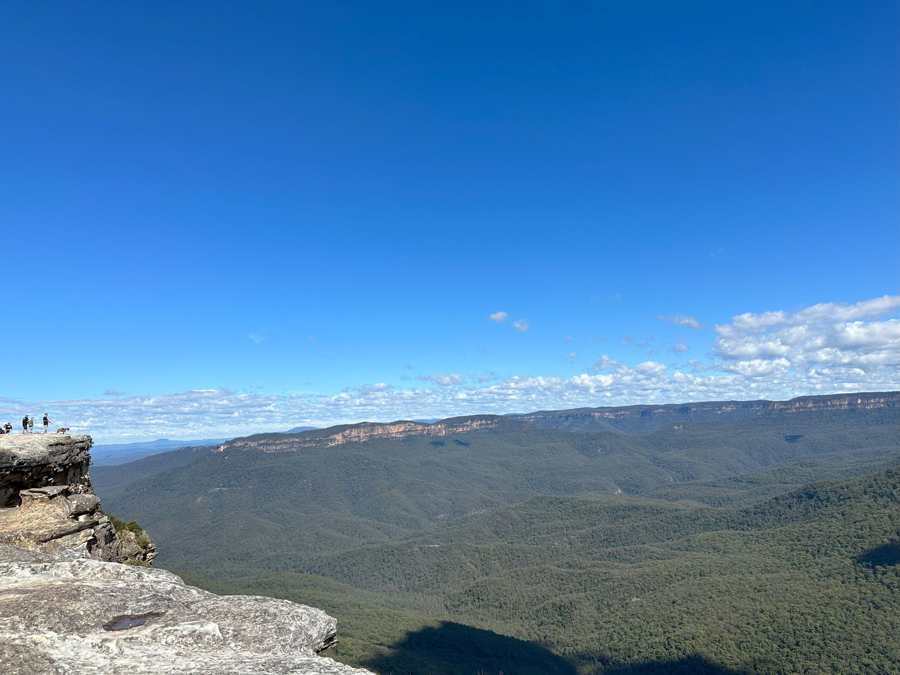

+++
author = "Sathyajith Bhat"
categories = ["Life"]
tags = ["weekly-notes", "sydney", "trael", "blue mountains", "meetup"]
type = "post"
series = ["Weekly notes"]
url = "/2023/04/16/weekly-notes-15-2023/"
title = "Weekly notes 15/2023"
date = 2023-04-16T12:00:00Z
summary = "Week 15 summary: a new blog post, a new game and a visit to a new place!"
images = ["/2023/04/16/weekly-notes-15-2023/thumb-three-sisters.jpg"]

+++

### What's been happening

* Ooh it's been chilly for the past week and the temperatures have been consistently low enough that we had to get the winterwear out. Hoodies, socks, turning off the fan, turning on the heater - it's all happening. My colleagues tell me it's unusual to be this cold this time of the year - it doesn't get this cold till May. Then again with Global warming, a lot of the regular weather has gone off rails.

* I finally playing Disco Elysium this week. I started Disco Elysium on the Steam Deck and after a couple of hours, stopped playing on the Deck and started playing on my computer. The game deserves to be played on the big screen! Gorgeous art and amazing music. Current earworm is the song as you enter Whirling-in-Rags. Give it a [listen](https://www.youtube.com/watch?v=Kkjmos0tjbc&list=PLLUcnrDRAU5q3_op2ubt9sKqqvSTWFw2h&index=2)!

* Went for the Data Engineering meetup! Data Engineering is not my forte but it's good to learn about the things you're not strong in. The talks were really good. I learned about Ontology and Simon's talk about Mastodon, Kafka, and processing toots using DuckDB was good. Here's his [blog post](https://simonaubury.com/posts/202302_mastodon_duckdb/) that he converted to the talk.

* Wrote a blog post on my tech blog after a long time - close to a year, in fact. Check out my post on [how I use fzf with PowerShell](https://sathyasays.com/2023/04/11/powershell-fzf-psfzf/).

* Went over to [the Blue Mountains](https://en.wikipedia.org/wiki/Blue_Mountains_(New_South_Wales)) with Vinayak yesterday! The area is gorgeous, and we're not in the fall season yet. Jo & I will probably be returning to the Blue Mountains sometime next month.
    * On a related note, I rented out the Toyota RAV4 for the trip. I don't usually drive SUVs but this was a fun drive. The RAV4 has adaptive cruise control, so maintaining speed was quite easy, provided the roads were straight. Quite a few roads along our trip were rolling hills and the car was struggling to maintain speed along these stretches.

    

    

*  We're just about a month away from [Barcamp Bangalore](https://barcampbangalore.com/bcb/) which is happening on May 20 at RV University. Though I can't make it, I'll be helping and cheering on from here. I'd recommend you [register and join](https://planning.barcampbangalore.com/register-for-barcamp-bangalore-2023/) in for the event. It's worth it!

### Links of the week

This week's link is that of HIDARI, a stop motion samurai action film with wooden puppets. Highly recommended! 



### Like & Subscribe!

Till next week. If you liked reading this post, do consider sharing the post via the links below and subscribing to the blog. You can subscribe via email using [Substack](https://sathyabhat.substack.com/). If you prefer RSS/news readers, you can [click here](https://sathyabh.at/index.xml) for the feed link.