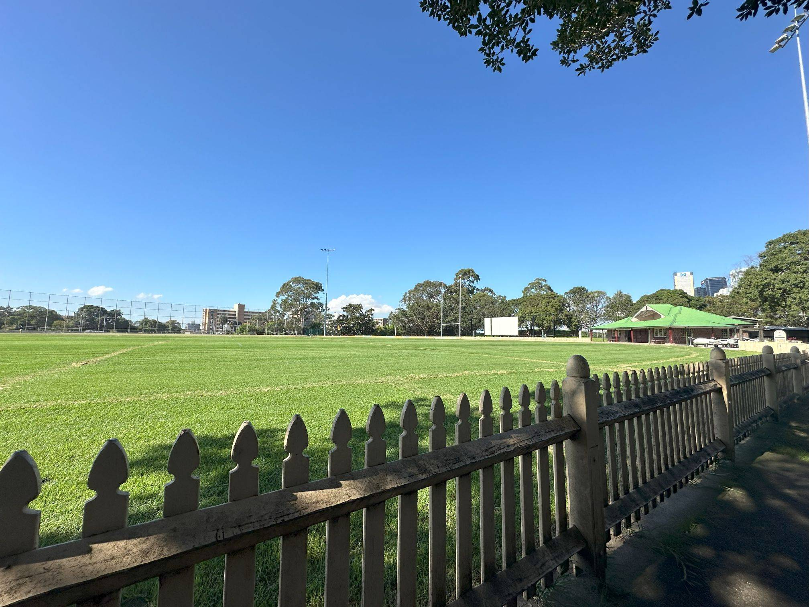

+++
author = "Sathyajith Bhat"
categories = ["Life"]
tags = ["weekly-notes", "gaming"]
places = "Sydney"
type = "post"
series = ["Weekly notes"]
url = "/weekly-notes-15-2024/"
title = "Weekly notes 15/2024"
date = 2024-04-14T12:00:00Z
summary = "Week 15 summary - a major incident in Sydney."
images = ["/weekly-notes-04-2024/thumb-bon-andrews-oval.jpg"]
+++

_Thumbnail image: The [Bon Andrews Oval](https://monumentaustralia.org.au/themes/people/sport/display/101545-gavin-john-bon-andrews) and plaque commemorate Gavin John (Bon) Andrews, a long-time resident of North Sydney who played over 600 grade matches, for his contribution to sport in North Sydney._ 

### What's been happening

* I've been working on a custom service at work and after many weeks of on/off work, I was finally able to devote some time to it and finish it off. The project had been dragging on for a while, I'm glad to have finished it. On to the next one :D 
* Jo and I went over to Vinnies to hunt for some more records. Ever since we've got the record player, been checking out a lot of second-hand stores and op shops[^op] to find interesting records, and we've found some incredible records at amazing prices. This time we found a Beatles and Rolling Stones record, along with some more classical ones. We've been playing the records on a Saturday or Sunday morning as they set the right mood for a lazy holiday morning!





* I (re)started playing Two Point Hospital, a hospital simulation game as I wanted to play some sort of business sim game. Two Point Hospital feels very much like a revamped version of Theme Hospital, another game I loved playing long back. 
* What was supposed to be a quiet Saturday for Sydney ended up being otherwise, with a major incident in a mall in Bondi Junction after a person [went slashing about a knife](https://www.abc.net.au/news/2024-04-14/nsw-police-investigate-man-stabbing-killed-bondi-junction-sydney/103705294), killing 6. Truly horrible stuff. I can only imagine how the family members of those affected are feeling.  

[^op]: 'strayan for opportunity shop, shop selling second-hand goods for charitable funds.

### Media Watch

Jo & I finished watching the first season of the 3 Body Problem and I enjoyed it. I must admit I was more hooked during the initial few episodes where there's more intrigue and a sense of what's happening. As I watched more episodes, it got a little more predictable and I can guess "Oh that's what's going to happen". I'm not saying that's bad - it's good at times to know what you're thinking is being validated but makes it a little predictive. There are still a lot of things happening in the show that make you wonder "Well if they can do x, why can't they do y?", plot holes at places, an overall lack of indication of the timelines/a sense of how much time has progressed, but if you're into Science Fiction and don't want to read through the books, I would highly recommend a watch.

### Music of the Week

Kent Nishimura's incredible _acoustic_ guitar solo of Tears For Fears' [Everybody Wants To Rule The World](https://www.youtube.com/watch?v=0ZII3Cu_Uo4) makes you forget he's the only one who is playing. 



### Link of the week

I have three links for this edition:

* Why does [part of the Windows 98 Setup](https://retrocomputing.stackexchange.com/questions/14903/why-does-part-of-the-windows-98-setup-program-look-older-than-the-rest) program look older than the rest?: one for the nostalgia hit. Read on to find out why.
* A scathing review of the Humane AI Pin ([Youtube video](https://www.youtube.com/watch?v=_w1vv7_dU2Y) or if you prefer, [the text article](https://www.theverge.com/24126502/humane-ai-pin-review) from The Verge): The AI pin whipped up a frenzy when first announced, and while the Pin is an interesting gadget, in its current state it seems to be a lot less than usable. 
* What is the James Webb Space Telescope [observing now](https://news.ycombinator.com/item?id=40013769)? This site is currently down for maintenance but shows an image of where the JWST is pointing to.

### Subscribe to my posts

Till next week. If you enjoyed reading this post, please consider sharing it via the links below and subscribing to the blog. You can subscribe via email using [Substack](https://sathyabhat.substack.com/). If you prefer RSS/news readers, you can [click here](https://sathyabh.at/index.xml) for the feed link. If you prefer to follow only my weekly notes, here's [the RSS feed](https://sathyabh.at/series/weekly-notes/index.xml) for the Weekly Notes series. 