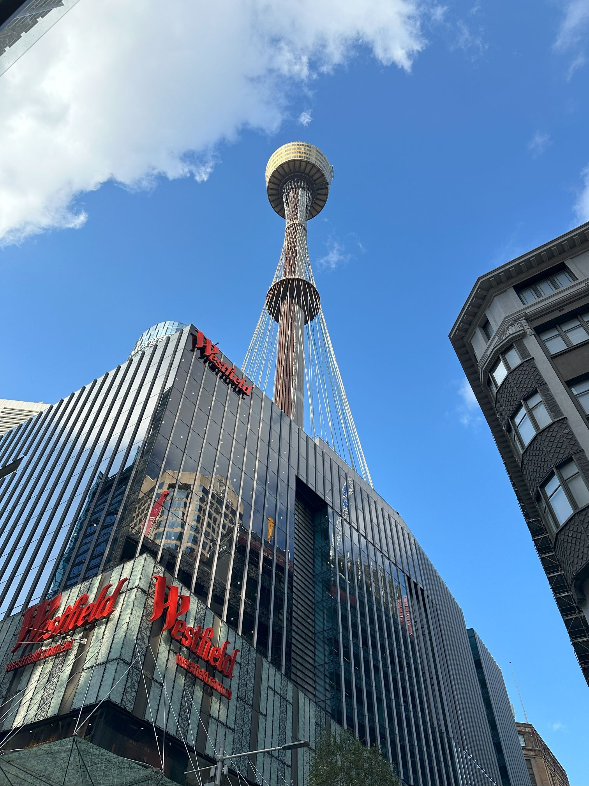

+++
author = "Sathyajith Bhat"
categories = ["Life"]
tags = ["weekly-notes", "gaming"]
places = "Sydney"
type = "post"
series = ["Weekly notes"]
url = "/weekly-notes-16-2024/"
title = "Weekly notes 16/2024"
date = 2024-04-21T12:00:00Z
summary = "Week 16 summary - signing up for a new class."
images = ["/weekly-notes-16-2024/thumb-apr-sydney-tower.jpg"]
+++

_Thumbnail image: [Sydney Tower Eye](https://www.sydneytowereye.com.au/) is the tallest structure in Sydney, New South Wales, Australia, and the second-tallest observation tower in the Southern Hemisphere._ 

### What's been happening

* We're slowly settling into Autumn/Winter now. It's been raining again this week, the minimum temperatures are getting closer to the 10-15 degree range. Can't go out for a walk now wearing shorts, or without a hoodie. 

* I took a day off to disconnect from work. I also realized that the books we loaned from the library were due to be returned, so I took the time to read a couple of graphic novels, both based on The Witcher:
    * [The Witcher: Ronin](https://www.goodreads.com/book/show/60568782-the-witcher). This is a manga featuring Geralt searching for Ciri, set in the Edo period in Japan. Given that I had never read a manga before, it took me a while to get used to reading one and I ended up re-reading the book thrice. The book is quite short, there isn't a lot of dialogue, and the emotions don't quite carry on the drawings because it's so busy showing all the action. There's a larger story about having to find Ciri and a few smaller stories covered in the book but sadly, the main story ends on a cliffhanger as "end of volume 1", with no Volume 2 in sight yet and this left me slightly disappointed. The artwork and drawings are top-notch, combined with a bestiary giving background about the various monsters that Geralt comes across is a nice touch. 
    * [Andrzej Sapkowski's The Witcher: A Grain of Truth](https://www.goodreads.com/book/show/58787726-andrzej-sapkowski-s-the-witcher): A Dark Horse comic version of the short story featured in the Netflix series (Season 2, Episode 1). The book is incredibly short, but the conversation between Geralt and Nivellen is pretty nicely drawn out and the hardcover book is great to hold. 

      
      

    * We returned these and a few more books and got some books:

      * [Wings of Fury](https://www.goodreads.com/book/show/55651393-wings-of-fury)
      * [Buddha 1 Kapilavastu](https://www.goodreads.com/book/show/209577.Buddha_Vol_1)
      * [Death Note: Black Edition, Vol. 1](https://www.goodreads.com/book/show/6345999-death-note)
      * [Fullmetal Alchemist. Volumes 1-3](https://www.goodreads.com/book/show/10182392-fullmetal-alchemist-3-in-1-edition-vol-1)
      * [Kindred: A Graphic Novel Adaptation](https://www.goodreads.com/book/show/28818221-kindred)
      * [Rivers of London Volume 2: Night Witch](https://www.goodreads.com/book/show/29504110-rivers-of-london)

    

* I signed up for a guitar class! When we were in Bucharest, I bought a Fender Squier Stratocaster on impulse and tried to learn by myself, and it went nowhere. Not long after we ended up moving out from Bucharest and moving the guitar would cost me more than I had bought it for, so I ended up giving it away. Last week, Jo told me about a guitar class happening nearby and encouraged me to sign up for it. And of course, since I would need a guitar, I ended up buying a low-cost acoustic - a Yamaha FG800. It's not the first time I'm using a guitar - back in school I would go for guitar classes since I sucked at sports stuff. A lot of time has passed since then, and might be difficult to get back at it, so I'm happy to give it a try.

  
  
  

* I'd been thinking of getting a new microphone for a year, and I finally decided to purchase a new dynamic microphone - the Samson Q2U. The Samson's got pretty good reviews, is not too expensive, and comes with USB as well as XLR interface as well as a headphone out jack so you can monitor the volume levels. I gave it a try for [yesterday's stream on Twitch](https://www.twitch.tv/sathyabhat) and I must admit I expected a lot more. While the capture quality is pretty good, the volume is pretty wanting, especially with my current setup. I'll be experimenting with more microphone placements and see if I can get it to be louder without having to get a boom arm so I can get it closer to me. 

  
  
  

* This week, a new game from the creators of Ori and the Blind Forest / Ori - The Will of the Wisps was launched in early access. Titled "[No Rest for the Wicked](https://store.steampowered.com/app/1371980/No_Rest_for_the_Wicked/)" - with bold claims to reimagine the ARPG genre by combining a Souls-like experience with the ARPG experience. A few of the Diablo streamers were sponsored and playing it, I watched a bit of the gameplay, and doesn't look like it's something I'd be interested in - it's just too slow and punishing (something mentioned by several others), and is sitting on a "Mixed" rating right now on Steam. From my watching of the streams, the game looks gorgeous but the combat goes against the principles of ARPG, which should be fast, attacking action. 

* We had a fire alarm inspection in our apartment to check that the alarms were working. While the people were checking, I was talking to the inspectors and found out that in addition to the smoke detectors, the house also has a thermal sensor that triggers an alarm to the fire detector when the temperature near the roof reaches 55 degrees Celsius. I was amazed that such a sensor exists and I guess it makes sense, especially since the sensor is close to the dryer where it can get fairly hot and might be a fire risk. Anyway, that was a nice TIL moment. 

### Music of the Week

First heard back in 2017 when I used to do my [Monday Tunes](/tags/monday-tunes/) newsletter, [this song is sad](https://www.youtube.com/watch?v=N8lar1zi3Xo), and the music video gets you down even further. To quote the lyrics - 

> And if a broken home is on the shelf
> You know what we should ask ourselves
> Were we ever happy acting in a family role?



### Link of the week

You've seen all the videos and reels of cats getting in the way of work, but in this case, this person's cat helped him to do more work! Funny post of SRE's life, oncall, and how a cat alerted [him of a DDOS attack](https://www.dannyguo.com/blog/my-cat-alerted-me-to-a-ddos-attack).

[Thej](https://thejeshgn.com/about/) has published the results for the 2024 [NMG Grant Awards](https://thejeshgn.com/2024/04/12/nmg-2024-results/). NMG is short for Nagarathna Memorial Grant (named after his mother) and Thej has been awarding the grant for several years now. I highly commend Thej for the grant.

### Subscribe to my posts

Till next week. If you enjoyed reading this post, please consider sharing it via the links below and subscribing to the blog. You can subscribe via email using [Substack](https://sathyabhat.substack.com/). If you prefer RSS/news readers, you can [click here](https://sathyabh.at/index.xml) for the feed link. If you prefer to follow only my weekly notes, here's [the RSS feed](https://sathyabh.at/series/weekly-notes/index.xml) for the Weekly Notes series. 