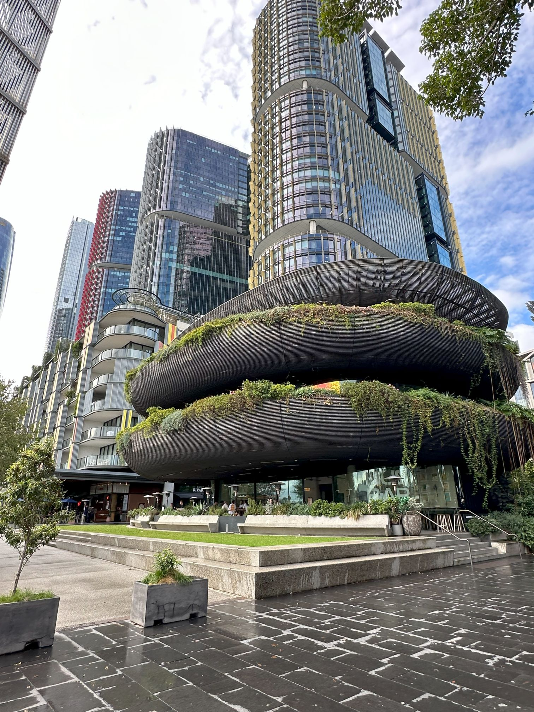

+++
author = "Sathyajith Bhat"
categories = ["Life"]
tags = ["weekly-notes", "gaming", "movie"]
places = "Sydney"
type = "post"
series = ["Weekly notes"]
url = "/weekly-notes-18-2024/"
title = "Weekly notes 18/2024"
date = 2024-05-05T12:00:00Z
summary = "Week 18 summary - meeting an old friend."
images = ["/weekly-notes-18-2024/thumb-international-towers-barangaroo.jpg"]
+++

_Thumbnail image: The International Towers is a skyscraper complex in central Sydney, in the Barangaroo area. The complex has three main office towers, with The Trade Desk office being in Tower 3._ 

### What's been happening

* After last [week's events](/weekly-notes-17-2024/) with the GPU dying, I decided to buy a new one since it was due for an upgrade anyway. What did I get? I asked Abhay, whom I usually rely on for such recommendations, and he suggested the Zotac GeForce RTX 4070 Ti SUPER Trinity Black Edition. The GPU was delivered a couple of days later and I've installed it on my desktop. 
    * I had to adjust the cables in the cabinet as the new GPU is much beefier and the existing cables were getting in the way. The newer 4xxx series of GPUs come with the new [12vHPWR adapter](https://en.wikipedia.org/wiki/16-pin_12VHPWR_connector) to cater to the higher power demands of the newer GPUs, and the Zotac GPU comes with a cable with the adapter to plug into the existing PCIE 8-pin cables that come with the power supply. The GPU also came with an adapter to prevent sag though I am not convinced it would be of much help. The Zotac GPU runs pretty cool at 66 degrees under load, and the fans are barely audible, so quite happy with the purchase.

  
  
  
  
  
  

* We had our second guitar class on Saturday morning. In this class, we focused a little bit more on warmup exercises, and finger stretching exercises and went back to practicing some strumming by playing the rhythm bits of America's "A Horse With No Name".
* Jo & I went for our first IMAX movie here in Sydney. IMAX Sydney recently opened after an extended renovation period, and Jo had been meaning to go watch Dune 2, so combined them for a Saturday outing.
    * We started with lunch at a Spanish restaurant, Born by Tapavino. We had some Jamón Serrano Sourbread, Croqueta del Día, Coca Potato, Spinach, Caramelised Onion Flatbread, and Lamb Fillets with White Bean Purée and Pistachio Picada. The food was really good! We were running late so couldn't sit for longer. After lunch, we went for the Dune Part 2 screening in IMAX. We took the recliner seats as they were the only few ones that were available when we were booking last week and weren't sure if the movie would be available next week. The recliners were pretty good, though I felt the cushion was a bit stiff.

      

      

      

      

      

      

* Swaroop was in Sydney and we had him over at our house for lunch.  It was great to meet him! I'm meeting Swaroop after a long time and was great to catch up on what he'd been up to. 

### Media Watch

We saw Dune Part 2 in the theatres. Given that it picks up where Part 1 left off, I started the movie on a backfoot because I could barely remember what happened in Part 1. I felt the movie also went quite slowly and it could have been cut short quite a bit. Dune Part 2 looks brilliant and weird at the same time - especially at certain scenes where they decide to forego colour and have stuff in monochrome for... whatever reasons. The movie ends rather abruptly, with many characters being killed without much fanfare, after a long tease. I'm not even getting to the final battle (between Paul and Feyd-Rautha, as well as the two factions) and the overarching political theme. It just seems so anticlimactic to have everything end abruptly when the starting was dragged out so much. At a nearly 3-hour runtime, you'd want to have a good chunk of time free to watch this, ideally something not very cosy because you're likely to fall asleep through some of the more dragged-out scenes.

I'd give a 7/10 Rating for Dune: Part 2. 

### Music of the Week

Guns N' Roses Estranged is one of my favourite tracks from them and I was amazed to find that they're still performing it albeit with a bit lesser intensity, but still sounding pretty good, given Axl Roses' age. [Give it a listen](https://www.youtube.com/watch?v=8GxlGFxtsNU).



### Link of the week

* [Doomscroller](https://doomscroller.xyz/) - a custom-built 'accessory' that does only one thing - doom scroll. When I came across this I wasn't sure if this was a meme or an actual thing. Turns out [Andrew McCalip](https://twitter.com/andrewmccalip) is doing this thing for real!
* [How an empty, private S3 bucket can make your bill explode into 1000s of $](https://www.reddit.com/r/aws/comments/1cg7ce8/how_an_empty_private_s3_bucket_can_make_your_bill/) - this exploded last week and in many ways, the conversation is still ongoing. The gist is that AWS charges a bucket owner for *any* writes, so anyone can be hit by a hefty bill if someone picks a random (but valid) bucket and sends a lot of requests. This works for any bucket - private or public, regardless of whether they have the credentials or not. Standard S3 PUT requests are priced at $0.005 per 1,000 requests, so it's not that difficult to fanout and send many, many requests. [Jeff Barr has mentioned that AWS](https://twitter.com/jeffbarr/status/1785386554372042890) is looking into this, so let's see how this will be changed.

### Subscribe to my posts

That's for this week. You can subscribe via email using [Substack](https://sathyabhat.substack.com/). If you prefer RSS/news readers, you can [click here](https://sathyabh.at/index.xml) for the feed link. If you prefer to follow only my weekly notes, here's [the RSS feed](https://sathyabh.at/series/weekly-notes/index.xml) for the Weekly Notes series. 