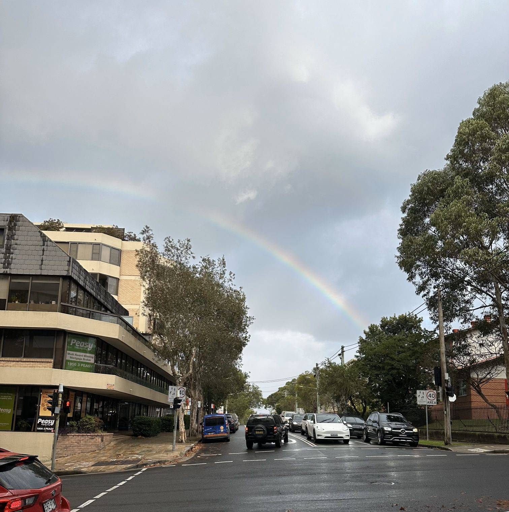

+++
author = "Sathyajith Bhat"
categories = ["Life"]
tags = ["weekly-notes", "gaming"]
places = "Sydney"
type = "post"
series = ["Weekly notes"]
url = "/weekly-notes-19-2024/"
title = "Weekly notes 19/2024"
date = 2024-05-12T12:00:00Z
summary = "Week 19 summary - vinyl hunt continues, and bought a new game."
images = ["/weekly-notes-19-2024/thumb-rainbow.jpg"]
+++

_Thumbnail image: Spotted a rainbow while I was heading to work this week._ 

### What's been happening

* We're now firmly in winter, with dropping temperatures (used the heater for the first time), and early sunsets (our smart lights that turn on the lights an hour before sunset now kick in at 4 pm). It's also been raining all week and getting into the office has been a bit difficult.
* Hades II was available to purchase in Early Access earlier in the week and I bought it right away. I don't buy games that are in Early Access, Hades II is an exception. I loved [the first Hades](/2021/01/02/gaming-report-for-2020/) and Hades II is looking pretty good. 
    * I've written a longer write-up about my initial impressions of Hades II on [Mastodon](https://mastodon.social/@Sathyabhat/112399555345611057). 

    <iframe src="https://mastodon.social/@Sathyabhat/112399555345611057/embed" class="mastodon-embed" style="max-width: 100%; border: 0" width="400" allowfullscreen="allowfullscreen"></iframe>
* We had our third guitar class, and it's progressing well. Our tutor has been focusing on technique and ensuring we are sitting right, and getting the finger/wrist positions right. It's nice to be reminded by him that getting things right takes a lot of time and should not expect immediate results. After our scheduled class session, we stuck around to listen to the advanced class students play and it was amazing. I hope to get there eventually.
* Despite the cloudy, rainy day, we went out on Saturday. To say that I was a bit grumpy would be an understatement 😅 
    * We had some nice Donburi at a Japanese Restaurant, along with Sake. The food was good!

    <iframe title="Pixelfed Post Embed" src="https://pxl.mx/p/sathyabhat/694866080130019845/embed?caption=true&likes=false&layout=full" class="pixelfed__embed" style="max-width: 100%; border: 0" width="400" allowfullscreen="allowfullscreen"></iframe>

    * From here, we went over to Red Eye Records to do some record hunting. We ended up buying Red Hot Chili Peppers' Return of the Dream Canteen, Kraftwerk's Man Machine. and Elton John's Here & There.

    

    

    * There was supposed to be a Fleetwood Mac tribute concert this Sunday as part of the Sunset Series that I was really looking forward to but sadly was canceled because of bad weather. Hopefully, it will be rescheduled to another day. 
* My Prometheus Exporter for YNAB seemed to have missed a bunch of scrapes resulting in choppy data. Not sure what happened there, and since I always wanted to play a bit with Honeycomb and OTEL, I added support for it into the library. I'll do some more work to add custom spans and such, but for now, I'll look at the auto-instrumentation results and see if I can see anything that is trending. 

* With all the news of the Geomagnetic Storms that have been hitting Earth the past couple of days, Jo & I were mesmerized by the pictures and even more surprised with reports that they can be sighted in many parts of Australia. Sadly, with the clouds playing spoilsport, we didn't get to see anything and the aurora sighting remains a bucket list item.

### Music of the Week

Every now and then, Spotify's recommendation engine pops up a great song, and [Looking Too Closely by Fink](https://www.youtube.com/watch?v=qoWRs7lXtYE) is one of those that came up this week. 

{{< youtube qoWRs7lXtYE > }}

### Link of the week

* Zomato announced that they have deployed a large number of crowd-supported weather infrastructure and [they even have free API access](https://www.weatherunion.com/). 

* Kurzgesagt with another great video about why [Smoking is Awesome](https://www.youtube.com/watch?v=_rBPwu2uS-w)

* Apple had a [new iPad](https://www.theverge.com/24151128/apple-ipad-pro-2024-hands-on) announcement launch event and released [a new ad that](https://www.youtube.com/watch?v=ntjkwIXWtrc) got many riled up enough that they [had to apologize for it](https://www.theverge.com/2024/5/9/24153113/apple-ipad-ad-crushing-apology). I can't remember when Apple last did something like this. My 2c: I found the ad to be interesting in a "you can do all of this from an iPad" narrative, but I can see why people are upset. 
* Ozzy Man's review of Met Gala is hilarious. Go [watch it](https://www.youtube.com/watch?v=perrdS8OaK0)!

* David Lowe gives a brief about how he came up with the [BBC News Theme](https://x.com/davidlowemusic2/status/1788832795344732175). Great to see how the various layers come together. 

### Subscribe to my posts

Till next week. If you enjoyed reading this post, please consider sharing it via the links below and subscribing to the blog. You can subscribe via email using [Substack](https://sathyabhat.substack.com/). If you prefer RSS/news readers, you can [click here](https://sathyabh.at/index.xml) for the feed link. If you prefer to follow only my weekly notes, here's [the RSS feed](https://sathyabh.at/series/weekly-notes/index.xml) for the Weekly Notes series. 