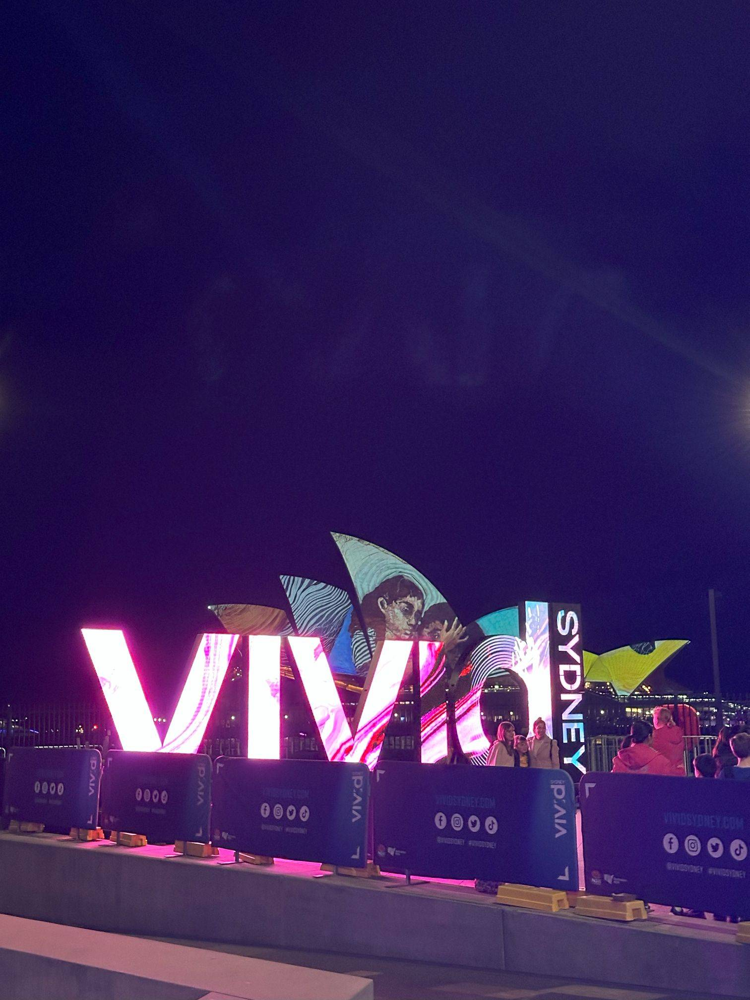

+++
author = "Sathyajith Bhat"
categories = ["Life"]
tags = ["weekly-notes", "gaming", "concert", "Diablo IV"]
places = "Sydney"
type = "post"
series = ["Weekly notes"]
url = "/weekly-notes-23-2024/"
title = "Weekly notes 23/2024"
date = 2024-06-09T12:00:00Z
summary = "Week 23 summary - nostalgia trip, a visit to a festival and more"
images = ["/weekly-notes-23-2024/thumb-vivid-2024.jpg"]
+++

_Thumbnail image: Pic from Vivid._ 

### What's been happening

* It's [Vivid](https://www.vividsydney.com/) time. Vivid is Sydney's annual lights and music festival. It usually runs for 3-4 weeks and this weekend, Jo & I went over to Circular Quay to check out the food stalls, and everything else that Vivid has to offer. 
    * We spent a couple of hours walking around checking out the light projections on the Museum of Contemporary Art, the Harbour Bridge, and the Opera House. We also picked up some food - I got a hotdog for myself and Jo picked up some churros and the potato twisty thingies. Kinda hilarious to see the response on my photos - "Oh those have reached Sydney too?!" 😆. 
    * Speaking of churros - ah yes, the churros. The churros were the main reason we went this weekend - Jo went to Circular Quay last week by herself to check out the light projections. While walking around, she saw the churros and wanted to get it but it'd be too much for her to eat by herself, so she skipped it and had been harping about the churros since then.  So we went back this week for the churros. I must admit the churros were great. Did I say churros too many times? 
    * That said, Vivid's not been getting a good response this time around. From [overcrowding](https://www.abc.net.au/news/2024-06-09/vivid-sydney-crowds-drones-show-crush/103956778), limited-run drone shows forcing the said [overcrowding](https://x.com/ooomz/status/1799585901359907181), non-existent light shows, or dull light shows - there's been a [negative response overall](https://www.reddit.com/r/sydney/comments/1dbqk7d/vivid_i_cant_see_shit/). We'd left earlier, and the amount of crowds pouring in had me worried back then. Glad to see that it didn't get seriously bad.

    
    
    
    
    
    
    
    
    
    

* We had our penultimate guitar class last Saturday. The upcoming Saturday we will have our last class, and on Sunday we will be having a little recording - hope we don't mess it up. We've been practicing a bit and getting better day by day. 
* With winter firmly here, we've been having a lot of condensation issues, especially in the guest bedroom where I have my computer and work. With water standing on the window sills for a long, I'm starting to see mold patches. With these factors, I decided to get a dehumidifier. I picked up a Breville Smart Dry Connect Dehumidifier.
    * The dehumidifier is pretty basic but does the job well. It is 'smart' which comes with its app but from searching on the Internet, it is a white-labeled Tuya appliance and that should make it easy to integrate with [Home Assistant](https://www.home-assistant.io/integrations/tuya/). 
* It's a long weekend here, but we don't have anything planned. It will be a relaxing weekend.
* Growing up as a kid, listening to Boney M was a staple diet. When I found out that they were performing in Sydney, I was surprised - "Are they even alive?!". Well, it turns out one of the artists from the original group is still touring with her troupe, and given the nostalgia hit, Jo & I bought the tickets. 
    * And that was such a good choice. For one, the supporting artist was Mark Williams who set the mood right with disco lights and a wonderful voice to back. The supporting band was also pretty good. Combined with an audience that was also getting into the groove, it was a great experience. 
    * Boney M (or rather Maizie Williams going by Boney M I suppose) was good as well. High energy levels, kept the whole crowd on their feet! The setlist for the concert is here. Somebody's put up a video of the concert - [check it out](https://www.youtube.com/watch?v=YMZbjPeRPEw).

      

* It's been a good week for gaming. First, there was a [teaser trailer](https://www.youtube.com/watch?v=pygcgE3a_uY) for Civilization VII. Now the trailer is essentially useless because there's zero gameplay video or any other information - but at least we know it's coming next year! 
  
* And just as I woke up today, Blizzard officially announced the next expansion for the game, titled Vessel of Hatred. The expansion is coming on October 8th and will feature a new class. More details will be out soon, so I can't wait for more details about both. The [release date trailer](https://www.youtube.com/watch?v=mtM0WpHEjWU) is out and is pretty gruesome. I would highly recommend against watching it if you're squeamish.  

  

### Music of the Week

On the theme of nostalgia, this week's music of the week goes to Tonic. Another band I discovered way back in 2008. Give them [a listen](https://www.youtube.com/watch?v=-lDIJjnCHco). [Sugar](https://open.spotify.com/album/2pfR40PFGyoOirj1AYRxGH?si=ylX10vkbS76PiYzavjBHDQ) is a fantastic album to dive in. 



### Link of the week

Came across this post on r/Australia [about favourite Australian slang](https://www.reddit.com/r/australia/comments/1d2eweq/favourite_slang_term/). Had never heard of them before.

### Subscribe to my posts

Till next week. If you enjoyed reading this post, please consider sharing it via the links below and subscribing to the blog. You can subscribe via email using [Substack](https://sathyabhat.substack.com/). If you prefer RSS/news readers, you can [click here](https://sathyabh.at/index.xml) for the feed link. If you prefer to follow only my weekly notes, here's [the RSS feed](https://sathyabh.at/series/weekly-notes/index.xml) for the Weekly Notes series. 