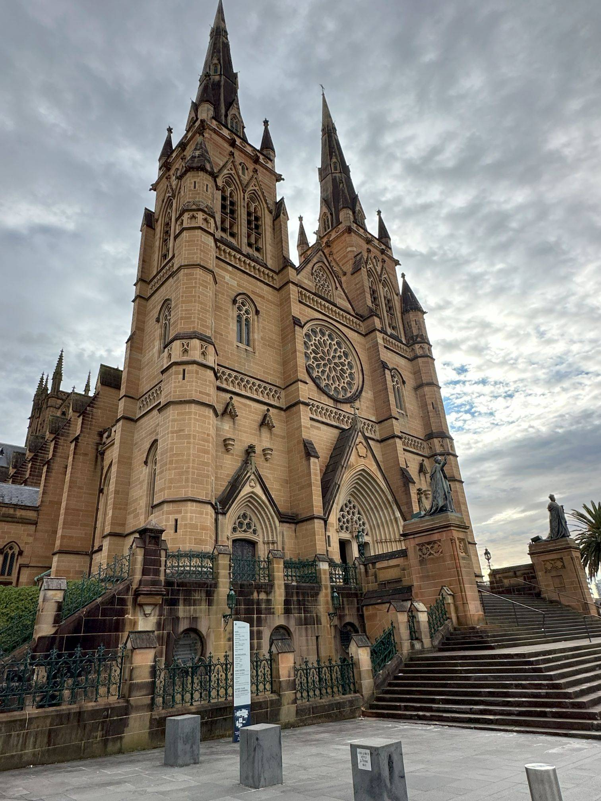

+++
author = "Sathyajith Bhat"
categories = ["Life"]
tags = ["weekly-notes", "gaming", "Diablo IV", "concert"]
places = "Sydney"
type = "post"
series = ["Weekly notes"]
url = "/weekly-notes-26-2024/"
title = "Weekly notes 26/2024"
date = 2024-06-30T12:00:00Z
summary = "Week 26 summary - meeting an old friend and making a new one."
images = ["/weekly-notes-26-2024/thumb-st-marys-cathedral-2024.jpg"]
+++

_Thumbnail image: St Mary’s Cathedral stands on the site of the first Catholic Chapel in Australia._

### What's been happening

- Another quiet week goes by. We've completed half of 2024 and I have no idea how time's gone by so fast.
- We had another concert yesterday - we had the pleasure of listening to Yiruma live at the Sydney Opera House. The concert was wonderful, had a really good time.
- I upgraded the RAM on my NAS this week. It originally [came with](/nas) 4GB RAM, and the official supported maximum capacity is 8GB RAM. I found out that many had upgraded to 16GB of RAM without any problems so I figured I would try adding an 8GB RAM stick, and if it doesn't work will return it. After installing the RAM the NAS did its POST and the OS detected it without any problems. The RAM upgrade has provided a much-needed respite to my NAS - since I've had Immich on, it's been running into a lot of out-of-memory and disk pressure/IOWAIT issues and the RAM upgrade has the NAS, especially new media scan/addition much more responsive. At a later point, I will add a couple of NVME drives so that the NAS can use it as a caching store because I can still see some significant IOWAIT numbers.

  

  

  

  

  

- I had a fairly busy Saturday - Vijay, an old colleague from 3i Infotech, reached out to me saying he'd be in Sydney and wanted to meet. He was pretty busy through the week and I thought I wouldn't be able to meet, but late Friday he messaged me asking if we could meet on Saturday morning. He was set to depart to the airport by 9:30 am, so had to meet him at 8:30 am. We didn't get to talk for a long time but it was nice to meet.

  

  - In a similar vein, another person from [Rands' Leadership Slack](https://randsinrepose.com/welcome-to-rands-leadership-slack/) was in Sydney and ended up having coffee with [Oliver](https://www.linkedin.com/in/oliver-bock). I found out Oliver runs his own firm BockPress - a WordPress consulting agency (and with a nice name to boot). We talked about different things and walked around Circular Quay for a bit. Overall a good interesting weekend!

    

- I have a busy couple of weeks ahead: a dental procedure this Monday, a PTE Academic exam to demonstrate my English proficiency that will be provided for my future visa work and I have a two-week visit to the US coming up in the last week of July.
- I've been playing some Diablo IV as well, having leveled my Barbarian to level 100 and slowly grinding it out to get the materials to upgrade my items. I completed a Tier 85 pit run and I think that'll be about my limit of Diabo IV for the Barbarian for this season. I still have a couple of non-level 100 characters, and I might pick up the Rogue and get it to 100 as well. I have a [YouTube video](https://www.youtube.com/watch?v=nHdOd6mniS0) about this run, take a look!

  

- It's the end of the financial year here and in Australia and there's a fair bit of discount sales going on. Jo got herself a camera - Sony Alpha 7C II and still getting familiar with it. For me, I talked to my ISP and got them to upgrade my 100 down/20 up fiber connection to a 100 down/40 up speed for the same tariff for 6 months. When 6 months are up, I will try to get the same plan extended, else will move to another ISP. Why didn't I move to another ISP? I'm currently paying for my modem/router via a monthly plan and the amount I'd end up paying to buy the modem outright if I were to move to another ISP would negate any other benefits, so I'll stick to this ISP for now and will change one the plans are up, or the benefits outweigh the expenses.

### Music of the Week

I came across [The War on Drugs' Pain](https://www.youtube.com/watch?v=CeMRlg8UsRw&pp=ygUVdGhlIHdhciBvbiBkcnVncyBwYWlu) via Spotify's Discovery and was instantly hooked to the song and liked their songs.



As a bonus, I found out Collective Soul has released a new double album titled ["Here to Eternity"](https://open.spotify.com/album/4ZRomgX1r7Fam2zytYHwP6?si=_tjajUWRQjqeAvYPE1FPVw) and they sound as great as ever.



### Link of the week

Josh tries to head from Newcastle to Sydney using local buses. Pain ensues. For context, the last time I drove from Newcastle to Sydney it took about 3 hours. Check out the [video](https://www.youtube.com/watch?v=JGLXMggDnYU)!



### Subscribe to my posts

Till next week. If you enjoyed reading this post, please consider sharing it via the links below and subscribing to the blog. You can subscribe via email using [Substack](https://sathyabhat.substack.com/). If you prefer RSS/news readers, you can [click here](https://sathyabh.at/index.xml) for the feed link. If you prefer to follow only my weekly notes, here's [the RSS feed](https://sathyabh.at/series/weekly-notes/index.xml) for the Weekly Notes series.

