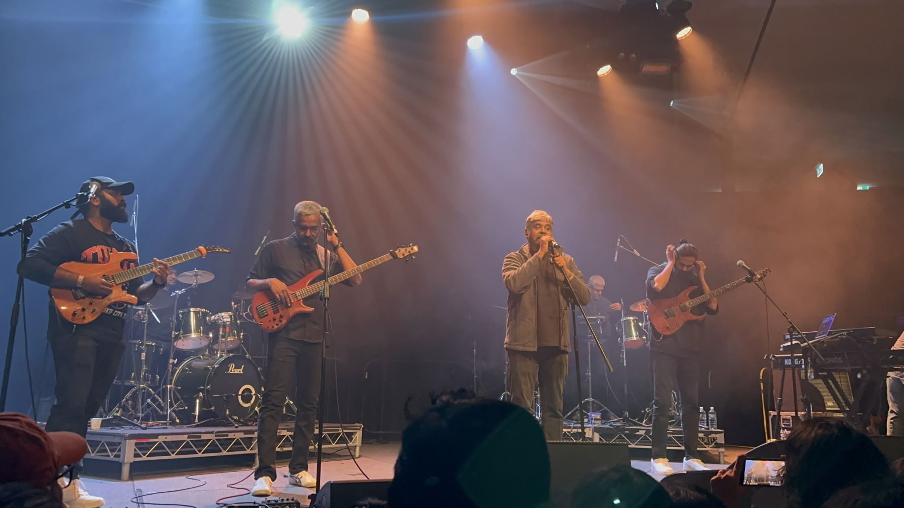

+++
author = "Sathyajith Bhat"
categories = ["Life"]
tags = ["weekly-notes", "gaming"]
places = "Sydney"
type = "post"
series = ["Weekly notes"]
url = "/weekly-notes-27-2024/"
title = "Weekly notes 27/2024"
date = 2024-07-07T12:00:00Z
summary = "Week 27 summary - more kickass concerts and preparing for an exam."
images = ["/weekly-notes-27-2024/thumb-agam.jpg"]
+++

_Thumbnail image: Pic of Agam performing._ 

### What's been happening

It's been a busy week

* I've been preparing for my PTE Academic test by watching a fair bit of YouTube videos on how to prepare and what sort of questions are expected. PTE Academic Test is required to demonstrate my English language proficiency for my upcoming Australian PR application, and I must admit I am a bit intimidated by this. I haven't done any tests in a long time, and PTE Academic is a completely automated way of grading your answers, even though the answers can be subjective and the tests cover Reading, Writing, Listening, and Speaking. Jo will do her test on Sunday afternoon, and I will have mine on Monday. Hopefully, we will both pass the test with the required scores. 
* After a long time, I've spruced up my [tech blog theme](https://sathyasays.com/), as well as cleaned up some of the older articles. There are a lot of the older articles that are simply not relevant anymore, with many links being dead so I removed the links, and moved the older posts to an [archives](https://sathyasays.com/archives) section so that they don't show up when navigating via the previous posts, but direct links to them will still work. 
* A busy concert weekend -
  * Agam at Roundhouse, University of NSW. I've heard of Agam for a long time but have never listened to any of their songs. Overall, I enjoyed the concert. The concert started about 20 minutes late, but once they started performing, it was quite sublime. Harish is really good in crowd management, getting the audience to sing with him, or keep it down. The entire band was terrific. T Praveen Kumar, the lead guitarist was bringing out violin-like sounds from his electric guitar.  Jagadish, the rhythm guitarist's superb prog rock/metal riff was glorious. The unsung heroes were the bassist Aditya Kasyap and Sivakumar Nagarajan on the Indian percussions. Their subtle touches added an amazing depth to the entire performance and elevated it to the next level. I would highly recommend watching them live if they perform in your city.

  
  
  
  
  
  

  * Zakir Hussain, Kala Ramnath, and Jayanthi Kumaresh in Triveni at the Opera House. I have no words to describe how awesome this was. This was about a 100-minute nonstop instrumental masterpiece and we didn't even realize how time went by here. They didn't allow any photography or videography so I don't have too many photos.

  
  

  * With this, we've completed 12 concerts this year, more than what we saw all of last year! We don't have any concerts planned for the later part of the year since most of the major concerts are happening in November, and we will be in India then. I will keep an eye out for some interesting artists coming up and see if we can get to see them live!

### What we ate

Trying out this section since we try out food from different restaurants and Jo does some awesome food too!

Egg Puffs: A staple food from my childhood that I miss the most, so asked Jo to make it and she did!




Koli Saaru: Jo wanted to do this and her quest to find the right recipe meant listening to all the videos that were playing in the background made my mouth drool and I was badly craving Akki Roti/Raagi Mudde. We had it with rice instead.




Pasta & Chicken Parm with Salad.

Jo wanted to try out fresh pasta we got from Coles, and had some chicken so she made this. Turned out pretty good, I even cleaned out the salad (or "ghaas phuus" as I like to call it).




That's for some of the interesting food. Will try to keep this section running!

### Music of the Week

One of the things I love the most about going to live gigs is to find other live versions of them performing and being able to contrast how they played live, or what improvisations they did. So here's a relatively old series of videos that I had no idea existed - Agam's live series of performances called A Dream to Remember. I love that there's a background choir with voices, strings, sitar, or other instruments. Wonderful series of videos. 



### Link of the week

Retool has a fantastic article, with some great visuals talking about [the history of Yahoo Pipes](https://retool.com/pipes). 

I remember reading about Yahoo pipes back in the day and was fascinated with web technology, with pipes, with RSS. In today's world, IFTTT and Zapier exist and for those who want self-hosted equivalents - [n8n](https://n8n.io/) and [Node-RED](https://nodered.org/) are good equivalent tools.

### Subscribe to my posts

Till next week. If you enjoyed reading this post, please consider sharing it via the links below and subscribing to the blog. You can subscribe via email using [Substack](https://sathyabhat.substack.com/). If you prefer RSS/news readers, you can [click here](https://sathyabh.at/index.xml) for the feed link. If you prefer to follow only my weekly notes, here's [the RSS feed](https://sathyabh.at/series/weekly-notes/index.xml) for the Weekly Notes series. 