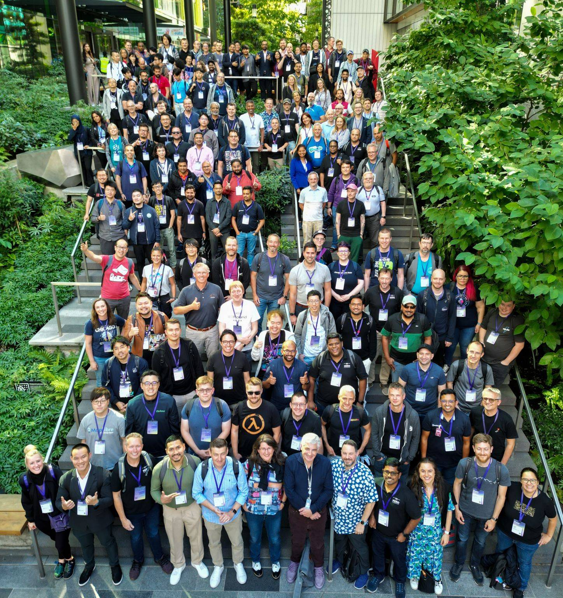

+++
author = "Sathyajith Bhat"
categories = ["Life"]
tags = ["weekly-notes", "gaming"]
places = ["Seattle", "Bellevue"]
type = "post"
series = ["Weekly notes"]
url = "/weekly-notes-29-2024/"
title = "Weekly notes 29/2024"
date = 2024-07-22T12:00:00Z
summary = "Week 29 summary - a week among Heroes."
images = ["/weekly-notes-29-2024/thumb-heroes.jpg"]
+++

_Thumbnail image: The AWS Heroes program recognizes a vibrant, worldwide group of AWS experts whose enthusiasm for knowledge-sharing has a real impact within the community. I was announced as a hero back in 2018_ 

### What's been happening

Wew, what a week. Yes, this week's edition is massively delayed, but we'll get to that.

* I mentioned in [last week's notes](/weekly-notes-28-2024/) that I would be in Seattle for a week-long AWS event. That was slightly vague for a reason, but here's the details: AWS flew all [the AWS Heroes](https://aws.amazon.com/developer/community/heroes/) over to Seattle for a 3-day Global Heroes Summit. The 3-day Summit featured many sessions where the service teams were soliciting feedback (a large number of service teams were present), a few Q&A/free-form discussions, as well as roadmaps and previews of upcoming new services. A whole bunch of us were vocal about the [overwhelming amounts of GenAI focus](https://x.com/theburningmonk/status/1814667796925849849), and I also provided some feedback on how Amazon Q [has been less than useful](https://x.com/SathyaBhat/status/1811585232467804351). A whole lot of things that we were shown are under NDA, so I won't be detailing more till they are clear to be published/launch but rest assured, there's a lot of interesting things coming.

  

* After the Heroes summit, I moved from [Seattle](https://sathyabh.at/places/seattle/) to [Bellevue](https://sathyabh.at/places/bellevue/). My plan was to be in Bellevue till end of the week, meet a whole bunch of folks and then fly to Boulder on Sunday. With my fellow Heroes being CrowdStruck, I figured I'll have a couple of days for the sitation to be sorted.
* With the remaining few days, I tried to meet as many people as I could:
    * Met [Gurupanguji](https://mastodon.social/@gurupanguji). I've been following pangu (I promise, I asked him if I can call him this :D) for a while now via [Saurabh](https://100rabh.com/). When I was in Seattle a few months ago, pangu asked if we could meet, but we couldn't do it at that time due to time constraints. This time we did, and it was great to put a face to the name, and had a good series of conversations. Here's to more.
    * I paid a visit to The Trade Desk Bellevue office and met my teammate and had lunch with him.
    * Went with Karthik and his wife and enjoyed a nice, quiet evening picnic with their daughter at Meydenbauer Bay Park
    * Finally, went to [Reetesh](https://reetesh.v3r.us/)'s house and spent an amazing 6 hours talking about all things servers, gaming, completely drooling over his OnePiece shrine and amazing entertainment den, and more. 

* I experienced the worst flight I've ever taken (yet). I've written a separate post about this, [have a read here](/alaska-airlines-the-worst-flight-of-my-life/). 

The music and links of the week will return next week.

### Subscribe to my posts

Till next week. If you enjoyed reading this post, please consider sharing it via the links below and subscribing to the blog. You can subscribe via email using [Substack](https://sathyabhat.substack.com/). If you prefer RSS/news readers, you can [click here](https://sathyabh.at/index.xml) for the feed link. If you prefer to follow only my weekly notes, here's [the RSS feed](https://sathyabh.at/series/weekly-notes/index.xml) for the Weekly Notes series. 