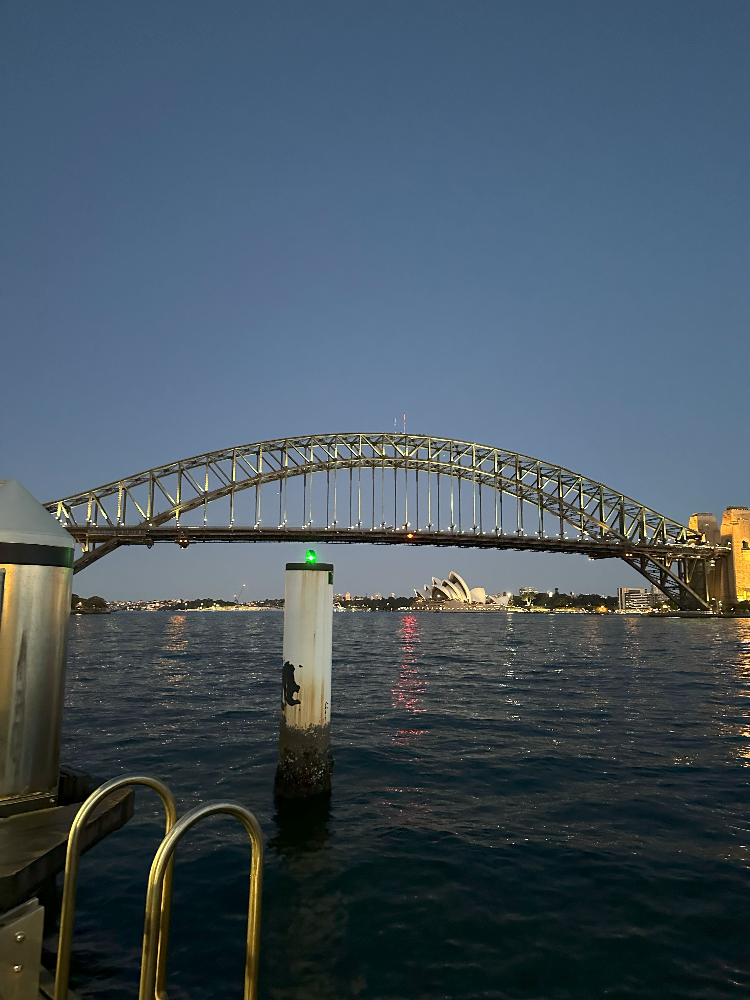

+++
author = "Sathyajith Bhat"
categories = ["Life"]
tags = ["weekly-notes", "gaming", "Diablo IV"]
places = "Sydney"
type = "post"
series = ["Weekly notes"]
url = "/weekly-notes-32-2024/"
title = "Weekly notes 32/2024"
date = 2024-08-11T12:00:00Z
summary = "Week 32 summary - birthday celebrations, a musical watch and more."
images = ["/weekly-notes-32-2024/thumb-harbour-bridge-opera-house.jpg"]
+++

_Thumbnail image: The Ferry Wharf of McMahon's Point is one of my absolute favourite public transport points of Sydney._ 

### What's been happening

* It's been a bumper birthday week. My brother-in-law, dad, niece and Jo all have their birthdays in August. I remembered my brother-in-law's birthday, told Jo to wish him and then completely forgot to wish him myself :|. I wished Dad as well.
  * I messed up Jo's birthday - she'd told she wanted to see Hamilton on her birthday, and I completely forgot to book the tickets and couldn't get tickets for a show on her birthday. I did get tickets for the previous day however, and we went for that show.

* And yes, we went to see Hamilton - a biographical musical of [Alexander Hamilton](https://en.wikipedia.org/wiki/Hamilton_(musical)), one of the American Founding Fathers. I've mentioned earlier I'm not a big fan of musicals and the last musical that I we went to was [Beauty and the Beast](/2023/09/10/weekly-notes-36-2023/) - and I loved that. Hamilton has a run time of about 3 hours, spread over two acts - the first act covers his early days and journey into American Revolutionary War while the second act covers his statesmanship days. I was amazed by the performance of the entire cast - with a lot of singing and rapping it was difficult to follow at times but nevertheless I enjoyed it. I guess I'm getting into the musicals after all! 
   
* I forgot to mention this in last week's notes - dad & mom had sent a care package from Mangalore and we finally received it! Only took about 15 days - which isn't too bad. Australia has very strict bio-security laws and that means sending anything is a challenge. I did some research and found that most home-made food will be rejected by bio-security and either discarded or sent back to the origin. They sent some ragi murukku, jackfruit chips, mixture, *tukdi*, *boondi*, tapioca chips, and banana halwa. They also wanted to send pickles (rather, I asked if they could) but IndiaPost said they couldn't send as historically packages containing pickles have been sent back. Oh well, I'm happy with the snacks :D.
  

### What have I been playing 

* Season 5 of Diablo IV has started and of course I'm playing it. This season's focus is on what is called "Infernal Hordes" - you flight against hordes of monsters for a set number of waves where the enemy count and difficult increases each wave. I started a Sorcerer (as always, I'm always inclined to play spell casters first) and given there have been a bunch of buffs to the Sorcerer class and to a large portions of the game - for example leveling a character is much faster now. I haven't played a lot so far, just got my character to level 50.
* Started another game of Civilization VI with the usual suspects - Kush, Rushabh (and this friend too for a change this time). I expect this game to go on for another couple of weeks (or months) as we usually get only the weekend to play together.

### What we ate

  * We went for a pre-show dinner to a restaurant called [Kko Kko Balinese](https://maps.app.goo.gl/KZ985w6fd1J256qC7). This restaurant is location in the basement of a mall and you wouldn't take a second glance at it, but so glad we did check it out. We ordered the set menu that included prawn crackers, Balinese fish cake, peanut salad, Taliwang Chicken with Jasmine Rice and Banana Fritters with Belgium Chock & Fresh Berries. The peanut salad was so delicious, and the chicken was so well done - really juicy and well marinated. We were running late for our show, so we had to skip the dessert but they gave us couple of cookies in exchange (even though we didn't explicitly ask for it). Overall, we had a good time and definitely revisit some time soon.

  
  
  
  
  
  

 * We went for brunch to a nearby cafe called [Soho On Miller](https://maps.app.goo.gl/zCv17xwtm5W1Xw4LA). Jo said the coffee was nice the last time she went there, but we went it wasn't that great (it looks awesome though). Felt like the coffee wasn't strong enough and the flavour wasn't coming through. For food, we had the Chili Scrambled Eggs and the Grilled Chicken with Creamy Mushroom. The food was pretty good, although I wish my chicken had a bit more gravy as it was slightly dry.

  

  

  

  

### Music of the Week

Thanks to [Malcom](https://www.malcolmalmeida.com/) for sharing this [concert of Ibrahim Maalouf](https://www.youtube.com/watch?v=le-e37ZMck8). Absolutely loved the entire set. 



### Link of the week

* If you've ever wondered what "urchin" or "utm" means in Google Analytics, then this [post](https://urchin.biz/urchin-software-corp-89a1f5292999) on the origin story of Google Analytics has you covered! Fascinating story about how they started, the challenges they faced and how ultimately they were acquired by Google. It's a long read so might want to grab a beverage before you dive in!
* Came across this post on [Reddit](https://www.reddit.com/r/programming/comments/1eea8qy/artifacts_is_a_apibased_mmorpg_game_use_any/) about [Artifacts](https://artifactsmmo.com/) which is a sandbox MMORPG where you can control any character with an API. That's an interesting way to learn a language I suppose. 

### Subscribe to my posts

Till next week. If you enjoyed reading this post, please consider sharing it via the links below and subscribing to the blog. You can subscribe via email using [Substack](https://sathyabhat.substack.com/). If you prefer RSS/news readers, you can [click here](https://sathyabh.at/index.xml) for the feed link. If you prefer to follow only my weekly notes, here's [the RSS feed](https://sathyabh.at/series/weekly-notes/index.xml) for the Weekly Notes series. 
