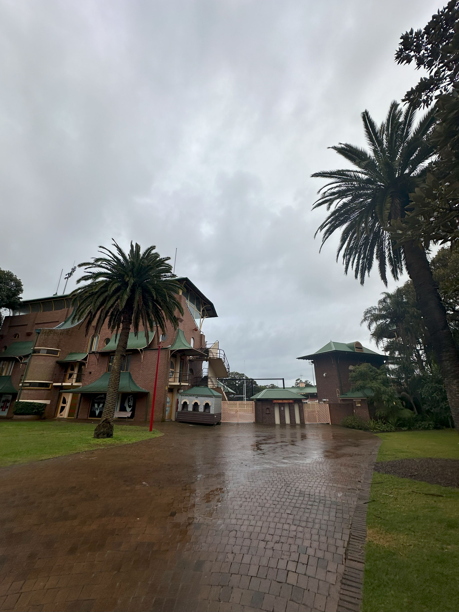

+++
author = "Sathyajith Bhat"
categories = ["Life"]
tags = ["weekly-notes", "gaming"]
places = "Sydney"
type = "post"
series = ["Weekly notes"]
url = "/weekly-notes-33-2024/"
title = "Weekly notes 33/2024"
date = 2024-08-18T12:00:00Z
summary = "Week 33 summary - a dental procedure, trying out some new things and more."
images = ["/weekly-notes-33-2024/thumb-north-sydney-oval-10-2024.jpg"]
+++

_Thumbnail image: A rainy day at the entrance of North Sydney Oval._ 

### What's been happening

* I had a dental procedure earlier in the week. A few weeks back I went to the dentist for a regular check-up and during the check-up the dentist found that I had a wisdom tooth in the upper left-side that's been nicely hidden away all this while. Since there's no supporting lower tooth, I was advised to remove the tooth as without the supporting tooth, the upper tooth will start going down. So earlier in the week, I went over to get this tooth extracted as well as remove another tooth that had fractured off. The dentist was pretty clear in explaining the procedure, what will be done, what is expected post-op, and the best and worst case scenarios of the procedure. Due to the angle of tooth, I had to move my jaw towards to the otherside while the dentist removed the tooth. Overall, the procedure went pretty well, though the soreness lasted for couple of days. I was also asked not to brush/gargle for 24 hours so I decided to work from home the next day - didn't think people would like stinky breath me in office!

* I mentioned last week about the [bumper birthday](/weekly-notes-32-2024/) week - it was Shriya's birthday this week. Jo & I sent some flowers. She was happy with the flowers :) 

* I had found about [DadLAN](https://dadlan.au/) a few weeks back and today was I went to the monthly meetup and it was a lot of fun. I'm meeting most of the people for the first time, though we've chatted a bit over the DadLAN Discord. We played some Unreal Tournament 2004 - was reminded of my UT99 days when I'd play a lot of the UT99 Demo against bots, and later on, against other people on [Kawabonka](https://old.reddit.com/r/IndiaNostalgia/comments/ptsy15/comment/hdz82ka/?utm_source=share&utm_medium=web3x&utm_name=web3xcss&utm_term=1&utm_content=share_button) servers on the dial up. Good times. We also played some Blur (came second in the race) and talked over some pizza and softdrinks. I look forward to the next event!
* My Guitar class has been progressing pretty well. We learnt another song - the chords for Eric Clapton's Wonderful Tonight (which is pretty similar in progression to the song we performed for the last term - Cranberries' Dreams). Along with this, we also learnt some melodies for a 70's rock song medly. I'm still struggling with keeping my fingers on the right string/fret and hope to get better at it. Jo's guitar string broke, so we've given it to be restrung at a nearby music store.
* I've been working for 17 years now, and I've been an IC (individual contributor) throughout my entire career and wasn't really interested in moving to the team lead role. I've decided to transition to a team-lead role. Why? I've always believed in trying out things - that's why we moved to Romania and now Australia. I have been with The Trade Desk for 2 years now, and I think it's a good time to try out some thing new. If it doesn't work out, I can always go back. So wish me best! 
* Also related to our stay in Australia - Fragomen, our immigration consultants have lodged our application for 186 visa which grants us Permanent Residence with the Department of Home Affairs. The 186 visa has a [long processing time](https://immi.homeaffairs.gov.au/visas/getting-a-visa/visa-processing-times/global-visa-processing-times)(50% processed in 13 months, 90% processed in 16 months) so all we can do now is wait. 

### What I have been playing

* Season 5 of Diablo IV continues. I found a pretty nice [Gloves of Illuminator](https://maxroll.gg/d4/wiki/gloves-of-the-illuminator) and I got tired of having to manage mana with the previous Chain Lightning build so I switched over to the Fireball build and having fun with it. I'm just a couple of levels shy of 100, so once I hit that and level my glyphs up, I should be in a better position to play the Infernal Hordes mode.
* As mentioned above, I played couple of hours of Unreal Tournament 2004 - as someone who doesn't play FPS due to motion sickness, I was able to play this game for a relatively long time but it also helped that I sucked at it and kept dying and respawning - which gave me some time to take a break. We also played Blur, and that was more to my liking.

### What we ate

* We went to Rangoon Colonial Club - an Indian Restaurant that specialises in the cuisine of the British Era. The restaurant was pretty empty when we went. The restaurant has a some nice touches to the decor including some gramaphones, lots of books, some tennis rackets(!) and pretty lavish looking tables. The menu was quite good with a healthy mix of Chicken, Lamb and Seafood options. We ordered the Seekh Kebab (likely served to us over a sizzling iron skillet),Lamb Rogan Ghosht and Garlic Naan. The food was really good - the naan was light and soft, thought the seekh kebab could have been a bit more spicier. Overall, we enjoyed the food and would recommend a visit if you're looking for some decent North Indian food.

  
  
  
  
  
  

* After the relatively heavy lunch, we walked around a bit and were feeling sleepy, so went to sit at a coffee shop called Bean Drinking. I wanted to try out some Pour Over, but sadly they did not have. So I asked instead for a Sparkling Cold Brew and quite happy I did - I usually stay away from cold brews because they tend to be rather acidic but this was very good. Jo asked for the barista's choice with oat milk and that was kinda okay. We also had a carrot cake that was pretty good.

  
  

### Music of the Week

I love fusion music, especially those that include elements of rock/metal with traditional music. I came across this band called The Hu who are Mongolian folk metal band. They incorporate Mongolian instruments, throat singing with elemets of metal. The [Wolf Totem](https://www.youtube.com/watch?v=jM8dCGIm6yc) is an incredibly catchy warsong while [Bii Biyelgee](https://www.youtube.com/watch?v=eb3ysMtu8t0) is an incredibly upbeat song.





### Link of the week

Ever since I came across a steering wheel and pedal set (back in 1998), it's been an aspirational peripheral for me. Now while many people get the steering wheel/sim rig kit to play, I came across this [post](https://outlandnish.com/hacks/ditch-the-sim-rig-use-your-car-instead/) where the author converts his actual car into a sim rig ?! Outlandish read indeed! 

### Subscribe to my posts

Till next week. If you enjoyed reading this post, please consider sharing it via the links below and subscribing to the blog. You can subscribe via email using [Substack](https://sathyabhat.substack.com/). If you prefer RSS/news readers, you can [click here](https://sathyabh.at/index.xml) for the feed link. If you prefer to follow only my weekly notes, here's [the RSS feed](https://sathyabh.at/series/weekly-notes/index.xml) for the Weekly Notes series. 
