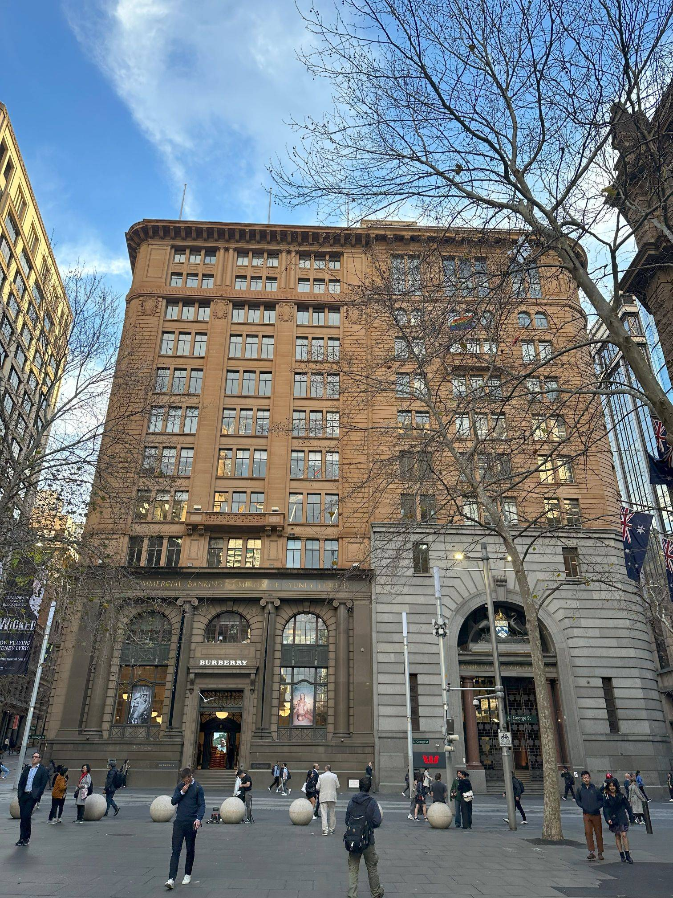

+++
author = "Sathyajith Bhat"
categories = ["Life"]
tags = ["weekly-notes", "Sydney", "gaming", "Baldurs Gate", "meetup"]
type = "post"
series = ["Weekly notes"]
url = "/2023/08/27/weekly-notes-34-2023/"
title = "Weekly notes 34/2023"
date = 2023-08-27T12:00:00Z
summary = "Week 34 summary - fun gaming moments, and a moon landing."
images = ["/2023/08/27/weekly-notes-34-2023/thumb-commercial-banking-company-sydney.jpg"]
+++

_Thumbnail image: [343 George Street, Sydney](https://streetartcities.com/markers/31870) is a heritage-listed former bank building built from 1921 to 1925, and until 2008 housed the Commercial Banking Company of Sydney (CBC) and later National Australia Bank. It is now a nine-storey retail and commercial premise._

### What's been happening

* I went to the [Sydney SaaS on AWS Meetup](https://www.meetup.com/sydney-saas-on-aws/events/295212541/). The meetup featured a talk by Nullify, a cybersecurity startup (think Sonarqube as SaaS) on how they run their SaaS entirely on server-less (sic). Ran into [Rich](https://twitter.com/richdevelops)! Nice to catch up with him. It's been a bit difficult to make connections, as most meetups seem to have more students or founders and not many repeat visitors.
* My proposal to write a re:Invent guide has been accepted! I need to start working on it right away. Look for it coming up! I'll put up a link here as well as on [my tech blog](https://sathyasays.com) when it's published.
* I've been playing a lot of Baldur's Gate 3 and have been mostly enjoying it. The things that I find frustrating are some poor camera issues which make it difficult to sight high vantage points - this hurts because positioning is of utmost importance, especially to come out of top in a tough fight. 

    
    
    

* After a lot of procrastination, I finally started writing a [Prometheus](https://prometheus.io/) exporter for You Need a Budget ([YNAB](https://www.ynab.com/)). The goal was to understand how exporters work, and for all the awesomeness that is YNAB, its reporting is pretty lackluster. It'll be interesting to see how my expenses and financial data can be modeled as time series and labels. 
* I'm not a big chess fan (barely played a couple of matches as a kid) but I was following the last few matches of the FIDE Chess World Championship, primarily because of the [R Praggnanandhaa](https://en.wikipedia.org/wiki/R_Praggnanandhaa) and [Magnus Carlsen](https://en.wikipedia.org/wiki/Magnus_Carlsen) match. I must give props the the commentators of the match Peter Leko and Daniel Naroditsky who made it pretty easy to follow what's happening with detailed descriptions of the moves and how/why they are good, bad, or can be countered. You can watch the previous live streams on the [Chess24 YouTube Channel](https://www.youtube.com/@Chess24/streams).

### Music of the Week

I'd first heard of San Cisco via their [Fred Astaire song](https://www.youtube.com/watch?v=ultX5ZR-sQE) long back - I can't even remember where. Maybe from one of [8 tracks](https://8tracks.com/) playlists? A few years back they did an amazing Between You and Me Live at Home gig that I frequently re-visit. Go [give it a listen](https://www.youtube.com/watch?v=XN8Sv70qphI&list=PLx9xtzG9zR-fAXriMKpXQ-_DYzjdo8K8d&index=1&t=1924s). It's about 38 minutes long, but well worth it.



### Link of the week

The Indian Space Research Organization (ISRO) achieved an amazing milestone - a successful Chandrayaan 3 mission including a soft landing of the Vikram lander and a [rollout of the Pragyan rover](https://twitter.com/isro/status/1694945669721776263). Congrats and kudos to [everyone involved](https://www.isro.gov.in/Making_Chandrayaan3_ISRO_culture.html)!



### Subscribe to my posts

Till next week. If you enjoyed reading this post, please consider sharing it via the links below and subscribing to the blog. You can subscribe via email using [Substack](https://sathyabhat.substack.com/). If you prefer RSS/news readers, you can [click here](https://sathyabh.at/index.xml) for the feed link. If you prefer to follow only my weekly notes, here's [the RSS feed](https://sathyabh.at/series/weekly-notes/index.xml) for the Weekly Notes series. 