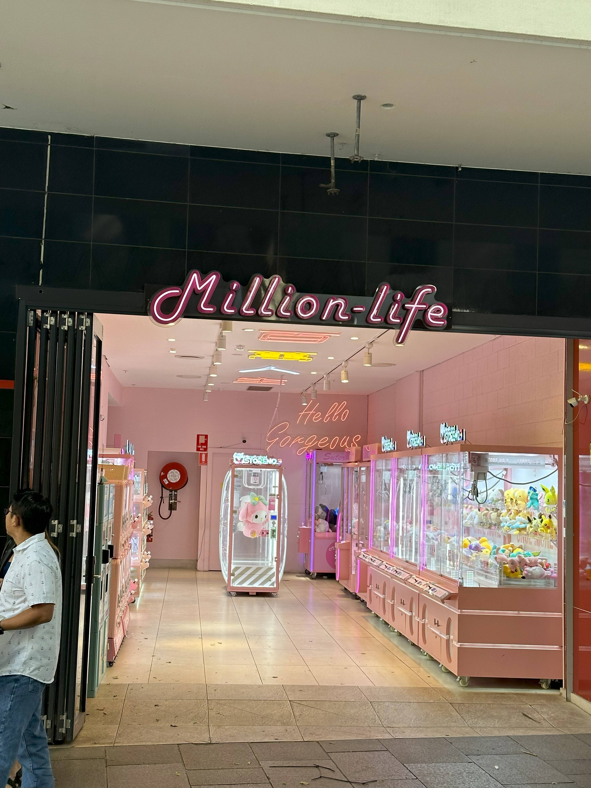

+++
author = "Sathyajith Bhat"
categories = ["Life"]
tags = ["weekly-notes", "Sydney", "movie", "eating-out"]
type = "post"
series = ["Weekly notes"]
url = "/2023/09/03/weekly-notes-35-2023/"
title = "Weekly notes 35/2023"
date = 2023-09-03T12:00:00Z
summary = "Week 35 summary - a weekend outing, a movie watch and more."
images = ["/2023/09/03/weekly-notes-35-2023/thumb-million-life.jpg"]
+++

_Thumbnail image: [Million Life on Dixon Street](https://streetartcities.com/markers/31870) is an brightly lit arcade featuring many "UFO Catcher" or "claw game" [machines](https://en.wikipedia.org/wiki/Claw_machine). It is said many of these machines are often rigged - the more money you spend, the greater the chance that the catcher will be able to hold on to the prize._

### What's been happening

* I bought the tickets for the Melbourne 2024 Formula 1 Grand Prix! Looking forward to be there. I got the 4-day pass. The schedule's not yet out, so not sure what's in store for Thursday but going by previous years, there would be something in store (like the Supercars or vintage car parade from the past few years). 

* Another concert booked for January! Lord Huron is touring Australia and they are performing in Enmore Theater in Sydney.

* It only took us a year but finally went to a movie theatre 😆 We went to watch Oppenheimer. And since it was an afternoon show, we decided to make the most of it with a visit to Chinatown which isn't too far off. 
    
    * We had lunch at [Motherchu's Taiwanese Gourmet restaurant](https://pxl.mx/p/sathyabhat/603829178108089561). We had crispy salted chicken, glutinous rice roll with pork floss, and the stir fry noodles. Personally, didn’t like the rice roll because it was dry but the rest of the food was good!.

    <iframe title="Pixelfed Post Embed" src="https://pxl.mx/p/sathyabhat/603829178108089561/embed?caption=true&likes=false&layout=full" class="pixelfed__embed" style="max-width: 100%; border: 0" width="400" allowfullscreen="allowfullscreen"></iframe>

    * After lunch, we had a brisk walk over to the movie theatre (only about 800m away, but we were close to running late). Oppenheimer was a great watch. I had no idea it was by Christopher Nolan, but thoroughly enjoyed it. What I didn't like about the movie: no subtitles meant it was hard to follow the dialog at certain places. The pacing and the timeline jump made it difficult to figure out when and where the events are happening, but that's a Nolan movie for you. 

    * After the movie, we went back to Chinatown for some unfinished business (aka dessert). First, a stop by Emperor's[ Bakery for some cream puffs](https://pxl.mx/p/sathyabhat/603842213395346650). Unless the samosa-style cream puffs that I've seen in Malaysian restaurants, these are small custard balls fresh and hot out of the oven. 

    <iframe title="Pixelfed Post Embed" src="https://pxl.mx/p/sathyabhat/603842213395346650/embed?caption=true&likes=false&layout=full" class="pixelfed__embed" style="max-width: 100%; border: 0" width="400" allowfullscreen="allowfullscreen"></iframe>

    * We went over to the last place for the day, Hong Kong Day Dessert for eggettes. Eggetts are spherical egg-based waffles. [Pictured is a mango eggettes roll](https://pxl.mx/p/sathyabhat/603846181050348763). Think of it as vanilla ice cream with fresh mangoes with a bubble waffle for a cone.

    <iframe title="Pixelfed Post Embed" src="https://pxl.mx/p/sathyabhat/603846181050348763/embed?caption=true&likes=false&layout=full" class="pixelfed__embed" style="max-width: 100%; border: 0" width="400" allowfullscreen="allowfullscreen"></iframe>

### Music of the Week

While searching for [Mutemath's Monument](https://www.youtube.com/watch?v=jSNLvyXmsv4&list=PL777F6F97DC4ADD07&index=15), I found that they recorded a version with Harmonium and it's a wonderfully done version. [Give it a listen](https://www.youtube.com/watch?v=yuD4mFR9WeA&list=PL777F6F97DC4ADD07&index=16). 

    

### Link of the week

Jeff Geerling tries to determine if data transfer by a pigeon is faster than the Internet. Give it [a read](https://www.jeffgeerling.com/blog/2023/pigeon-still-faster-internet).

### Subscribe to my posts

Till next week. If you enjoyed reading this post, please consider sharing it via the links below and subscribing to the blog. You can subscribe via email using [Substack](https://sathyabhat.substack.com/). If you prefer RSS/news readers, you can [click here](https://sathyabh.at/index.xml) for the feed link. If you prefer to follow only my weekly notes, here's [the RSS feed](https://sathyabh.at/series/weekly-notes/index.xml) for the Weekly Notes series. 