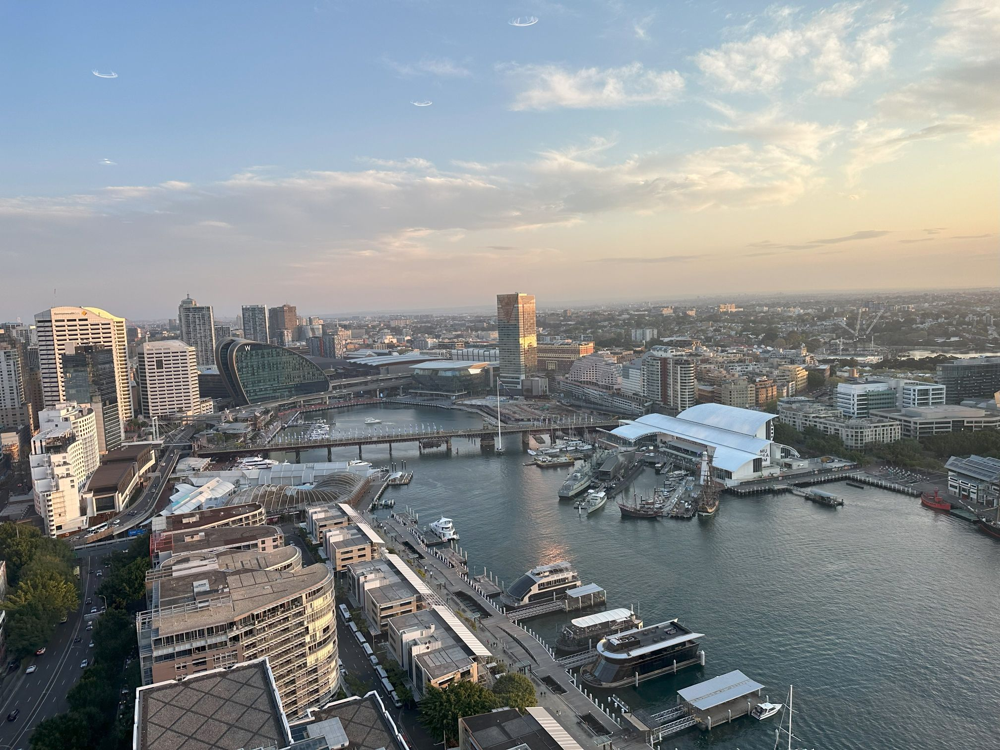

+++
author = "Sathyajith Bhat"
categories = ["Life"]
tags = ["weekly-notes", "sydney", "gaming"]
type = "post"
series = ["Weekly notes"]
url = "/2023/09/10/weekly-notes-36-2023/"
title = "Weekly notes 36/2023"
date = 2023-09-10T12:00:00Z
summary = "Week 36 summary - a new experience, a new blog post and lots of eating out."
images = ["/2023/09/10/weekly-notes-36-2023/thumb-barangaroo-wharf.jpg"]

+++

_Thumbnail image: View of the [Barangaroo Wharf](https://en.wikipedia.org/wiki/Barangaroo,_New_South_Wales) from The Trade Desk office. Barangaroo used for fishing and hunting by Indigenous Australians prior to colonial settlement. The area is inclusive of The Hungry Mile, where workers would walk from wharf to wharf in search of a job, often failing to find one._

### What's been happening

* I have completed my re:Invent guide and submitted to AWS! Once it gets approved and published, I will link it in my weekly notes and in my tech blog once it's live.
* I wrote a blog post on my tech blog after a long time! Check out [Bulk tagging all instances in an Auto Scaling Group (ASG) using AWS CLI and JMESPath Expressions](https://sathyasays.com/2023/09/04/bulk-tag-instances-in-asg-aws-cli/). I wrote the post more than 3 months ago, but didn't get to publish it because I thought it was too trivial. Given how many times I've had to refer to my draft, I figured it might be useful to others.
* We had a good weekend. In a first for me, went to see a musical with Jo. The musical was [Beauty & the Beast performed at the Capitol Theatre](https://pxl.mx/p/sathyabhat/606004304576524291). I've never been a fan of musicals, but have to appreciate the performance - the actors were really good. The production was quite outstanding - really well done set design, lightning, sound. It was quite an experience!

    
    
    

    * We decided to go to the musical fairly late, so we had to rush to the theatre. The musical was for 2.5 hours, and by the time the show was over, we thought most of the restaurants would have closed (pain point of being in Sydney CBD). Thankfully, we found a nice Thai [restaurant called @Bangkok](https://pxl.mx/p/sathyabhat/606374679004766283) that was open.

    <iframe title="Pixelfed Post Embed" src="https://pxl.mx/p/sathyabhat/606374679004766283/embed?caption=true&likes=false&layout=full" class="pixelfed__embed" style="max-width: 100%; border: 0" width="400" allowfullscreen="allowfullscreen"></iframe>

* We went for pancakes for breakfast! We went to a place called [Pancakes on the Rocks](https://pxl.mx/p/sathyabhat/606338333639102530). We ordered pancakes, bacon, hashbrowns and scrambled eggs. The pancakes and other food was pretty good but lacked salt. Adding a little bit of seasoning made it so taste so good. 

    <iframe title="Pixelfed Post Embed" src="https://pxl.mx/p/sathyabhat/606338333639102530/embed?caption=true&likes=false&layout=full" class="pixelfed__embed" style="max-width: 100%; border: 0" width="400" allowfullscreen="allowfullscreen"></iframe>

### Music of the Week

It's been a Foo Fighters week - been listening to them all week long. I also found out that their acoustic live album, [Skin and Bones](https://www.youtube.com/watch?v=yRFCbeyQ2WI&list=PLIDmetLgAoj4E1UNiyv6QiXtYiAgtABrB) is back up on YouTube. I think it's one of their best concerts ever. 



### Link of the week

I never got to visit any LAN parties, though used to read about them quite a lot. Spotted this gem of a post - [Memories from old LAN parties](https://thomask.sdf.org/blog/2023/09/09/memories-from-old-lan-parties.html).

### Subscribe to my posts

Till next week. If you enjoyed reading this post, please consider sharing it via the links below and subscribing to the blog. You can subscribe via email using [Substack](https://sathyabhat.substack.com/). If you prefer RSS/news readers, you can [click here](https://sathyabh.at/index.xml) for the feed link. If you prefer to follow only my weekly notes, here's [the RSS feed](https://sathyabh.at/series/weekly-notes/index.xml) for the Weekly Notes series. 