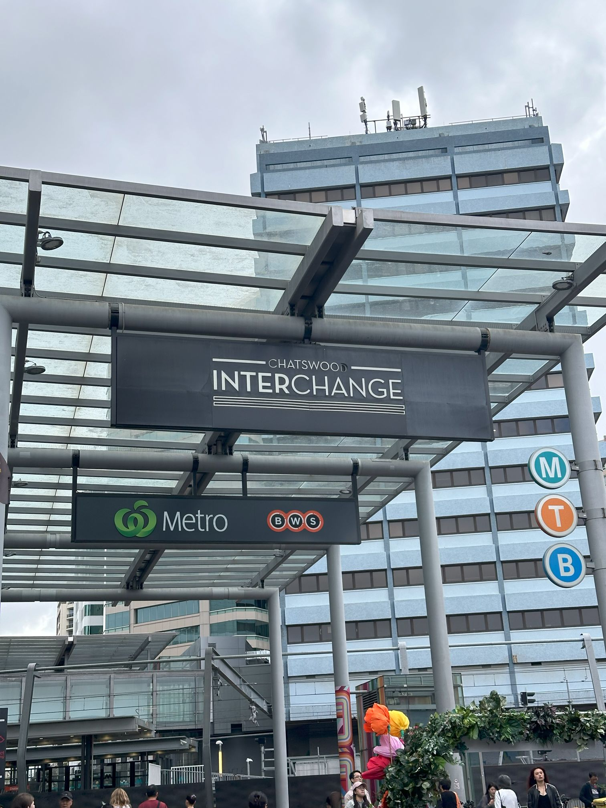

+++
author = "Sathyajith Bhat"
categories = ["Life"]
tags = ["weekly-notes", "gaming"]
places = "Sydney"
type = "post"
series = ["Weekly notes"]
url = "/weekly-notes-36-2024/"
title = "Weekly notes 36/2024"
date = 2024-09-08T12:00:00Z
summary = "Week 36 summary - a birthday party, an astrophotography workshop, and an unexpected resurgence."
images = ["/weekly-notes-36-2024/thumb-chatswood.jpg"]

+++

_Thumbnail image: Chatswood Interchange is a shopping centre in the suburb of Chatswood and is integrated with the Chatswood railway & metro station._

### What's been happening



* Jo and I went to a night photography/astrophotography workshop organized by the [Powerhouse Museum](https://powerhouse.com.au) in association with Sony. They had loaner cameras and tripods, we had to get our memory cards. Since Jo already had her camera, I opted not the use the loaner camera but took up on the offer for the tripods. The workshop was very useful and the instructor explained us some basics of night photography and what to look for when doing night photography, astrophotography and star trails. We took a bunch of pictures at ISO 3200 with exposure time set to 10 to 15 seconds. Since it was mounted on tripod, we were spared of the camera shakes. It was quite hazy and we were at Sydney observatory in downtown so quite a bit of noise pollution but pretty decent for first attempt. Check out Jo's picture here on [Instagram](https://www.instagram.com/p/C_hKW0fS3de/). 
* August was a month of no concerts but we're back! We went for the 14th concert of the year - Prateek Kuhad performing at the Metro Theatre, Sydney. Prateek's performance was pretty awesome, covering an hour and a half by self singing and playing the acoustic and electric guitars and the piano at different times. While the performance was great, I can't say the same about the audience. The bunch of people around and infront of us were absolutely pain. They were talking to each other or on the phone non-stop, talking on phone,  taking photos/videos (which is fine, I do it as well) but with the bloody flash or torchlight on. They were also yelling he was talking about the story of the song which completely completely spoilt the mood for me.









* Jo's friend invited us over to her kid's first birthday picnic. The picnic was in Centennial Park, a grand open park that reminded us of Cubbon Park. The picnic was pretty nice, got to meet a few new pepple. The most amazing thing was when we found out one of the folks that was at the picnic is a distant relative of Jo. The world is a small place.









* I've been playing Diablo 3 and DIablo IV since launch, and for the first time ever, I managed to complete a character in terms of getting the best items, including the Mythis on my Druid. While I can continue improving the character, the return on that is going to be minimal and will require quite a bit of grinding. For me, the Diablo games have always been a journey of taking a character to building it out to reach the top endgame and I've never been motivated to get better/incremental updates of the character after getting most of the items. I will probably roll a new Rogue and get it to 100 next.
  * I've been using [neovim](https://neovim.io/) since the past few weeks and now I'm in a position where I'm close to comfortable to using it fulltime. The past three weekly notes have been written using neovim, and the past week I wrote a CLI tool for exporting a report about AWS IAM users/policies using neovim and I can comfortable jumping around, moving through files etc. It's been a pretty steep learning curve, and the distribution that I use - LazyVim has some really good, sane defaults but the documentation is pretty poor. Dusty Phillips book called [LazyVim for Ambitious Developers](https://lazyvim-ambitious-devs.phillips.codes/) has been incredibly useful in helping me get the most out of neovim/lazyvim and would highly recommend if you want to pick up LazyVim. 

### What we watched

* [Peaceful Property](https://mydramalist.com/758585-peaceful-property) - Jo got me to start watching this Thai TV series about a chef who gains the ability to see ghosts and uses these powers to start a ghostbusting business. The series has ample amounts of comedy and the chemistry between the actors are really good. It does get over-the-top quite often but that's Thai shows for you. 
* The Grand Tour - One for the Road - While the episode airs next week, the trailer for this came out this week. And for those unware, this is the last episode ever of The Grand Tour and potentially the last of the terrible three (Clarkson, Hammond, May) together on a series, so lots of tears expected for this. 
  

### Music of the Week

Out of nowhere, Linkin Park announced a regrouping this week with a new singer (Emily Armstrong), new drummer (Colin Brittain) and a new album(From Zero) and a new single from the album called [The Emptiness Machine](https://www.youtube.com/watch?v=SRXH9AbT280) . They also had an [hour long livestream](https://www.youtube.com/watch?v=IL1nlWOciL0) with them featuring the new single as well as several of their best hits. 

  
  

### Link of the week

  In the ye' old days, scandisk and defrag were diagnostic utilities that needed to be run on a regular basis to ensure the hard drive is working as expected and data fetch from the disk were not delayed due to fragmentation. Viktor Brawn's [Defrag The Game](https://defrag-game.com/) takes us back to those times, only this time you get to do the defrag as a puzzle game instead of having to wait [starting at the defrag screen](https://www.youtube.com/watch?v=KR3TbL3Tl6M).
  * I'm actually surprised somebody is making 8 hour videos of these..

### Subscribe to my posts

Till next week. If you enjoyed reading this post, please consider sharing it via the links below and subscribing to the blog. You can subscribe via email using [Substack](https://sathyabhat.substack.com/). If you prefer RSS/news readers, you can [click here](https://sathyabh.at/index.xml) for the feed link. If you prefer to follow only my weekly notes, here's [the RSS feed](https://sathyabh.at/series/weekly-notes/index.xml) for the Weekly Notes series. 
