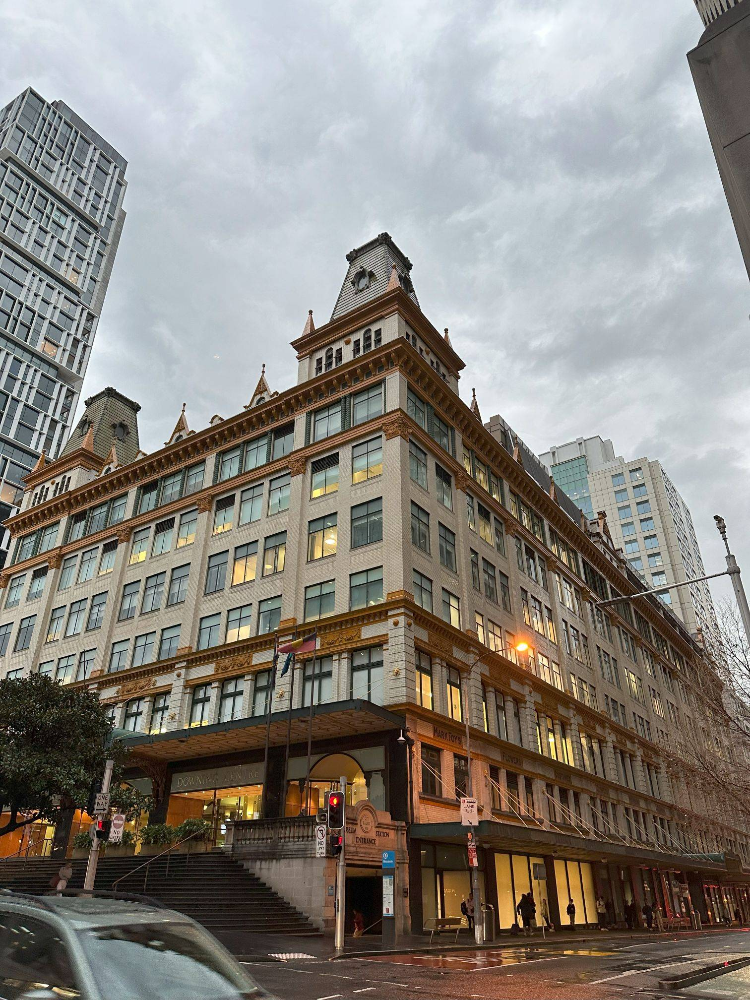

+++
author = "Sathyajith Bhat"
categories = ["Life"]
tags = ["weekly-notes", "sydney", "gaming", "cruise", "Diablo III", "blueboarding"]
type = "post"
series = ["Weekly notes"]
url = "/2023/09/17/weekly-notes-37-2023/"
title = "Weekly notes 37/2023"
date = 2023-09-17T14:00:00Z
summary = "Week 37 summary - fresh start to an old game and a lovely harbour cruise."
images = ["/2023/09/17/weekly-notes-37-2023/thumb-downing-center.jpg"]
+++

_Thumbnail image: [The Downing Center](https://en.wikipedia.org/wiki/Downing_Centre) is a major heritage-listed former department store and now courthouse complex in Sydney CBD. The building was originally called the [Mark Foy's](https://en.wikipedia.org/wiki/Mark_Foy%27s) Piazza Store, a department store founded by Francis and Mark Foy in 1885._

### What's been happening

* I used to be a huge newspaper buff. As a kid, I would read The Hindu, or Times pretty much cover to cover. Nowadays with my attention span I find it hard to read anything. I’m trying this experiment to read a newspaper. I’ve subscribed to [Sydney Morning Herald](https://www.smh.com.au/), which gives me a weekend paper delivery. The subscription also gives me access to a digital scan of the daily papers and crossword and sudoku puzzles :D



* The new season of Wheel of Time is out, and Jo and I have been watching it. So far, the first few episodes have been pretty slow to start, with the pace picking up in the past two episodes. With 5 or 6 different storylines, it's a bit confusing at times but they seem to be converging pretty decently. Hopefully, the pace for the next few episodes will be much faster.
* The new season of Diablo 3 has started. This season has some interesting changes (cap to the paragon points being the most prominent). I've started the new season with a Necromancer, I plan to create a new Witch Doctor at least.
* Jo & I did a sunset harbour cruise, redeeming the Blueboard experience from my first year milestone reward. Check out my [blog post of this experience](/2023/09/17/captain-cook-sydney-harbour-sunset-dinner-cruise).



### Music of the Week

Every now and then, YouTube pops up a recommendation out of nowhere and it makes me wonder, why did I not know about this!?. One such recommendation was [Martin Miller](https://www.youtube.com/channel/UCKrWgJg6GU9OwC-5fSqfB1g) Session Band's [Ultimate 80's medley](https://www.youtube.com/watch?v=r4U4b1CJAPg&list=PLHMXDT3DkTcWm1v3YJspMgVnBunpriODg&index=1&pp=iAQB8AUB). The band is so good, and the performance is really awesome. I have been listening to every single medley they've done, and they are just amazing. They capture the sounds, the songs, the little nuances of different bands and ages so well, I would highly recommend giving them a listen.



### Link of the week

Jo told me there's a train from Sydney to Perth. That's a distance about about 4,400 kms. Fascinated, I searched about it and found out about [The Indian Pacific](https://www.journeybeyondrail.com.au/indian-pacific/) which comes with 3-night 4-day package including off-train experiences. This [vlog from Paul](https://www.youtube.com/watch?v=_r1-M5lnSyo) is a wonderful narration of the experience. 



### Subscribe to my posts

Till next week. If you enjoyed reading this post, please consider sharing it via the links below and subscribing to the blog. You can subscribe via email using [Substack](https://sathyabhat.substack.com/). If you prefer RSS/news readers, you can [click here](https://sathyabh.at/index.xml) for the feed link. If you prefer to follow only my weekly notes, here's [the RSS feed](https://sathyabh.at/series/weekly-notes/index.xml) for the Weekly Notes series. 
