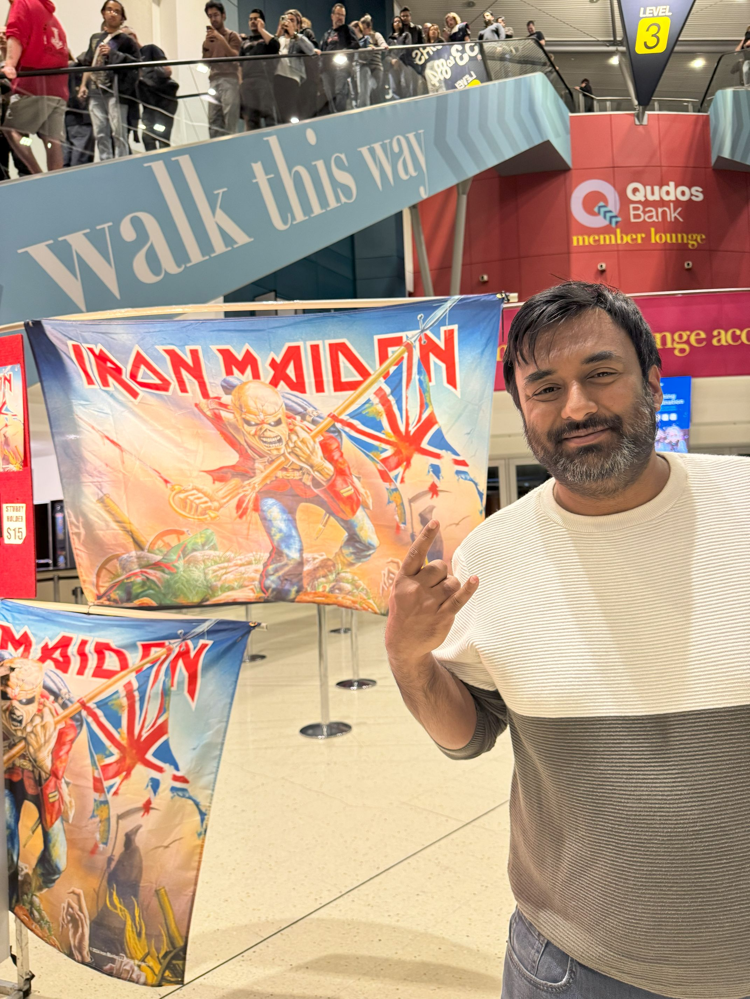

+++
author = "Sathyajith Bhat"
categories = ["Life"]
tags = ["weekly-notes", "gaming", "Civilization VI", "Civilization VII", "DadLAN"]
places = "Sydney"
type = "post"
series = ["Weekly notes"]
url = "/weekly-notes-37-2024/"
title = "Weekly notes 37/2024"
date = 2024-09-15T12:00:00Z
summary = "Week 37 summary - another kickass concert and a LAN gaming event."
images = ["/weekly-notes-37-2024/thumb-iron-maiden.jpg"]

+++

_Thumbnail image: At Qudos Bank Arena for the Iron Maiden concert ._ 

### What's been happening

* After a couple of weeks of warm weather, we're back to the cold times. It's been a rather chilly week and I've had to retire my shorts to my wardrobe for a bit.
* Another concert this weekend - our 15th concert of the year - Iron Maiden live at the Qudos Bank Arena. Amazingly, we almost missed this concert. I'd known that Iron Maiden were coming to Sydney way back in June and told Jo but she didn't register/realize it. Cue last week, just a week before the concert she tells me they're coming and I'm like 😑.

  

  Killswitch Engage kicked off the concert for them and were received quite well. And when Iron Maiden hit the stage, the reception was phenomenal. The Future Past Tour as Iron Maiden calls it focused pretty heavily on songs from their most recent album [Senjutsu](https://open.spotify.com/album/3TymcPWXqsCRA5oSL0TkPU?si=C1yCnlg5QDK9X5sJ0QEFvg) and from the 1985 album [Somewhere in Time](https://open.spotify.com/album/0OEg65hPhgP7B0Dy9TqP2L?si=BMNVcWC4QpO8_kkRIRUCwA). The set design was fantastic with emphasis on a futuristic cyberpunk design. The setlist is [here](https://www.setlist.fm/setlist/iron-maiden/2024/qudos-bank-arena-sydney-australia-5bab83b8.html). Some photos below, apologies on the fairly blocky pics.

  

  

  

  

  

  

  

  

  

  

  

  

* It was the September edition of [DadLAN](/weekly-notes-33-2024/) and I wasn't going to miss it. This time, there's two subnets for Sydney - one for City & other for Sydney Inner West. Both are fairly equidistant for me but I decided to go to the Inner West Subnet which was in Newtown as it was easier to reach via public transport. And it was good fun - we played Unreal Tournament 2004 again, and despite me being pretty clumsy with FPS, I did fairly decent. I don't think anyone was keeping score anyway but feels nice to get some kills in! 
  * While I was at DadLAN, Jo went over to some of the record stores in Newtown and found some pretty sweet records:
    * Foo Fighters - Echoes, Silence, Patience & Grace
    * Oscar Peterson - My Favorite Instrument
    * Elvis Presley - All The Best
    * Styx - Paradise Theatre 
    * Eagles - Eagles Live

  Can't wait to listen to them! We've collected quite a few records now and I need to catalogue them properly. 

  

  

  

* Civilization VII had a [showcase](https://www.youtube.com/watch?v=JjUdkPW3zLg) of one of the major changes to the game - the various ages and age transition. In Civilization VII, each game players through three distinct ages and each age can be represented by a unique Civilization and a leader. The showcase is about an hour and half long and is pretty densely packed with lots of information that I am ignoring till I play the game. Some of the principles of Civilization VI will still be retained (Firaxis has a 33% rule where each new Civilization game will retain 33% of the original features, 33% will be improvements of the existing features, and the rest are all new features). I'm not quite happy with the UI, icons and typography and hope that will be changed soon. The video features one of their Senior Historian - Dr Andrew Johnson is an amazing persona and, and you can see how passionate is about history and how it ties into the game. I did some research and found he's completed a PhD in Anthropology from Cornell and he was actually an Associate Professor at Ashoka University in India. There's also a blog that [talks about this](https://civilization.2k.com/civ-vii/news/dev-diary-1-ages/). 

* I completed yet another game in Civilization VI. However, this one is my highest score yet, and a Cultural victory game. Cultural victories are some of the hardest in Civilization VI due to the obscure mechanics involving generation of tourism, and especially when you're playing against the AI there really isn't a lot that you can do to counter it despite pulling out tons of more Culture and tourists. Annoyed that despite my culture and tourism outputs, the AI was still running away and making my cultural victory a long drawn one, I decided to wage a war and take over all the cities - well, the initial goal was just to plunder the cultural districts, but when I realized how _badly_ underdeveloped the cities were, I decided to occupy the cities. I still have no idea how it was able to run away with such high culture and tourists despite such anaemic cities.

### Music of the Week

I was looking for music videos from Iron Maiden's Senjutsu album and came across this banger of a track - "[The Writing On The Wall](https://www.youtube.com/watch?v=FhBnW7bZHEE)". Amazing song and even better video. And the live performance was equally epic. 



Also had to [include a video](https://www.youtube.com/watch?v=hep_a9o60Pg) of the full show from their concert 



### Link of the week

Vikram makes a hilarious case for Indian cities having _unique_ versions of amusement park rides. Give [his post](https://vikrchan.substack.com/p/sporting-nations) a read. Highly recommend his [Substack](https://vikrchan.substack.com/) as well!

### Subscribe to my posts

Till next week. If you enjoyed reading this post, please consider sharing it via the links below and subscribing to the blog. You can subscribe via email using [Substack](https://sathyabhat.substack.com/). If you prefer RSS/news readers, you can [click here](https://sathyabh.at/index.xml) for the feed link. If you prefer to follow only my weekly notes, here's [the RSS feed](https://sathyabh.at/series/weekly-notes/index.xml) for the Weekly Notes series. 
