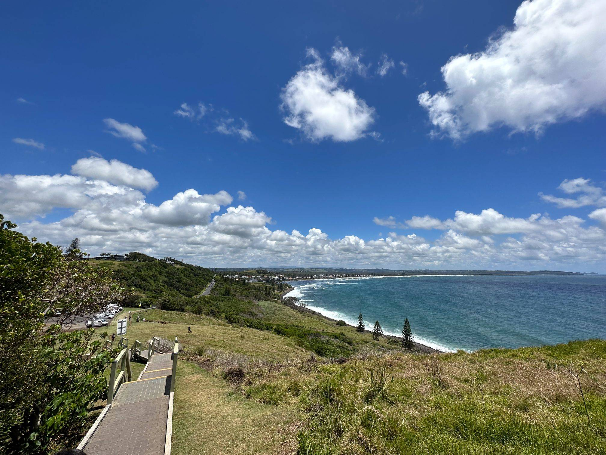

+++
author = "Sathyajith Bhat"
categories = ["Life"]
tags = ["weekly-notes", "Sydney"]
type = "post"
series = ["Weekly notes"]
url = "/2023/10/01/weekly-notes-39-2023/"
title = "Weekly notes 39/2023"
date = 2023-10-01T12:00:00Z
summary = "Week 39 summary - we travel time again, a new season of a favourite TV show and more."
images = ["/2023/10/01/weekly-notes-39-2023/thumb-pat-morton-lookout.jpg"]
+++

_Thumbnail image: [Pat Morton Lookout](https://www.visitnsw.com/destinations/north-coast/byron-bay-area/lennox-head/attractions/pat-morton-lookout) offers seats and a grassy area with idyllic views over the village and up Seven Mile Beach._

### What's been happening

* It's October. I can't believe we're starting the 10th month of the year, so fast. Feels like the year had just started. With October also comes time travel - Daylight Saving time is now in place. This means we're now an hour ahead from India and I'd have to adjust my calling home hours accordingly. 
* It was CDK Day yesterday. I've helped with CDK Day planning for the past 3 years, and the last two years I was the host for a track on CDK Day. I wanted to continue with that tradition, but being in Australia, the timings were way too late for me to run the whole track. But I pitched in for the first two hours :D If you're interested in watching the talks, check out the links on the [CDK Day website](https://www.cdkday.com/).
* We're getting closer to re:Invent and last week, the re:Invent schedule was published. 
    * Along with the schedule, the Attendee Guides have been published. Check out my guide for [Reliability Engineers](https://reinvent.awsevents.com/learn/attendee-guides/reliability-engineering/)
* One of my favourite TV shows, [The Amazing Race](https://trakt.tv/shows/the-amazing-race-2001/seasons/35) is back for it's 35th season(!). It's nice to see the race back in its original form, point-to-point racing, people having to book on the tickets on the own, and hopefully departures 12 hours after the arrival - for the past couple of seasons, they had done some changes to account for COVID. These changes included charter travel for teams and joint departures - which kinda makes sense, but honestly didn't make for interesting viewing.
* I saw that Netflix [shipped its last DVD](https://about.netflix.com/en/news/thanks-for-watching). I remember back 2009 - I’d moved to Austin and found out about Netflix. Was curious about the logistics and how it worked. Was mind blown by how fast it was delivered. Fun fact: I rented out Gladiator. Are you not entertained?



### Music of the Week

Going on last couple of weeks' trends of covers - here's an amazing electric guitar cover of Pink Floyd's High Hopes by Kfir Ochaion. Kfir absolutely nails the tone and the solos. Great treat for the ear, especially if you love the original. And for those interested in a visual spectacle, background set in Poisoned Glen in Donegal, Ireland gives a great visual treat as well.



### Link of the week

What can you do if you have Wifi on your flight but no internet access? James Vaughan digs into Southwest Airlines failed WiFi and [charts out some neat data](https://jamesbvaughan.com/southwest-wifi/). 

### Subscribe to my posts

Till next week. If you enjoyed reading this post, please consider sharing it via the links below and subscribing to the blog. You can subscribe via email using [Substack](https://sathyabhat.substack.com/). If you prefer RSS/news readers, you can [click here](https://sathyabh.at/index.xml) for the feed link. If you prefer to follow only my weekly notes, here's [the RSS feed](https://sathyabh.at/series/weekly-notes/index.xml) for the Weekly Notes series. 