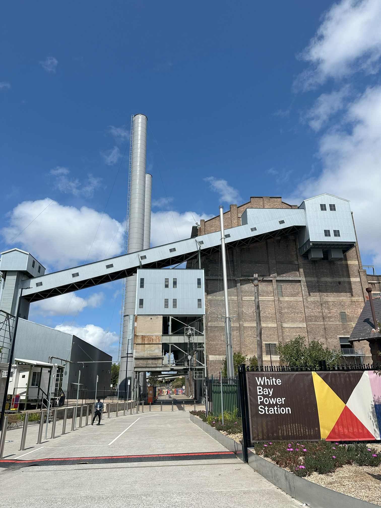

+++
author = "Sathyajith Bhat"
categories = ["Life"]
tags = ["weekly-notes", "gaming", "Yakuza", "concert"]
places = "Sydney"
type = "post"
series = ["Weekly notes"]
url = "/weekly-notes-39-2024/"
title = "Weekly notes 39/2024"
date = 2024-09-29T12:00:00Z
summary = "Week 39 summary - country music time!"
images = ["/weekly-notes-39-2024/thumb-white-bay-power-station.jpg"]
+++

_Thumbnail image: White Bay Power Station is the only power station in Sydney that still holds machinery and equipment from before the 1950s._

### What's been happening

- It's been a pretty cold and wet week. Kinda weird for the weather to change around so drastically - even had to get our hoodies out.
- We went for our second gym class this week. After the second class we were feeling much better compared to how we were feeling after our first. I had a minor muscle catch in my upper thigh and little bit of shoulder pain, but weren't feeling as sore as we did after the first, so we're looking forward to increasing our visits soon.
- Earlier this week, Sega had a publisher sale on Steam and the Yakuza series of games were on sale. I've been meaning to get back to the Yakuza series (I haven't played any since Yakuza 6), so I bought Like Yakuza: Like A Dragon (aka Yakuza 7) and Like a Dragon: Ishin! I played a little bit of Yakuza: Like A Dragon when it was in Xbox Game Pass. I don't have a subscription anymore so I had to start the game from scratch. I wouldn't have remembered where I was anyway so it's not much of a loss. It's only been a few hours, will post my impressions at a later time.
- This weekend, Jo wanted to visit the [Sony Scene Trade show](https://scene.sonyanz.com/) and asked if I wanted to accompany her. Given that I didn't have much to do, I went along with her. The trade show was mainly Sony demonstrating their various audio/visual/imaging devices - cameras, lenses, TVs, the PlayStation etc. There were also a few talks and workshops - we went for one, but left the trade show in the afternoon. The PlayStation booth had couple of PlayStations connected to the Bravia 8/Bravia 9 TVs. There was also a SimRig setup with a [Hyperdrive](https://hyperdrive.com.au/) cockpit and [Thrustmaster GT II](https://www.thrustmaster.com/products/t-gt-ii/) Force Feedback Wheel & Pedal kit. It was fun to play Gran Turismo with the whole set up. I've been meaning to set up a steering wheel/pedal kit at home but space is a premium for now and thus the wait continues.

  

  

  

  

  

- Another concert this week and our 16th of the year! This was a bit of a weird one: Jo booked the tickets for [Sons of the East](https://open.spotify.com/artist/6cSxzHrQgGc4I4Ck5Gewej?si=S-Ey3X1EQa6tsWqzKwczVw) performing at the ICC, only to realize that they were the support artists (along with [James Johnston](https://open.spotify.com/artist/69HMYPrcstafeCTHI3Dcp1?si=IeSSoSoyQ-yLS7iX-zWdUw)) for [Kip Moore](https://open.spotify.com/artist/2hJPr4lk7Q8SSvCVBl9fWM?si=npH7auP7Sa61PvaNQGXxdQ). Might be the first case where we booked a ticket for a support artist without realizing. Oh well, no harm done - we enjoyed all three artists - country music isn't something we listen to a lot but the performances by everyone was fantastic. Can't say the same about the photos below though, heh.

  

  

  

  

  

  

- We completed our New Zealand Visa paperwork and submitted the application. Hopefully, we'll know soon enough whether the visa was approved or not.
- The upcoming weekend is a long weekend as Monday is a holiday for Labour Day. We’re heading over to [Port Stephens](https://www.portstephens.org.au/).

### Music of the Week

Still high on the Iron Maiden concert from couple of weeks ago, I was listening to artists similar to them and came across this amazing song called [Holy Diver by Dio](https://www.youtube.com/watch?v=2lvs2FzF64o). Been on my mind since I heard them.



### Link of the week

There's a lot of timelapse videos of building Factorio bases but today's was among the best that I've ever seen. Factorio is a sandbox factory construction simulation game. You crash land on an alien planet and your goal is to build a rocket to get out of the planet. Building a rocket takes a great deal of resources and you start by building things by hand, slowly expanding your factory to an eventual state where everything is automated. Check out the video [here](https://www.youtube.com/watch?v=Vvo9XK4sGuM).



### Subscribe to my posts

Till next week. If you enjoyed reading this post, please consider sharing it via the links below and subscribing to the blog. You can subscribe via email using [Substack](https://sathyabhat.substack.com/). If you prefer RSS/news readers, you can [click here](https://sathyabh.at/index.xml) for the feed link. If you prefer to follow only my weekly notes, here's [the RSS feed](https://sathyabh.at/series/weekly-notes/index.xml) for the Weekly Notes series.
