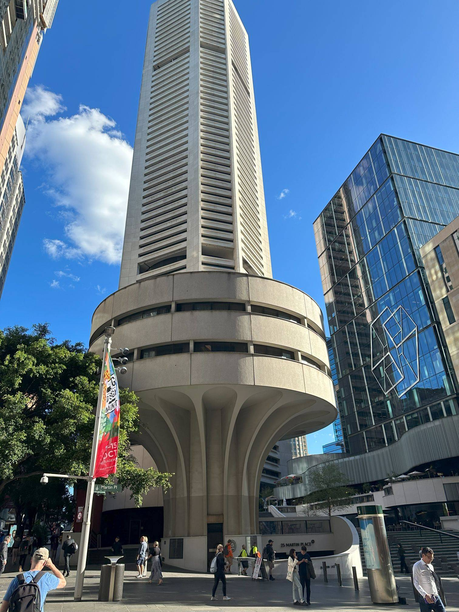

+++
author = "Sathyajith Bhat"
categories = ["Life"]
tags = ["weekly-notes", "Sydney", "gaming"]
type = "post"
series = ["Weekly notes"]
url = "/2023/10/08/weekly-notes-40-2023/"
title = "Weekly notes 40/2023"
date = 2023-10-08T12:00:00Z
summary = "Week 40 summary - sore thighs, upcoming flights and more."
images = ["/2023/10/08/weekly-notes-40-2023/thumb-martin-place.jpg"]

+++

_Thumbnail image: Martin Place is a pedestrian mall in the Sydney central business district. Martin Place has been described as the "civic heart" of Sydney. Pictured here is 25 Martin Place, formerly known as the MLC Centre._

### What's been happening

It's been a painful week. 

* We had a fire evacuation drill in our office building. My office is on the 31st floor. Having to walk down 31+ a few more floors was... not pleasant. My thighs haven't recovered from this yet, and hope to recover soon, before my upcoming airport run.
* Vacation time! I'll be flying to India this Friday. I'll be spending a week in Mangalore and the second week in Bangalore. It'll be a year since I was in India and look forward to a little bit of downtime before the upcoming re:Invent storm.
* Speaking of which... I will be [a speaker](https://hub.reinvent.awsevents.com/attendee-portal/catalog/?search=NET327) at this year's re:Invent! I will be joining Sean Meckley, the GM of the AWS Global Accelerator service team, talking about The Trade Desk's experience with the AWS Global Accelerator and how we use it. I've been working on the slides for the talk and will have a dry-run this upcoming week, just before I head off to India.
* With the deadline for filing Australian Income tax returns coming up this month end, I finished filing the returns (put it away for long). The experience was pretty smooth. The ATO portal automatically filled in most of the details: TDS, Bank interest amounts, medical insurance details, dividend information etc. I got my refund in couple of days as well. I wish the Indian Tax portal would prefill a lot of the details and save us the time. Ah well.

### Music of the Week

Fleetwood Mac's got some amazing songs and I was watching some of their videos when I came across [Lindsey Buckingham's live performance of "Big Love"](https://www.youtube.com/watch?v=bVsxvoUX9Rw&list=PL777F6F97DC4ADD07&index=25). Amazing, flawless performance.



### Link of the week

The link I post here is usually picked from the articles I share/save to my Raindrop collection, creatively titled [Wot I Read](https://raindrop.io/sathyabhat/wot-i-read-34029926). This is now publicly available in case you want to follow. I haven't seen any WWE stuff since quite some time, but it's pretty well known that WWE now is not what it used to be back in the Attitude era. Here's a nice video which talks about why [WWE feels so different today](https://www.youtube.com/watch?v=1H1Pq34RAxk&si=Cz8uxeHHa0JgEwPY). For a change, there's some nice comments on the video too.

### Subscribe to my posts

Till next week. If you enjoyed reading this post, please consider sharing it via the links below and subscribing to the blog. You can subscribe via email using [Substack](https://sathyabhat.substack.com/). If you prefer RSS/news readers, you can [click here](https://sathyabh.at/index.xml) for the feed link. If you prefer to follow only my weekly notes, here's [the RSS feed](https://sathyabh.at/series/weekly-notes/index.xml) for the Weekly Notes series. 