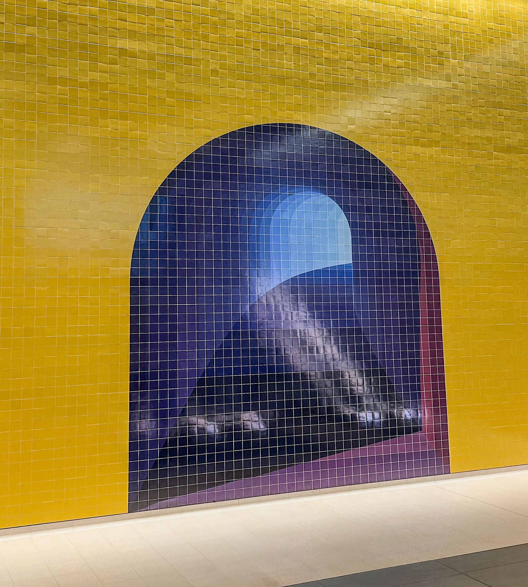

+++
author = "Sathyajith Bhat"
categories = ["Life"]
tags = ["weekly-notes", "travel", "road trip"]
places = "Sydney"
type = "post"
series = ["Weekly notes"]
url = "/weekly-notes-40-2024/"
title = "Weekly notes 40/2024"
date = 2024-10-05T12:00:00Z
summary = "Week 40 summary - long weekend."
images = ["/weekly-notes-40-2024/thumb-gadigal-the-underneath.jpg"]
+++

_Thumbnail image: The Underneath are two tiled artworks by Callum Morton marking both entrances of the new Gadigal Metro Station. Pictured here is one of them._ 

### What's been happening



* This will be a short post since Jo & I are doing a road trip to Port Stephens, staying in Anna Bay. I'll have a separate longer post about the trip similar to the [Blue Mountains travelogue](/2023/05/07/blue-mountains-day-trip-travelogue/).
* At work, I found and fixed a minor bug for our  internal "scream testing" tool (scream testing - block/stop something so that we can find out who's using for some really old infrastructure that have no tags etc). When I was testing the tool, I noticed that the tool reported it couldn't successfully block even when it completed the block successfully. After some time of debugging and looking at the code, I realized it was because the notification was looking at a wrong key in the response object in one case and in the other, the response object was not being passed to the arrow function (this is all in Typescript). The fix was quite easy but in my 18 something years of working this is the first time I'm doing a front-end fix (if you exclude the few years of Oracle Forms stuff anyway). Time to add React experience to CV 😂😆.

* Our gym is closing :/ We received an email saying that the owners are not going to renew the lease and shutdown the gym. Feels bad, I was just getting used to the gym and the trainer. The gym's been running since quite some time and a few folks have been going to this gym for many years, so not a light decision. What's in store for us? We'd taken a 10-visit subscription when we signed up because we wanted to get a feel for the gym before committing to a longer period, so we will complete our 10 visits before the gym shuts down. And probably sign up at another UBX which is near our house (but not as near as this one is).

### Music of the Week

Came across this cover of [Outkast's Hey Ya](https://youtu.be/PWgvGjAhvIw?si=FnhNYO_6Hnn-26t7), as performed by [Obadiah Parker](https://youtu.be/c745E7T_Wvg). It deviates from Outkasts' version every so lightly but is very nicely done. 

  

### Link of the week

Ninad tries got resurrect his old Raspeberry Pi purchased in 2013 and hooks it up with a Network Video Recorder(NVR) and a custom LCD screen to stream the video from the cameras. Great [post](https://ninad.pundaliks.in/blog/2024/09/old-pi-gets-a-new-life/) on his struggles to get it up and running and eventual triumph!

### Subscribe to my posts

Till next week. If you enjoyed reading this post, please consider sharing it via the links below and subscribing to the blog. You can subscribe via email using [Substack](https://sathyabhat.substack.com/). If you prefer RSS/news readers, you can [click here](https://sathyabh.at/index.xml) for the feed link. If you prefer to follow only my weekly notes, here's [the RSS feed](https://sathyabh.at/series/weekly-notes/index.xml) for the Weekly Notes series. 
