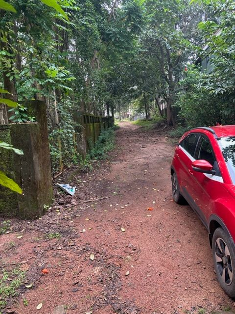

+++
author = "Sathyajith Bhat"
categories = ["Life"]
tags = ["weekly-notes", "Sydney", "Mangalore", "Diablo IV", "gaming"]
type = "post"
series = ["Weekly notes"]
url = "/2023/10/15/weekly-notes-41-2023/"
title = "Weekly notes 41/2023"
date = 2023-10-15T12:00:00Z
summary = "Week 41 summary - a week of several firsts."
images = ["/2023/10/15/weekly-notes-41-2023/thumb-home.jpg"]
draft = true
+++

_Thumbnail image: Driveway to my home in Mangalore._ 

It's been a week of several firsts.

### What's been happening

* The first re:Invent dry run went well. Sean and I completed the talk within the allotted time - actually a bit too early. We got some good feedback on our content and will work on improving them. 
* It's my first visit back home to India since moved to Australia. Also for a first - this is the first blog post I'm writing on my iPad. Since [my blog](https://sathyabh.at) is a static site powered by Hugo (for people reading on Substack - the post is imported to Substack later), I was trying to see how I can write a post without spending a lot of time trying to figure it out. I remembered [VSCode.Dev](https://vscode.dev) gives me an online VS Code editor. It can also connect to my GitHub repo and I can write posts on the browser. 
    * The writing experience on VSCode.Dev was pretty nice, similar to writing on my computer. I even did a git branch change midaway as I was writing this and it applied the changes seamlessly. Uploading of an image worked pretty well too. The only pain point I noticed (and this was a problem a year back when I first experimented with iPad-only travel), is that when I choose a different tab and switch back, it doesn't detect my attached keyboard and I need to fiddle at different places before the event that triggers keyboard attachment gets fired. This can be really annoying, especially if you're referencing contents from another tab.
* Another first - I did a business class travel. Qantas had a well-priced business upgrade available via points (42,000 points to be precise - well-priced as compared to a business-class ticket purchase anyway) and because of my previous travels and that I could transfer points from Jo's account over made requesting the upgrade a no-brainer. The upgrade was approved evening before the flight. Qantas mentions that not all benefits may be made available if upgrade gets approved at the gate/airport. To be honest, lack of lounge access is not that big of a deal as compared to a roomier seat. Qantas' service on the business class was fantastic. I'll write up on this on a separate post. 
* Another first - I'm experimenting with FindPenguins as a way to share my travels. FindPenguins lets me upload photos/videos (or queue them up as drafts and upload later) and has good features to mark profiles/trips/individual events as private. I've been trying to find out a way to share a trip easily - the typical way I suppose is via Twitter/Instagram, or send pictures directly via WhatsApp or Discord. While it's easier to provide a trip URL, but unless people create an account and follow, they won't be notified of new posts. Not sure if there's any better solution. For now, check out my [FindPenguins trip URL](https://findpenguins.com/sathyabhat/trip/india) and check  regularly for updates.
* I've been chilling at home in Mangalore. Today, my sister, neice and I did a small day trip to Moodubidiri and surroundings. Check out my FindPenguins trip below.

<a href="https://findpenguins.com/sathyabhat/trip/india" target="_top">India | FindPenguins</a>

### Music of the Week

I came across this amazing acoustic-electric + finger peck version of a masterpiece. 

Check out [Slow Dancing in a Burning Room by Mike Dawes](https://youtube.com/watch?v%253DTp6r82DB63Q%2526si%253DJ1k_bePVK7GAk0Q2).



I haven't read a lot this week, so I'll point you to a [great tribute by The Corrs](https://youtu.be/VRspLUybOS4?si%25253DGqpIpHV9KTsJqDh7) to Fleetwood Mac's Christine McVie



### Link of the Week

After a lackluster first season and a poor endgame launch, Blizzard's Season 2 and the next big patch aiming to overhaul Diablo IV's endgame systems looks promising. MaxRoll has a [great summary of](https://maxroll.gg/d4/news/diablo-4-patch-1-2-for-season-2-massive-changes-incoming) what's changing.

### Subscribe to my posts

Till next week. If you enjoyed reading this post, please consider sharing it via the links below and subscribing to the blog. You can subscribe via email using [Substack](https://sathyabhat.substack.com/). If you prefer RSS/news readers, you can [click here](https://sathyabh.at/index.xml) for the feed link. If you prefer to follow only my weekly notes, here's [the RSS feed](https://sathyabh.at/series/weekly-notes/index.xml) for the Weekly Notes series. 