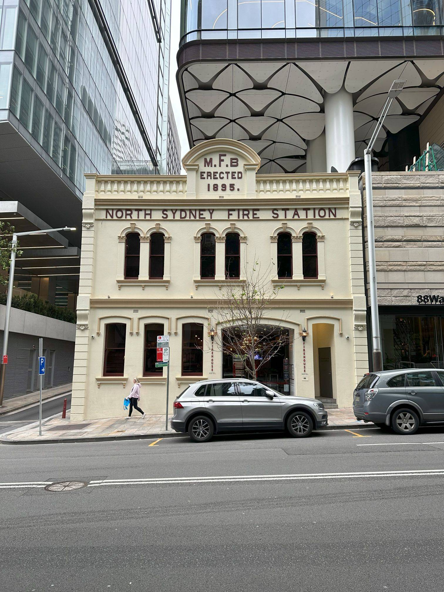

+++
author = "Sathyajith Bhat"
categories = ["Life"]
tags = ["weekly-notes", "gaming", "Diablo IV"]
places = "Sydney"
type = "post"
series = ["Weekly notes"]
url = "/weekly-notes-41-2024/"
title = "Weekly notes 41/2024"
date = 2024-10-12T12:00:00Z
summary = "Week 41 summary - recovering from the long weekend."
images = ["/weekly-notes-41-2024/thumb-north-sydney-fire-station.jpg"]

+++

_Thumbnail image: The North Sydney Fire Station / Firehouse Hotel is a 1895 heritage listed fire station that has been remodelled into a two-level restaurant._ 

### What's been happening

* It was bit hard to get back to work because I was still in vacation mode. We have a long-ish vacation (and visit to India) coming up next month, so looking forward to that.
* We had our health assessment earlier this for 186 ENS Permanent Residence visa application. The health assessment was pretty brief - fill in a form about history, complete a chest X-Ray, some blood tests and a physical examination. All in all, we completed it in an hour.
  * Along with this, we also got our Medicare cards. I thought we wouldn't be eligible for [Medicare](https://en.wikipedia.org/wiki/Medicare_(Australia)) till our Permanent Residence was approved, but it seems that applying for Permanent Residence is 
* It's been about a month since I signed up for the gym and I've been going regularly - started with once a week for the first two weeks and now at twice a week. This upcoming week will be the last week at UBX North Sydney - they are shutting down end of week. I still haven't figured out what I will do. Jo went to check out a Muay Thai gym - might considering joining her for that.

### What I have been playing

* The new expansion for Diablo IV called Vessel of Hatred is out. I didn't get to play a lot of it - just started. Hope to finish it off by the next week and jump into the seasonal endgame. 
* I also started playing a bit of OpenTTD. I played a lot of Transport Tycoon Demo as a kid so it's always nice to go back to it and try to relive what I used to do! 

### What we ate

Soko Soko is a small, quick service Japanese/Korean fusion restaurant nearby Eat Street in North Sydney. We went over here last Friday to grab a quick lunch and ordered the Koren Pork poke bowl for me and Jo had the Teriyaki Salad bowl. The food was really good both quality and quantity wise. Highly recommend a visit.

  

  

On Saturday, we went to Venn Cafe for brunch. Compared to other cafes, Venn has better food options and the coffee isn't too bad either. I had the Fried Potatoes with Pesto and Poached Eggs, while Jo had the Pumpkin Fritters. I didn't my food that much - the potatoes while nice and crunchy but pretty bland for the most part. Jo's Pumpkin Fritters were really good and would have traded my food for hers pretty bland for the most part. Jo's Pumpkin Fritters were really good and would have traded my food for hers 😆. The coffee was good as always. Worth a revisit to check out the other food options!

  

  
  
  
  
  

  

  

### Music of the Week

I really enjoyed listening to Diablo 4: Vessel of Hatred's soundtrack. It's really well done and suits the setting of the expansion (the jungles of Nahantu) really well. My favourite track is called "Lingering Hatred" (track 5), some incredible work in that album. Give it a [listen](https://youtu.be/EcEbkLNDlm0?t=755)

  

### Link of the week

[Dookie Remastered](https://www.dookiedemastered.com/) - I came across this website that has tracks of [Green Day's](https://open.spotify.com/artist/7oPftvlwr6VrsViSDV7fJY?si=MLmLfjhwSVqirt43io9i4Q), demastered(!) in 15 formats. Check it out!  

### Subscribe to my posts

Till next week. If you enjoyed reading this post, please consider sharing it via the links below and subscribing to the blog. You can subscribe via email using [Substack](https://sathyabhat.substack.com/). If you prefer RSS/news readers, you can [click here](https://sathyabh.at/index.xml) for the feed link. If you prefer to follow only my weekly notes, here's [the RSS feed](https://sathyabh.at/series/weekly-notes/index.xml) for the Weekly Notes series. 
