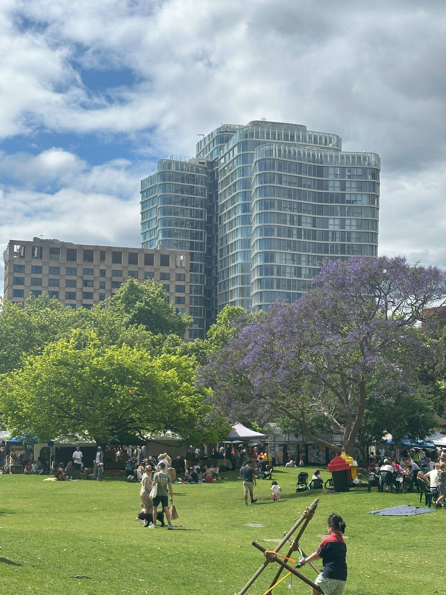

+++
author = "Sathyajith Bhat"
categories = ["Life"]
tags = ["weekly-notes", "gaming", "Diablo IV"]
places = "Sydney"
type = "post"
series = ["Weekly notes"]
url = "/weekly-notes-42-2024/"
title = "Weekly notes 42/2024"
date = 2024-10-20T12:00:00Z
summary = "Week 42 summary - back to guitar classes and we explore some cafes."
images = ["/weekly-notes-42-2024/thumb-jacaranda-oct-2024.jpg"]

+++

_Thumbnail image: Jacaranda season is here and Sydney is slowly seeing the purple bloom of Jacaranda._ 

### What's been happening

* Our New Zealand Visitor Visa was approved. Many people were surprised that we needed a visa to visit New Zealand despite being in Australia. New Zealand maintains a list of visa waiver countries and unsurprisingly, India is not in the list of visa waiver countries list. And since we aren't Australian permanent residency holders, we still need a 'proper' visitor visa. For Indian citizens who are permanent residents of Australia, they'd still need a New Zealand ETA - but the turnaround time for such applications is much shorter (a few days vs a few weeks). The nice thing about New Zealand visa was that everything was online and digital (though we had to get photographs taken to the spec of NZ Visa). A special mention is that we could login to the visa application site and fetch the current status of our visa application.
  
* Our guitar classes have started again and it's good to be back. Despite not having practiced in the past few weeks, I was able to pick up where we left off - shows how much better it would have been if I did practice 😆
* I completed the campaign of Diablo IV: Vessel of Hatred and I must say I was completed underwhelmed by the story and the delivery. I don't play Diablo for the story and I'm not looking for the greatest piece of story writing - but you do expect some amount of _effort_ for a paid expansion. That said, the new character class and the fantastic music (linked in [last week's weekly notes](/weekly-notes-42-2024/)) does a whole lot to redeem the disappointment of the poor story. There's a decent amount of lore being backfilled by means of off-quest dialogues with other NPC characters - more than usual as compared to the base game so it's good to see that. There's some nice throwbacks to Diablo 2 - characters, locations, music that brought a smile on my face. Some screencaptures of the campaign are below:

  

  

  

  

  

  

* This Friday marked the last day of UBX North Sydney as they are shutting down. It's a shame but such is life. Jo & and I were beginning to enjoy the visit - the coaches were really good and we were beginning to have fun. I will sign up for a new gym come Monday - don't want to break the momentum as I think it will be hard for me to get back to it if I stop now.
* We bought an air fryer and are experimenting with it. It's not the first time that we're using it - back when I was in Romania and during COVID times, I had purchased the air fryer as it was a simple and easy way to cook meat(and I wasn't too comfortable handling meat back then).
* We had some friends come over to our house on Saturday evening. We talked about a bunch of random stuff and was nice to connect. It's hard to make new friends in a new country, especially at later years so was good to have them over. 
* This Sunday morning was quite noisy and we could hear some chants - sounded like protestors. A quick search and [I found out](https://www.smh.com.au/national/royal-visit-australia-live-updates-king-charles-queen-camilla-to-attend-north-sydney-church-service-20241019-p5kjn4.html?post=p57qqw#p57qqw) that King Charles and Queen Camilla were on the way to the St Anglican Church and the protestors were chanting against them. There certainly was a huge crown awaiting then. I took this picture and walked by, as Jo was waiting for me at the Stanton Library. 
  

### What we ate

We went to [Lumos Ground Espresso](https://maps.app.goo.gl/Hw32HL2ADpfMqFmu6) on Pacific Highway, North Sydney. I've been meaning to check out the place since quite some time and on Friday after we had lunch, Jo was open to the idea so went there for post-lunch coffee. The place was good and we enjoyed both our coffees - Jo got the cold brew and I got the cappuccino. We also bought a carrot cake to share.

  

  

  

  

  

  

After picking up a few books from the library, we stopped by The Library Cafe just next to the Stanton Library. The Library Cafe is a nice little cafe that is worth revisiting for the cozy place and some nice coffee. Walking in, it seems like there's not a lot of places to sit but then you realize there's ample place at the rear and outdoor seating as well.

  

  

  

### Music of the Week

[Malcolm](https://x.com/mloclam) posted a link to this [live rendition](https://www.youtube.com/watch?v=Lk0sZwXTwnc) of Post Malone's Sunflower, and what an amazing version it is! The bass lines, the fiddle, the slide guitars all add layers to an already amazing track. 

  

### Link of the week

I've been following Matt Mullenweg's crazy tirades especially around the WP Engine dispute since it first popped up and I cannot believe what has been going on. It's a shame because I did look up to him but as the popular phrase goes - [never put someone on a pedestal](https://www.merriam-webster.com/dictionary/put%2Fplace%20%28someone%29%20on%20a%20pedestal). TechCrunch has a story on [the drama](https://techcrunch.com/2024/10/19/wordpress-vs-wp-engine-drama-explained/) and 404 Media has a insider [view of what's been happening inside](https://www.404media.co/automattic-buyout-offer-wordpress-matt-mullenweg/) Automattic. 

### Subscribe to my posts

Till next week. If you enjoyed reading this post, please consider sharing it via the links below and subscribing to the blog. You can subscribe via email using [Substack](https://sathyabhat.substack.com/). If you prefer RSS/news readers, you can [click here](https://sathyabh.at/index.xml) for the feed link. If you prefer to follow only my weekly notes, here's [the RSS feed](https://sathyabh.at/series/weekly-notes/index.xml) for the Weekly Notes series. 
