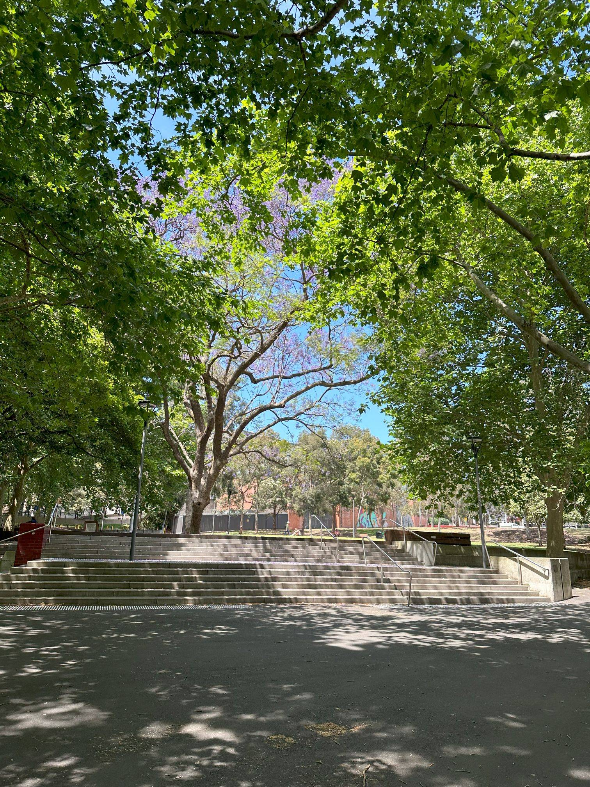

+++
author = "Sathyajith Bhat"
categories = ["Life"]
tags = ["weekly-notes",  "gaming", "Bangalore", "Diablo IV"]
places = [ "Bangalore"]
type = "post"
series = ["Weekly notes"]
url = "/2023/10/30/weekly-notes-43-2023/"
title = "Weekly notes 43/2023"
date = 2023-10-30T12:00:00Z
summary = "Week 43 summary - back to the grind."
images = ["/2023/10/30/weekly-notes-43-2023/thumb-sydney-harmony-park.jpg"]
+++

_Thumbnail image: [Harmony Park](https://www.cityofsydney.nsw.gov.au/histories-local-parks-playgrounds/history-harmony-park)._ 

### What's been happening

Another delayed post, this time because I was flying back to Sydney.

- My vacation is over, and I'm back in Sydney. Had a good time in Mangalore and Bangalore.
    - I met a few people in Bangalore. With my short stay, I wished I could meet more people, but sadly it did not happen. I will try to plan better next time.
    - With [Nemo's](https://tatooine.club/@nemo) email, I realized I missed [India FOSS 3.0](https://indiafoss.net/2023/conference/schedule). It's a shame I did not plan for this either.
- This is my first visit to Bangalore since I moved to Sydney, about a year and a half ago. It's always interesting to visit a city that you've spent a long time in and look for changes.
    - For airport transfers, I used [Shoffr](https://www.shoffr.in/). Shoffr is an all-electric taxi company and offers pre-booked rides. The cab arrived ahead of time, and the cars were neat and clean inside - exteriors, however, had bad scrapes and bruises. Both the cars were a BYD E6 and looked like the Toyota Innova. I really liked that when the cabs arrived, they had the air-conditioning already running, and I didn't have to wait for the car to cool down. They provide you with small water bottles, some mints, and my cab on the way back to the airport had the day's newspapers - in English and Kannada.

        

    - I stayed at my home in JP Nagar, which is being rented out to Jo's cousins. They made me feel like a King. Thanks, Sanju & Viggy 😊
    - In terms of Bangalore, not much has changed. JP Nagar 24th Main/100ft Ring Road, however, is quite buzzing now - akin to Indiranagar 100ft road. I still remember the time when we moved to our apartment - after the housewarming function, we stepped out for dinner only to find a lot of restaurants had already closed by 9:30 pm. This is no longer the case. With the renewed shops also comes bad traffic - since the roads have more or less remained the same.
    - Metro coverage has improved, but last-mile connectivity remains poor. There's a feeder bus that has started from near my apartment, but when I tried to use that, it either left early or left late - I can't figure out which it was. The feeder buses are the BMTC big buses that run every hour or so. I can't help but think they'd have better success if BMTC runs smaller buses more frequently.
    - The evening before I left Bangalore, Saurabh and I went over to Jayanagar 4th block, [having some purple tea, walking](https://findpenguins.com/sathyabhat/footprint/653e2d6c14c870-63719763) and looking at buildings and just reminiscing about ye good ol' days. It was a nice walk 😊
- My return flight got upgraded to a Business class as well (paid, not free). One of the crew members on the Qantas flight remembered me from the previous flight a couple of weeks ago, which was pretty nice. The flight took off from Bangalore at 5:30 pm, and after the inflight meal, I promptly switched my seat to the nearly fully reclined bed mode and had a really good sleep. Sadly, despite reaching an hour ahead of the scheduled arrival, the aircraft didn't get an empty bay, and we were waiting on the runway for the full hour.
- Once disembarked, I went over to immigration and cleared it pretty fast (immigration in Australia is always fast - that's a nice touch). My bag had arrived at the baggage carousel; I picked it up and went over to Biosecurity. Australia's really strict on biosecurity, and whatever time you'd have gained from the quick immigration, you'd lose out at biosecurity. There's a strict must-declare policy where you must declare any food items that you might be getting (including pickles, masalas, etc.). They must be commercially packed, sealed, and labeled with the ingredients list, and any home-cooked food will not be allowed. Till now, both Jo and I hadn't brought anything from India, but in this trip, Jo sent me a list of masalas, snacks, and other things to get from India. I filled in the biosecurity declaration form, told the biosecurity officers all the things that I am carrying, they inspected a few of the items and cleared them all. Since there weren't any other international flights arriving at this time, biosecurity was done far quicker than I thought, and I reached home.

    

- The new season of Diablo IV has started and has been getting significantly better reception than the first. I started my character (a Druid this time) on the Steam Deck, but didn't play much. Look forward to playing more in the weeks ahead.

- Really happy to be back with Jo 😊



### Music of the Week

[Tom BetGeorge](https://www.youtube.com/@TomBetGeorge) makes some amazing light shows, and this one with one of my favorite Foo Fighters' songs, [Everlong](https://www.youtube.com/watch?v=uk_9Snn8QtQ), is just awesome.



### Link of the week

Duolingo has a [music course that is supposed to be releasing soon](https://blog.duolingo.com/music-course/). I used Duolingo quite heavily when I was in Romania and had a decent amount of success with it, especially to build up my Romanian vocabulary. I'd be keen to try out the music course when it's out.

### Subscribe to my posts

Till next week. If you enjoyed reading this post, please consider sharing it via the links below and subscribing to the blog. You can subscribe via email using [Substack](https://sathyabhat.substack.com/). If you prefer RSS/news readers, you can [click here](https://sathyabh.at/index.xml) for the feed link. If you prefer to follow only my weekly notes, here's [the RSS feed](https://sathyabh.at/series/weekly-notes/index.xml) for the Weekly Notes series.
