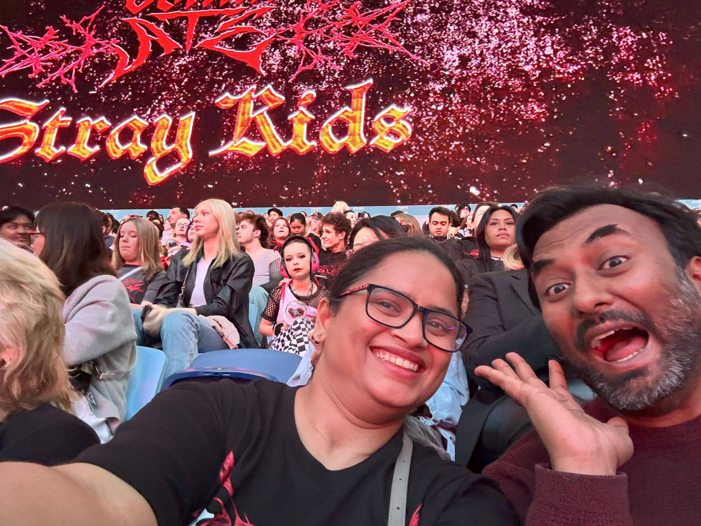

+++
author = "Sathyajith Bhat"
categories = ["Life"]
tags = ["weekly-notes", "gaming", "concert", "Diablo IV"]
places = "Sydney"
type = "post"
series = ["Weekly notes"]
url = "/weekly-notes-43-2024/"
title = "Weekly notes 43/2024"
date = 2024-10-27T12:00:00Z
summary = "Week 43 summary - busy work week and exploring a new genre."
images = ["/weekly-notes-43-2024/thumb-stray-kids-concert-241027.jpg"]
+++

_Thumbnail image: Very excited at Stray Kids concert!_ 

### What's been happening

* It's a busy work week - we had a couple of colleagues come down from the US for a new project that they're kicking off, and I was part of the small group trying to figure out the details. Most of the week was spent in meetings talking about problems, use cases, thinking through designs and a lot of white boarding. I learnt a lot about many aspects of ad-tech that I didn't know about. It was a very interesting week.
* I joined another gym - Body By Brando. While not a boxing gym, they focus more on functional strength training, and that's something I've been meaning to focus on. I've had a couple of classes now and it's looking pretty good. We'll see how it goes.
* With the Diablo IV campaign over, I've been playing the seasonal quest and powering the Spiritborn to the endgame. I got lucky with some drops and made it easy to progress further and bump to Torment II difficulty. Slowly trudging my way towards Torment III now.
  
  

* Our second guitar class went well - we have a new person who's joined us. We've been learning and playing Eric Clapton's Wonderful Tonight and Coldplay's Yellow - and I have been struggling with getting the chords right. While we're in a beginner class, we have about half an hour overlap with the advanced players' class and there's a new person who has joined the advanced class with an electric guitar and it's really amazing to see some nice tricks with the electric guitar such has bends and mutes in person.
* I went for my first K-pop concert with Jo. Stray Kids were performing in Sydney, and Jo wanted to go for their concert and insisted on me coming along as well. I was told K-pop concerts are quite an experience and that I should be prepared for a lot of screaming. I just didn't expect it to be hysterics. The screaming aside, I had a good time at the concert. The Stray Kids performed pretty well - some great choreography, amazing light and camerawork, and a little bit of pyrotechnics as well ensured awesome moments. They performed for almost two and a half hours straight - breaking on a rare moment for some introductions at the start, in the middle when each member of the band was performing their solos, and towards the end as they explained about their song choices. Of course, a lot of it was inaudible thanks to the ridiculous shrieking 🤷🏽‍♂️. All in all, Jo had a great time (I hope, I asked and she said she did) and I enjoyed it as well.

  

  

  

  

  

  

### Music of the Week

[Hollow Coves](https://open.spotify.com/artist/7IAFAOtc9kTYNTizhLSWM6?si=8tscJAxeQwKtDnNoYBo-Jg) are an Australian indie-folk band. Their songs very nice and soothing to hear. [Coastline](https://www.youtube.com/watch?v=Cp-1t9B62zc) is a great song to relax to. It's a shame that we will miss their upcoming Sydney concert - next time!

  

### Link of the week

I've been watching Tom BetGeorge's Light Shows for a few years now and they've always been fantastic. This year he takes it a notch above. Give it [a view](https://www.youtube.com/watch?v=QYxJ7swX4lg) - I think you will enjoy it.

   

### Subscribe to my posts

Till next week. If you enjoyed reading this post, please consider sharing it via the links below and subscribing to the blog. You can subscribe via email using [Substack](https://sathyabhat.substack.com/). If you prefer RSS/news readers, you can [click here](https://sathyabh.at/index.xml) for the feed link. If you prefer to follow only my weekly notes, here's [the RSS feed](https://sathyabh.at/series/weekly-notes/index.xml) for the Weekly Notes series. 
