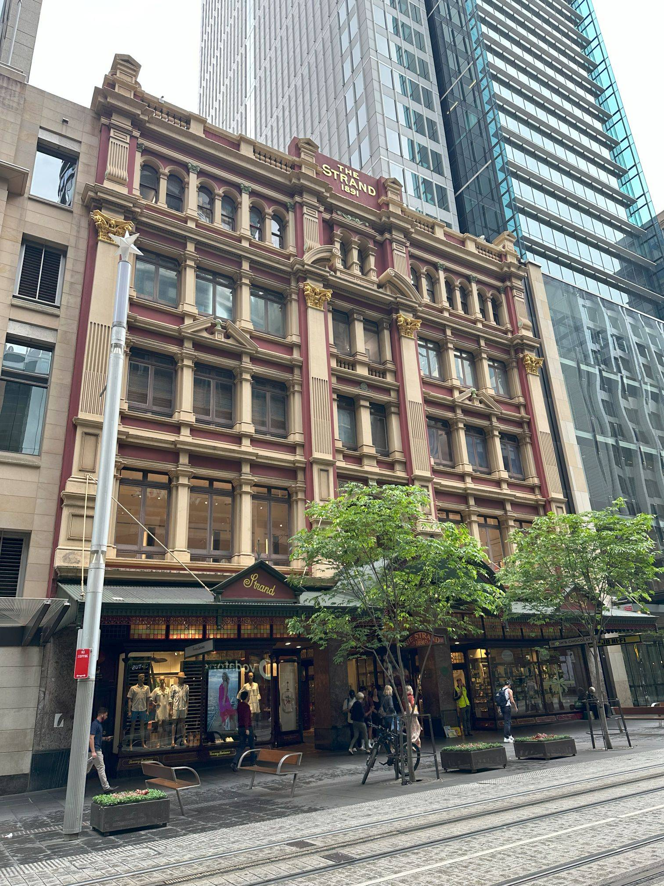

+++
author = "Sathyajith Bhat"
categories = ["Life"]
tags = ["weekly-notes", "Sydney", "gaming", "Diablo IV", "reInvent"]
type = "post"
series = ["Weekly notes"]
url = "/2023/11/05/weekly-notes-44-2023/"
title = "Weekly notes 44/2023"
date = 2023-11-05T12:00:00Z
summary = "Week 44 summary - a new chair, a walk around the block and more!"
images = ["/2023/11/05/weekly-notes-44-2023/thumb-the-strand.jpg"]
+++

_Thumbnail image: [The Strand Arcade](https://www.strandarcade.com.au/) is a heritage-listed Victorian-style retail arcade located at 195–197 Pitt Street in Sydney, New South Wales._ 

### What's been happening

- AWS re:Invent month is here! Slightly screaming in panic, anticipation and excitement. [My talk does not have](https://hub.reinvent.awsevents.com/attendee-portal/catalog/?search=NET327) reserved seating available anymore, only walkups. I also have my second dry run scheduled for this week.
    - If you'll be there at re:Invent and looking for tips, check out my guide for [Reliability Engineers](https://reinvent.awsevents.com/learn/attendee-guides/reliability-engineering/) for some session recommendations tailored to SREs. 
- I'll be giving a talk at the [next Sydney SaaS on AWS Meetup](https://www.meetup.com/sydney-saas-on-aws/events/296986740/) this Wednesday on "Running containers on AWS". I'll publish the slides as usual on my [tech blog](https://sathyasays.com/talks)
- It's Blizzcon weekend, and Diablo IV's new expansion - "Vessel of Hatred" - was announced. The new expansion will continue the story that was, IMO, awkwardly stopped midway and will focus on Torajan jungles. There's a new class that's coming, but the expansion is still about a year away, so should have decent time to find more details over time.
    - On that note, my Diablo IV Seasonal Druid is coming along pretty well - completed the first capstone dungeon at level 43 (sadly, wasn't recording it) and I'm at level 50 now - all set to get into the end game. I'm not sure if I will have the time/patience to get to level 100, I might start another character.

- At the start of the year, I [bought a SecretLab Titan Evo](/2023/02/04/weekly-notes-05-2023/) for myself, replacing the earlier Ikea chair. Since then I'd been asking Jo to get one for herself. She always declined. In the past few months since she started working, her current chair has been inadequate. When I was vacationing in India, Jo borrowed my chair and started using it. When I returned and took my chair back, her old chair wasn't usable anymore 😂😆. So now there's a second SecretLab Titan Evo chair in the house. Highly recommended by both of us!

- Jo & I started going for more walks around our house after work. It's been pretty nice, especially since the temperatures have reduced in the past few weeks. Enjoy some photos from our walks.






### Music of the Week

[Baldur's Gate 3](https://sathyabh.at/tags/baldurs-gate/) has some amazing music, and [I found this awesome](https://www.youtube.com/watch?v=xJtOTvtcpso) performance of the opening theme - The Symphony of Sin.



### Link of the week

I spotted this thread about "What's your go-to self-hosted YouTube channel?" on [Reddit](https://www.reddit.com/r/selfhosted/comments/17mw22b/comment/k7nolen/). If you're planning to get into self-hosting, or want to get some ideas about self-hosting, check out [Nemo's](https://captnemo.in/setup/homeserver/) and [Karan's](https://mrkaran.dev/) blogs (and talks) - they have excellent write-ups. [Bonus plug for my NAS](/2023/01/21/asustor-lockerstor4-as6604t/). 

### Subscribe to my posts

Till next week. If you enjoyed reading this post, please consider sharing it via the links below and subscribing to the blog. You can subscribe via email using [Substack](https://sathyabhat.substack.com/). If you prefer RSS/news readers, you can [click here](https://sathyabh.at/index.xml) for the feed link. If you prefer to follow only my weekly notes, here's [the RSS feed](https://sathyabh.at/series/weekly-notes/index.xml) for the Weekly Notes series. 
