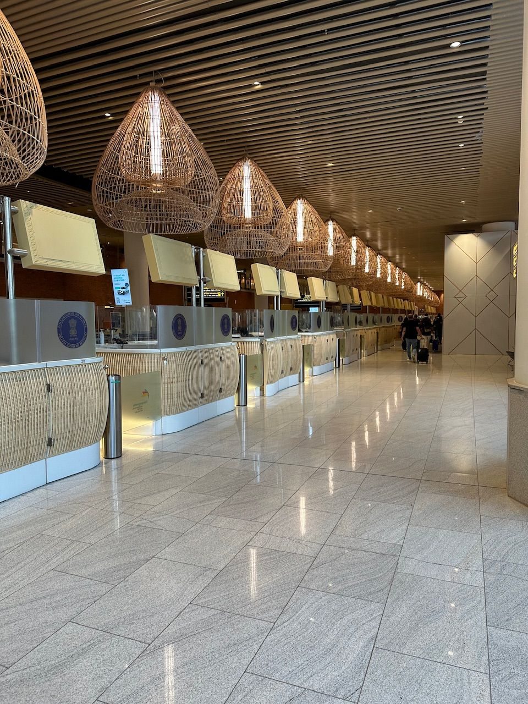

+++
author = "Sathyajith Bhat"
categories = ["Life"]
tags = ["weekly-notes", "gaming", "travel"]
places = ["Sydney", "Mangalore"]
type = "post"
series = ["Weekly notes"]
url = "/weekly-notes-45-2024/"
title = "Weekly notes 45/2024"
date = 2024-11-10T12:00:00Z
summary = "Week 45 summary - homebound."
images = ["/weekly-notes-45-2024/thumb-bangalore-t2.jpg"]

+++

_Thumbnail image: The new (well, not so new) designed Terminal 2 at Kempegowda International Airport has interesting decor._ 

### What's been happening

We started our week with potentially my final concert of the year. Jo has another K-POP artist concert at a later date. We went to see John Butler perform at the City Recital hall. I came across John Butler with his incredibly awesome song Ocean that I have referenced under my prior [Music of the week](/weekly-notes-35-2024/) and to catch him live is not something I would have wanted to miss. John Performed his latest instrumental album, [Still Searching](https://open.spotify.com/album/4rGSui8BAT9L627KTqlZ6t?si=yMtD3lqQTte3MWSXDLIJvA) plus a few other songs including Ocean. To see an amazing guitar player such as John was quite incredible and to have two percussionists join the stage and perform with him was even better. This was one of the most amazing recitals that I have been to yet and would highly recommend checking out his show if you ever get to see him live.

  

  

  

  

  

It's also time for our [vacation](/weekly-notes-44-2024/) - Jo and I are flying to Mangalore this Saturday via Bangalore. We'll be in Mangalore for couple of weeks. Looking forward to the break! We flew to Mangalore from Sydney via Bangalore. The onward flight from Sydney to Bangalore was pretty uneventful. We had paid extra for the exit row seats and that made the travel a little bit comfortable. We had a cabin crew member sitting right infront of us and had some interesting conversations with him. He was also curious to know whether we had paid extra for the exit row seats - apparently another traveller was arguing with him on why she couldn't get the exit row seat. I mean, like come on, seat selection is something that you do when you book your ticket, or even later on. Anyway.

We had about 5 hours of layover in Bangalore and we spent the time at the VIP section of the 080 Lounge. It was expensive but pretty worth it - the VIP section was cordoned off and empty and had plenty of empty space and more importantly, very quiet and good service.The food at the lounge was pretty good - given we were in the VIP section, we also had table service and an a la carte menu. I ordered a mysore masala dosa and filter coffee for myself which Jo ordered a plain dosa and a Kerala Pepper Chicken. As we were having our food, Flighty kept announcing the various delays my incoming flight to Mangalore was running into, so we decided to stay in the lounge for a bit longer till the aircraft finally landed in Bangalore (a 40 minute delay in the end). The flight to Mangalore was straightforward and once landed, we picked our bangs and went to meet my parents who had come to pick us up at the airport.

Come Sunday, mom made Mangalore Buns (known as just buns in Mangalore fwiw) for breakfast which was rapidly devoured down. Mom had also made a fresh batch of banana chips that I had with tea mid day. We'll have some family visits later today and this week, and I will do a beach run as well. Look for my next weekly note!

### Music of the Week

[Colors](https://www.youtube.com/watch?v=0G383538qzQ) is a fantastic song by American psychedelic soul band [Black Pumas](https://open.spotify.com/artist/6eU0jV2eEZ8XTM7EmlguK6?si=_IRJ6qB-RRa6UzxcGqKxDA). The song's got everything - fantastic voice, great backing vocals, some killer riffs and a keyboard solo to finish it off. Great track if you like soul!

  

### Link of the week

Have you ever wondered why electric trains (for example the metro/subway ones) make funny noises, or a crescendo of notes while starting? This fantastic video dives into how electric trains work and why they make interesting sounds. 

  

### Subscribe to my posts

Till next week. If you enjoyed reading this post, please consider sharing it via the links below and subscribing to the blog. You can subscribe via email using [Substack](https://sathyabhat.substack.com/). If you prefer RSS/news readers, you can [click here](https://sathyabh.at/index.xml) for the feed link. If you prefer to follow only my weekly notes, here's [the RSS feed](https://sathyabh.at/series/weekly-notes/index.xml) for the Weekly Notes series. 
