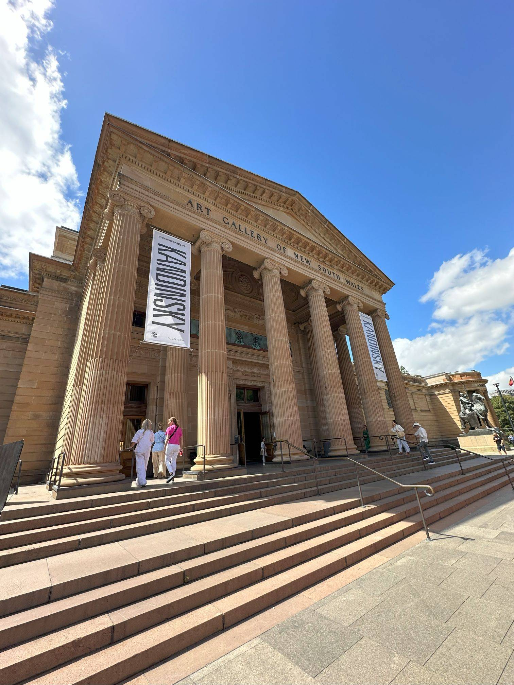

+++
author = "Sathyajith Bhat"
categories = ["Life"]
tags = ["weekly-notes", "reInvent"]
places = "Sydney"
type = "post"
series = ["Weekly notes"]
url = "/2023/11/19/weekly-notes-46-2023/"
title = "Weekly notes 46/2023"
date = 2023-11-19T12:00:00Z
summary = "Week 46 summary - a museum visit and a shot in the arm!"
images = ["/2023/11/19/weekly-notes-46-2023/thumb-art-gallery.jpg"]
+++

_Thumbnail image: [The Art Gallery of NSW](https://www.artgallery.nsw.gov.au/)._ 

### What's been happening

* Jo has been bitten by the Lightroom bug. She's been taking a lot of photos and editing them in Lightroom, totally transforming the images. I remembered that Adobe Portfolio can set up amazing gallery websites powered by Lightroom Albums (here's [mine](https://pics.sathyabh.at/)) and thus we bought [joshenoy.me](https://joshenoy.me) and set up Adobe Portfolio. Check out [her site](https://joshenoy.me)!
* I did a thing! Well most of the hardwork was done by AWS. Earlier this week, AWS [launched](https://aws.amazon.com/blogs/aws/build-ai-apps-with-partyrock-and-amazon-bedrock/) PartyRock, an Amazon Bedrock Playground. PartyRock is a shareable generative AI app building playground that's pretty cool to play around, and for a limited time, has a free trial. I experimented with music and built Sathya's Song-O-Matic for music discovery. Enter an artist or song title to find related artists and songs. Play with it over at [my PartyRock app](https://partyrock.aws/u/sathyabhat/mojOlyjru/Sathya's-Song-O-Matic/snapshot/Rtkh5Hhbi).
* Jo was keen on attending a [Wassily Kandinsky](https://www.theartstory.org/artist/kandinsky-wassily/) exhibit and thus we went over to [the Art Gallery of NSW](https://www.artgallery.nsw.gov.au/whats-on/exhibitions/kandinsky/), spending our Saturday morning there. 





* After the Kandinsky exhibit, the entry to the [Royal Botanic Garden](https://www.botanicgardens.org.au/) was just opposite the Art Gallery so we walked over there and spent a couple of hours. It was quite nice, though we had a fair number of [bin chickens](https://www.theguardian.com/cities/gallery/2018/apr/09/bin-chickens-grotesque-glory-urban-ibis-in-pictures) and [Silver Gulls](https://australian.museum/learn/animals/birds/silver-gull/) cackling at us. 





* I fly out to Las Vegas for AWS re:Invent next week. I wanted to get my Covid booster shot before I left (I got [get my first Covid](/2022/12/21/recovering-from-covid) at last year's re: Invent). I got my shot yesterday, and while I didn't feel any ill effects yesterday, today was a completely different story. My arm was sore, I had a 100-degree fever and a massive headache. For now, my fever has subsided and my arm is not that sore, but the headache remains. Hopefully, I will recover before Tuesday morning - because I have my third dry run [for my talk](https://www.linkedin.com/feed/update/urn:li:activity:7131054434247196674/) on Tuesday.

### Music of the Week

Martin Miller teams up with Mateus Asato for another killer performance. [Go check it out](https://www.youtube.com/watch?v=PYp0JE1qzms&list=PL777F6F97DC4ADD07&index=2).



### Link of the week

I think it's fair to say in between today's World Cup final between India & Australia, [Sam Altman, OpenAI's now-former-CEO ouster](https://www.theverge.com/2023/11/17/23966446/what-happened-to-sam-altman-open-ai) and potential [return](https://www.theverge.com/2023/11/18/23967199/breaking-openai-board-in-discussions-with-sam-altman-to-return-as-ceo), and the [successful race](https://www.formula1.com/en/latest/article.verstappen-says-charge-through-the-field-for-las-vegas-gp-win-was-a-lot-of.1YqadyJh8HnZwqrJPdIhnW.html) yet [painful](https://www.formula1.com/en/latest/article.fp1-first-practice-session-in-las-vegas-brought-to-early-end-amid-red-flags.2jBEl8KmbU9FowFZCXMV4p.html) and [rocky](https://www.formula1.com/en/latest/article.fp2-for-the-las-vegas-grand-prix-delayed.3TRumjKL6LssR9rUJUiwPq.html) start of the Vegas Grand Prix, pretty much everything has been overshadowed by these. 

### Subscribe to my posts

Till next week. If you enjoyed reading this post, please consider sharing it via the links below and subscribing to the blog. You can subscribe via email using [Substack](https://sathyabhat.substack.com/). If you prefer RSS/news readers, you can [click here](https://sathyabh.at/index.xml) for the feed link. If you prefer to follow only my weekly notes, here's [the RSS feed](https://sathyabh.at/series/weekly-notes/index.xml) for the Weekly Notes series. 