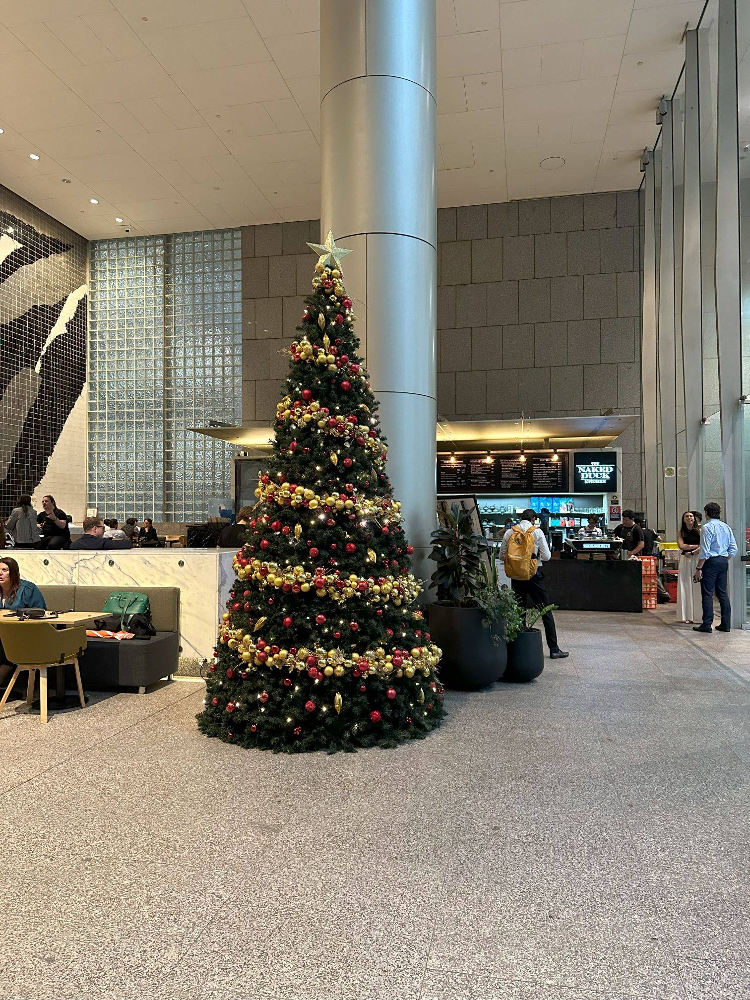

+++
author = "Sathyajith Bhat"
categories = ["Life"]
tags = ["weekly-notes", "Sydney", "gaming", "Diablo IV"]
type = "post"
series = ["Weekly notes"]
url = "/2023/11/24/weekly-notes-47-2023/"
title = "Weekly notes 47/2023"
date = 2023-11-24T12:00:00Z
summary = "Week 47 summary - Vegas, baby! (yes, I always wanted to say that)"
images = ["/2023/11/24/weekly-notes-47-2023/thumb-christmas-tree.jpg"]

+++

_Thumbnail image: December is here and I see Christmas tree installations all over Sydney. Here's one from my office building._ 

### What's been happening

* An early newsletter this week! I'll be flying to Las Vegas for AWS re:Invent and won't be able to get this one out after tomorrow, so wanted to publish this week's post. Looking forward to meeting a lot of folks! Also excited about [my talk: NET327 Improve web application performance using AWS Global Accelerator](https://hub.reinvent.awsevents.com/attendee-portal/catalog/?search=NET327) on Nov. 28.
* Summer's coming soon, and we're preparing for it. So much so that we bought another [Vornado 660](/2023/01/21/weekly-notes-03-2023/) for the Living Room. We'd already been impressed with it, and with Jo now working remotely from her desk in the living room, buying another was a no-brainer, especially since it has been much more effective (both cost as well as temperature-wise) than running ducted air conditioning. 
    <iframe title="Pixelfed Post Embed" src="https://pxl.mx/p/sathyabhat/629559058223636112/embed?caption=true&likes=false&layout=full" class="pixelfed__embed" style="max-width: 100%; border: 0" width="400" allowfullscreen="allowfullscreen"></iframe>

* I also picked up a [Belkin MagSafe 3-in-1 Wireless Charging Stand](https://www.belkin.com/au/3-in-1-wireless-charger-with-official-magsafe-charging-15w/P-WIZ017.html) for my desk. I thought of going for a generic no-brand solution but they coming nearly to the same price as the Belkin ones (at least the two-in-ones anyway) but some more research indicated that determining whether or not they would do fast charging is another headache. I would rather pay some extra and get a solution that will last longer and provide fast charging, so picked up this one.
* Media watch: I completed watching some of the reality shows that I had started watching:
    * [The Amazing Race Australia Season 7: Celebrity Edition](https://trakt.tv/shows/the-amazing-race-australia/seasons/7) - this one was quite surprising. A lot of good competitive teams and great racing around, with some episodes having extremely close calls. The ending kinda ruined it for me (I won't spoil it), but still worth a watch.
    * [The Amazing Race Season 34](https://trakt.tv/shows/the-amazing-race-2001/seasons/34) - I didn't like a lot of changes the season had brought in due to COVID restrictions (specifically, the starting together bit) and most of the teams were quite boring.
    * [Gordon, Gino and Fred: Road Trip](https://trakt.tv/shows/gordon-gino-and-fred-s-road-trip) - I can't remember who recommended this but has been a pretty good watch. Think Grand Tour, but instead of Clarkson/Hammond/May you have Gordon/Gino/Fred. Binge-watching the entire four-season series might be too tiring, so I would recommend watching maybe one or two seasons at a time. 
* Gaming watch: I'm close to finally being level 100 with my Druid in Diablo IV (only 9 more levels to go). I probably should get back to Baldur's Gate 3, that said I might start another character in Diablo IV, given that there's still some time for the season to end. 



### Music of the Week

I'm not a big fan of Metal, but Helloween is an exception. One of the most influential power metal bands, I enjoy their ballads, and the sweeping riffs. I came across this [amazing rendition of Forever and One](https://www.youtube.com/watch?v=43OKd48UXIg) with both Andi Deris & Michael Kiske singing the song. 



### Link of the week

I came across this series of posts about the development of GTA Vice City. I love the GTA Series (see my previous post on this), and I enjoyed reading the posts. Sadly, the posts were taken down due to his ex-colleagues not liking him spilling the beans. Luckily for us, the Internet Archive still [has the posts](https://web.archive.org/web/20231122005820/https://insiderockstarnorth.blogspot.com/). Go read while it lasts, or save a copy, maybe. 

### Subscribe to my posts

Till next week. If you enjoyed reading this post, please consider sharing it via the links below and subscribing to the blog. You can subscribe via email using [Substack](https://sathyabhat.substack.com/). If you prefer RSS/news readers, you can [click here](https://sathyabh.at/index.xml) for the feed link. If you prefer to follow only my weekly notes, here's [the RSS feed](https://sathyabh.at/series/weekly-notes/index.xml) for the Weekly Notes series. 