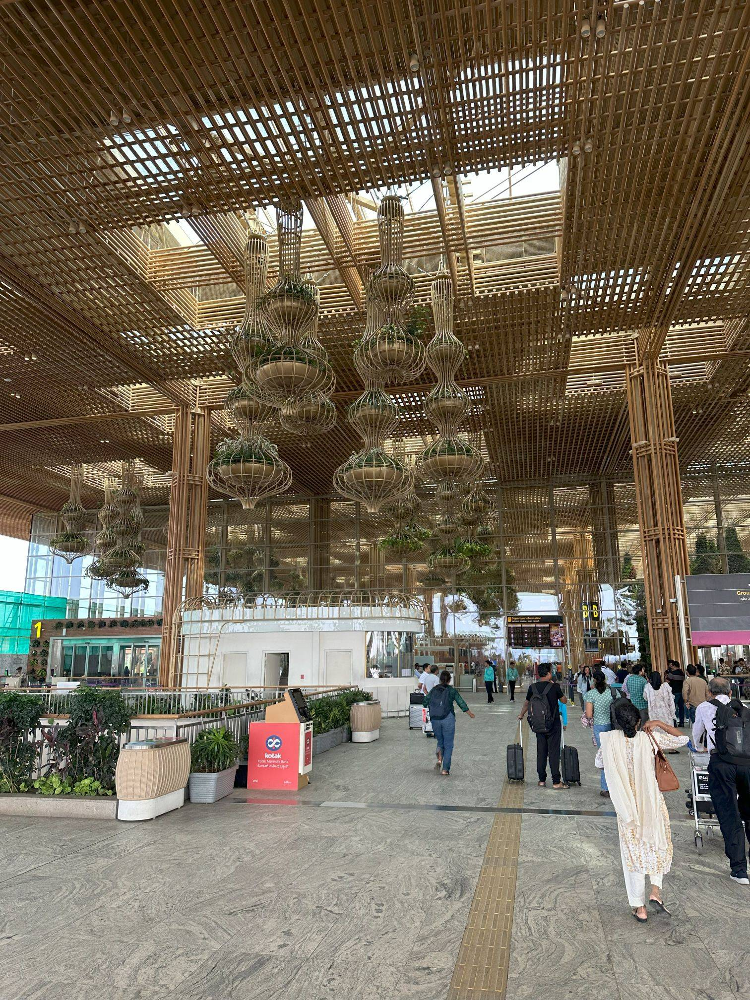

+++
author = "Sathyajith Bhat"
categories = ["Life"]
tags = ["weekly-notes", "gaming"]
places = "Mangalore"
type = "post"
series = ["Weekly notes"]
url = "/weekly-notes-47-2024/"
title = "Weekly notes 47/2024"
date = 2024-11-23T12:00:00Z
summary = "Week 47 summary - back to Sydney."
images = ["/weekly-notes-47-2024/thumb-terminal-2-kial-241125.jpg"]
+++

_Thumbnail image: Terminal 2 of Kempegowda International Airport, Bangalore._ 

### What's been happening

Alas, before I even realized I was on vacation, it has come to an end.

The past week went by pretty fast. We started the week with a trip to Puttur for the _Phool Muddi_/_Sangeet_. Jo's uncle and aunt had booked a _Tempo Traveller_ to transport many of us, but I was less inclined to sit in it. Thankfully, we were told the Tempo Traveller was overbooked and asked if we could drive to Puttur with Jo's sister and her husband. I was happy with this arrangement, and thus started driving towards Puttur after picking them up. The road to Puttur was pretty smooth except for about a 10km segment at Kalladka where the road was non-existent and took a really long time to cover the distance. To make matters worse, it got really dark and started raining very heavily. The downpour was so severe that I had to slow down to 30 Kph as I could barely see the road ahead. After about 30 mins and just as we were getting close to the hall, the rains stopped and we were able to get down and head to the wedding hall without getting drenched.

The rest of the evening went pretty smoothly, and we finished the _Phool Muddi_ and _Sangeet_ on time. Despite the rains, the next day was pretty manageable (it usually gets pretty muggy in Mangalore on the day after rains) and the wedding went pretty well too. We had stayed overnight at a hotel nearby, and I hit my foot against the edge of the board and got a cut. Thankfully, the cut wasn't deep - I washed it and Jo went over and got a first aid kit, further cleaning and applying bandage on it to heal. The wedding was over by 4pm, and we had to rush to vacate the rooms and head back to Mangalore. Once we were back in Mangalore, we went over to the groom's house to await the bride and groom's arrival. Once they arrived, we welcomed and congratulated them, and I headed home.



Over the week, we went to my sister's house for dinner (she made _Kori Rotti_ for us and ordered some fish from outside) and to the _Satyanarayana Pooja_ and the wedding reception. We went to the Surathkal Beach and Mukka Beach on different days and spent the evening watching sunset there. These beaches were quite empty (given that it's about half hour from Mangalore City) and thus we were able to enjoy the peace.

  

  

  

  

  

  

  

  

  

  

No trip to home is complete without trying out some local delicacies and suffice to say we had plenty of them. Jo wanted to have some _cabbage ambado_ from [The Balli Shop](https://maps.app.goo.gl/YMy5f2RmfShgD4QB8) before we left Mangalore. It's available for a limited time, so we had to make two visits before we could get our hands on it.

  

  

While at home, I'd been meaning to get a new set of contact lenses but the ones that I want (Bausch & Lomb Soflens 59) in the power that I need is usually available only on pre order and we'd spent almost the entire trip not visiting an optician so I wasn't confident I could purchase it. Separately, Jo broke her glasses and we knew visiting a big-name optical shop would probably decline to fix it, so we found a small business owner near her house and asked him if he could fix it. He was reluctant at first, especially given our timelines (we visited the shop on Friday evening and asked him if it could be ready by Saturday morning) but when I asked about my contact lens availability, he said he'd try to keep it ready and said would fix the glasses as well. Nothing like some extra business to make a tiny work complete, I guess heh. In the end, we picked up my lenses as well as Jo's fixed glasses.

With the wedding functions done and two weeks in Mangalore completed, it was time to return to Sydney.

  

As much as I wanted to stay in Bangalore and meet folks, that was not happening this trip. To cover the case where our Mangalore - Bangalore flight might be delayed, we decided to head to Bangalore one evening before our Sydney flight and stay overnight at the Taj Airport hotel. My flight to Sydney wasn't till evening and asked a few folks if they could come to meet - and, they did. 
I'm really stoked that Sharath, Fossil(+C), Saurabh, Karthik, Sharath, Bibhas (and A+M) and Ashwin made the long trek to the Taj hotel and meet us for breakfast.

  

A final note: the service and the hospitality at the Taj Airport was really amazing. I have forgotten how much Indian star hotels pamper you with amazing service and hospitality as compared to those outside, esp in US. I've been to several top tier hotels (well, per their brand value anyway) and none of them offer a service even close to what we get in the Indian counterparts. Anyway, this week's note is delayed because I couldn't finish writing it at the lounge and decided to complete it once I am back in Sydney. Well, back to regularly scheduled programming.

  

  

  

  

### What I've been playing 

I'm a big fan of builders/simulation games and just a few days before flying to Mangalore, Transport Fever 2 went on sale on Steam. Having noticed it's certified for Steam Deck, I decided to purchase it and installed it on the Steam Deck. I've been playing it on the Steam Deck for about 8+ hours and have been enjoying it more than I thought I would. 

[Transport Fever 2](https://store.steampowered.com/app/1066780/Transport_Fever_2/) is a sandbox transport simulator game - where you build railroads/roads and build your transport company & fleet consisting of trains, lorries, ships, airplanes and connect industries and towns and watch them grow. You typically start by connecting two industries, or even two cities, or perhaps an inter-city passenger service and then soon enough start expanding to a massively interconnected logistics system. For example, I have 60 trucks bringing in crude oil from three different oil wells into an oil refinery. A train then picks up the oil from a station attached to this refinery and transports this oil to another station attached to a fuel refinery. Another train then picks up the fuel and drops it off at a train station outside of the city which is then picked up by lorries and drops off the fuel in the industrial areas of the city. Building these long line of chained industry networks is pretty fun and rewarding, especially early on when you're strapped for cash. 

It's really pleasing to see two trains pass by each other at a passover point on a single track between two stations. If free play isn't your thing, the campaign missions are pretty decent too. The UI adapts for the Steam Deck pretty well and is pretty easy and intuitive. Finally, the game provides you with a first person view of your vehicle doing its routes and that is another thing that you can spend minutes, if not hours just watching it do its thing. If you're a transport sim nerd, I would highly recommend Transport Fever 2. 

### Music of the Week

Martin Miller Session Band & Mateus Asato are back with another killer cover, taking on [Bon Jovi's It's My Life](https://www.youtube.com/watch?v=-70XoLLLR-o).



### Link of the week

Grinding Gear Games, the makers of the popular Path of Exile ARPG recently published their plans and endgame content reveal for what's in store for the sequel, Path of Exile II and to say it looks brilliant is a huge understatement. I've been on the edge about Path of Exile 2, and this video puts me into the _will buy early access to try it out_ camp. If you have an hour to spend, check out the video detailing what's coming up in Early Access in _2 weeks_ time!

  

### Subscribe to my posts

Till next week. If you enjoyed reading this post, please consider sharing it via the links below and subscribing to the blog. You can subscribe via email using [Substack](https://sathyabhat.substack.com/). If you prefer RSS/news readers, you can [click here](https://sathyabh.at/index.xml) for the feed link. If you prefer to follow only my weekly notes, here's [the RSS feed](https://sathyabh.at/series/weekly-notes/index.xml) for the Weekly Notes series. 
