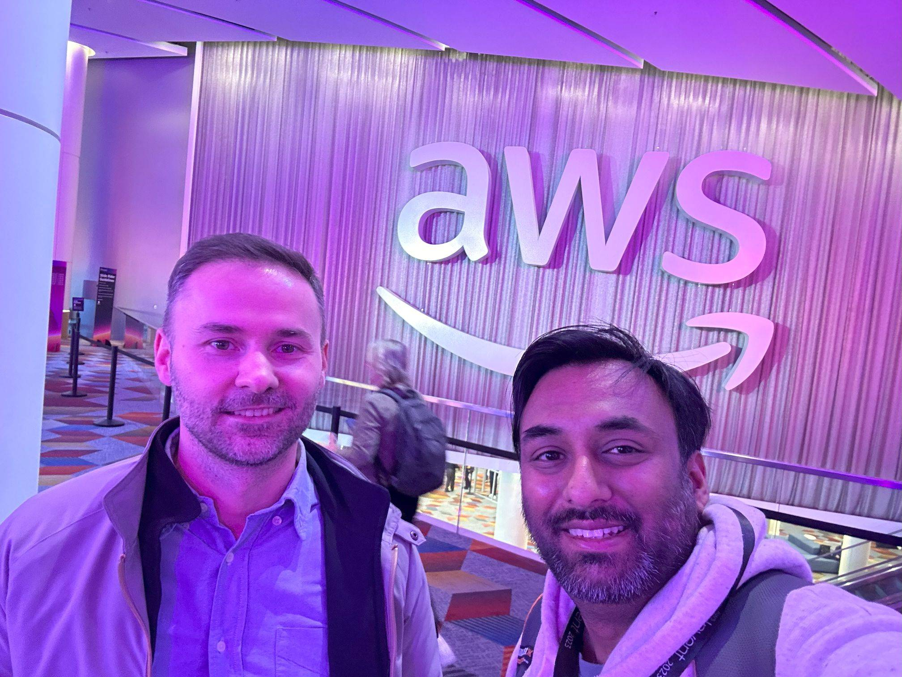

+++
author = "Sathyajith Bhat"
categories = ["Life"]
tags = ["weekly-notes", "cpgweds", "reinvent"]
places = ["Las Vegas"]
type = "post"
series = ["Weekly notes"]
url = "/2023/12/04/weekly-notes-48-2023/"
title = "Weekly notes 48/2023"
date = 2023-12-04T12:00:00Z
summary = "Week 48 summary - a milestone week."
images = ["/2023/12/04/weekly-notes-48-2023/thumb-reinvent.jpg"]
+++

_Thumbnail image: At AWS re:Invent with Cosmin, my former team mate._ 

### What's been happening

Well, writing this post just a few hours after landing in Sydney. As mentioned in [last week's note](/2023/11/24/weekly-notes-47-2023/), I spent all of last week in Las Vegas, attending AWS re:Invent, so most of the post will talk about my Las Vegas experiences. I'll post about the technical aspects of my AWS re:Invent experience on my [tech blog](https://sathyasays.com/) if that interests you, so keep an eye out for that.
* Let's talk about the flights: Long-haul flights are never fun, but for a change, my flights weren't too bad. I flew on United and the flight path to Las Vegas was via a layover in SFO. While selecting seats for both the onward as well as the return flights, I noticed that the middle row seats from row 30 onwards were quite empty, so I picked a seat on the later rows, hoping I wasn't selecting the seat too early. Well, it turns out my wish came true, my onward flight had a person on the far end aisle seat of my row, while my return flight had an empty row. I was able to stretch my legs (and on return, sleep on the row). To more such flights 😆
* I stayed at The Venetian Resort (AWS pays for the flights and the hotel, as a Hero perk). Having a room at the Venetian makes navigating re:Invent that much easier, as most of the other venues where the sessions take place are accessible either by long walks or by shuttle. Since most Heroes are also accommodated in the Venetian, it is quite common to run into fellow Heroes as you either walk to/from your rooms or attend the various networking events. It's not uncommon to get lost in the Venetian as well as the other resorts - it is truly difficult to describe the vastness of the resorts in writing - I racked up well over 11,000 steps and over 8kms of walking daily by *just* walking through the corridors of the Venetian and I'd argue that I didn't even explore re:Invent that much.






* One of the highlights of this year's re:Invent was being invited to talk about how we at [The Trade Desk](http://thetradedesk.com/) use the [AWS Global Accelerator](https://aws.amazon.com/global-accelerator/) for a breakout session. The invite came in pretty late, and I had to prepare a rough draft of the slides, narration, and outline of my portion of the talk in under a week since the deadline for major edits to the slides would fall when I was out for my two-week [vacation](/2023/10/15/weekly-notes-41-2023/) to India. I like my talks to be a bit more freeform and had to adapt my talk style to a bit more scripted approach. That said, despite the talk being on Networking - which admittedly isn't something that a lot of people focus on, seeing a 200+ seating capacity room full and more people trying to walk in blew my mind away. The talk recording is also up on [YouTube](https://www.youtube.com/watch?v=ecNDlRNWW3w&). 







* While in Las Vegas, I didn't do any excursions or road trips, but I did not miss a chance to check out the Sphere. Postcard from Earth is a short film that runs about 50 minutes, chronicling the history of planet Earth, and is an amazing experience at the Sphere. If you're in Las Vegas, I would highly recommend it, especially at the $50 price I got it for. 






* On milestones - it's hard to believe but Jo and I completed our 10th anniversary. I cannot believe 10 years have gone by so fast. It's been the best 10 years of my life, yet and cannot [imagine what my life would have been](/2013/12/24/on-to-a-new-life/) if not for her. She's been my constant source of support, encouragement, companionship, and belief. She encouraged me and stood beside me when I did some crazy radical things like ditching my very comfy database-insurance-related job to [move to Styletag](/2016/07/12/in-with-the-new-job/) and shift to DevOps when it was nearly unheard of in India. She didn't say anything when I spent 6+ months writing [Practical Docker with Python](https://sathyasays.com/2018/10/02/so-i-wrote-a-book-presenting-pratical-docker-with-python/) mostly on weekends, or when I decided to [move to Romania](/2020/01/08/salut-bucharest/), even though that meant she couldn't move with me, due to Romania's policies. Here's to many more years 😊
* Meta note: I used to add the city where I spent the week in, as a tag. Now I have moved it to a separate taxonomy called "[places](/places/)" which you can find on the footer of my blog. I'll update older posts and add the tag to more posts over the next few weeks.

### Music of the Week

Another Martin Miller week, this time with the [Ultimate 90s Medley](https://www.youtube.com/watch?v=M1CaJZO9FHA). I've got my Spotify wrapped too, but I'll save it for next week's post.



### Link of the week

I've been part of so many communities, and every one of them has seen a trend that is explained so clearly in this article about [The Evolution of expert communities](https://lcamtuf.substack.com/p/the-evolution-of-expert-communities). Whether it is a group, a forum, private IMs - all run through the same set of stages. 

### Subscribe to my posts

Till next week. If you enjoyed reading this post, please consider sharing it via the links below and subscribing to the blog. You can subscribe via email using [Substack](https://sathyabhat.substack.com/). If you prefer RSS/news readers, you can [click here](https://sathyabh.at/index.xml) for the feed link. If you prefer to follow only my weekly notes, here's [the RSS feed](https://sathyabh.at/series/weekly-notes/index.xml) for the Weekly Notes series. 