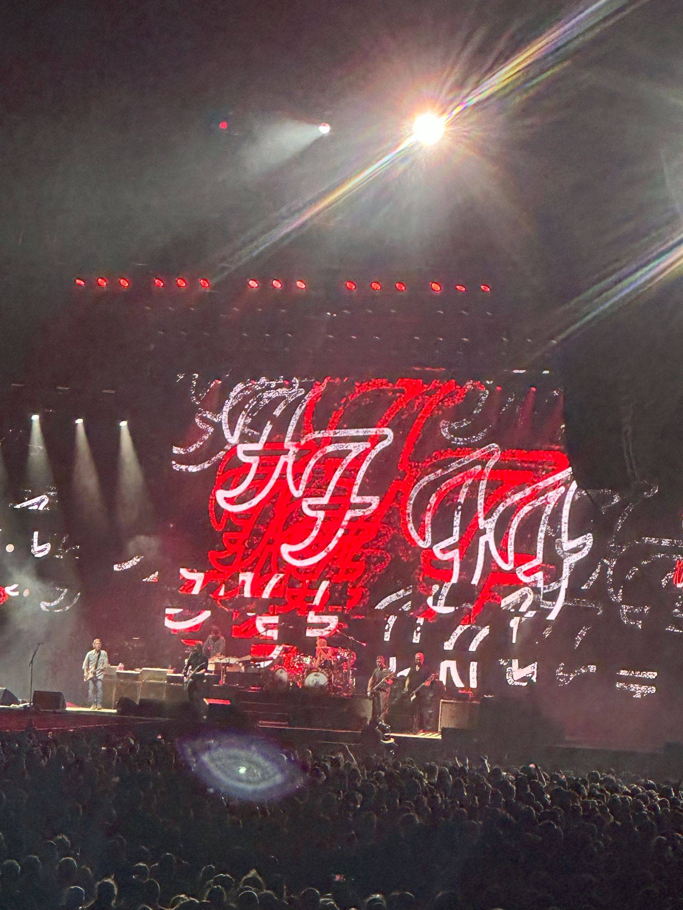

+++
author = "Sathyajith Bhat"
categories = ["Life"]
tags = ["weekly-notes", "concert", "Foo Fighters"]
places = "Sydney"
type = "post"
series = ["Weekly notes"]
url = "/2023/12/10/weekly-notes-49-2023/"
title = "Weekly notes 49/2023"
date = 2023-12-10T12:00:00Z
summary = "Week 49 summary - two concerts and a COVID scare."
images = ["/2023/12/10/weekly-notes-49-2023/thumb-foo-fighters.jpg"]
+++

_Thumbnail image: The Foo Fighters concert at the Accor Stadium, Sydney._ 

### What's been happening

I was most excited about this week. However it didn't start well

* Monday afternoon or so, I wasn't feeling too well. I had a bit of a fever, a bad headache, and a sore throat. The headache was bad enough that I stopped working and took a nap. I woke up a few hours later - the fever had subsided, but the sore throat remained. I was wondering if I had picked up Covid like last year. I had a light dinner and went to sleep.
    * The next day I woke up and I was feeling much better. We had a concert on Wednesday and Saturday and wanted to do a COVID test for myself, just to be sure. Thankfully the COVID test came negative.
* On Wednesday, we went to a concert by Kraftwerk. Kraftwerk is a German electronic band and is widely considered an innovator and pioneer of electronic music. Growing up as a kid, I had heard Kraftwerk's The Man Machine album quite a lot as Dad had the Man Machine cassette (remember those?) and had heard the songs quite a lot. When I found out they were coming to Sydney, I had to attend the show. In the end, the show was really good - they played most of their hits, including my favorites from The Man Machine, and a few more that I wasn't aware of. All in all, with fantastic lighting, and minimal set design - it was a memorable evening.







* This Saturday was the hottest day of the year with temperatures hitting 41 degrees. It was also one of the days I had been looking forward to for quite some time - Foo Fighters were performing at the Accor stadium. The heat made it difficult, but once the sun went away combined with a [southerly](https://en.wikipedia.org/wiki/Southerly_Buster) buster](https://en.wikipedia.org/wiki/Southerly_Buster), the temperature dropped down to the low 30s and made it tolerable as the evening went by. Foo Fighters were awesome. Arguably, the [Red Hot Chili Peppers concert](/2023/02/04/red-hot-chili-peppers-post-malone-sydney-2023) had the better sound setup, but the Foo Fighters had better crowd interaction and the crowd was a lot more responsive. Personally, for me, this has been the best live event that I've been to, yet. Here's the [setlist for the concert](https://www.setlist.fm/setlist/foo-fighters/2023/accor-stadium-sydney-australia-bae353a.html).






### Music of the Week

I mentioned last week I'll have my Spotify wrapper, so recorded it and put it up on [YouTube](https://youtu.be/pov0wf9R0R0?si=N6J8Tr5NTPHkjyBZ)!



### Link of the week

Ken Block died earlier in the year. Like many, I'd known of Ken Block via his [Gymkhana](https://www.youtube.com/playlist?list=PLhU72li4fhIfBIHMHSa5ZtjGCplUazKlu) series of videos which dazzled me with phenomenal car control. Hoonigan Media released the last project they were working on, just before this death. [Check out Electrikhana 2](https://www.youtube.com/watch?v=U4FAqwkn-pc).



### Subscribe to my posts

Till next week. If you enjoyed reading this post, please consider sharing it via the links below and subscribing to the blog. You can subscribe via email using [Substack](https://sathyabhat.substack.com/). If you prefer RSS/news readers, you can [click here](https://sathyabh.at/index.xml) for the feed link. If you prefer to follow only my weekly notes, here's [the RSS feed](https://sathyabh.at/series/weekly-notes/index.xml) for the Weekly Notes series. 
