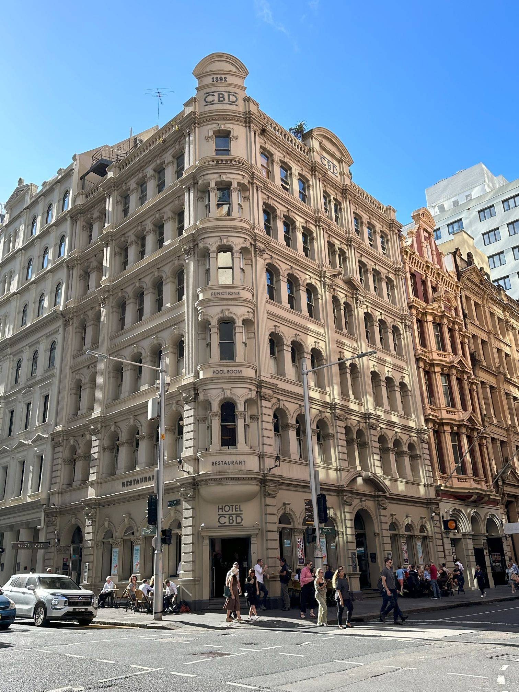

+++
author = "Sathyajith Bhat"
categories = ["Life"]
tags = ["weekly-notes", "gaming"]
places = "Sydney"
type = "post"
series = ["Weekly notes"]
url = "/2023/12/17/weekly-notes-50-2023/"
title = "Weekly notes 50/2023"
date = 2023-12-17T12:00:00Z
summary = "Week 50 summary - a museum visit and a new medium of music"
images = ["/2023/12/17/weekly-notes-50-2023/thumb-hotel-cbd.jpg"]
+++

_Thumbnail image: Merivale Hotel CBD - when we moved to Sydney, the Merivale Hotel CBD was one of the few venues that were open after we checked into our temporary accommodation. Sadly, the kitchen was closed when we reached there. We had to settle for a few bar snacks the bartender scrounged for us._ 

### What's been happening

* It's getting hotter as Summer gets closer. For the most part, the [Vornados](/2023/11/24/weekly-notes-47-2023/) have been coping well, especially in the larger rooms (ie, the living room and the master bedroom). However, in the office, due to the smaller place and that my gaming PC can run relatively hot, it's been getting uncomfortably warm. The aircon hasn't been effective, and I'm not sure if it is because the aircon isn't working or it's so hot. I'm inclined to believe the former and have written to my real estate agent to get it checked.
* When I first moved to Australia, the first question that everyone would ask was have you come across any huge spiders or other such insects? And till now, it's been the same - "No, we're in the city, so don't see any spiders or such". Last week, however, when Jo opened the closet she noticed a huge spider, pretty much the largest I've seen in my life. So that answer is going to change from now. It's not clear why the spider made it in after so long - my guess is the outside heat and pest control done on the building might have forced the spider to come in via the window. Needless to say, Jo has not agreed to open the window in the past week. 
* We went over to the Australian Museum today for a Ramses II exhibit - titled [Ramses II & The Gold of the Pharaohs](https://australian.museum/exhibition/ramses/). The exhibit focused on the life, and accomplishments of Ramses II, often regarded as the greatest and most celebrated pharaoh of Ancient Egypt. Overall the exhibit was decent - we spent a couple of hours there, looking at some of the artifacts, watching a hastened summary of the [Battle of Kadesh](https://en.wikipedia.org/wiki/Battle_of_Kadesh) and reading up about [Abu Simbel](https://www.worldhistory.org/Abu_Simbel/) - an ancient temple built during the reign of Ramses II, originally cut into a solid rock cliff and [then sliced into smaller](https://www.youtube.com/watch?v=D2qoZDdg6ho) pieces and relocated to make way for a dam. Here's a [longer video about this](https://www.youtube.com/watch?v=l4O4pCRm2xY) if you're interested.

    
    
    Some pictures from the exhibit: 

    
    
    
    
    
    
    
    
    

* I bought the second-generation AirPods Pro for myself, engraved with my Memoji. I still have [my Sony WH-1000 XM4](/2023/06/19/weekly-notes-24-2023/) for my desktop & travels, I'll be using the AirPods Pro for my walk to the office, as well as my office calls - with the current heat and summer temperatures, there's no way for me to continue using the XM4 for my commute to the office.

    

    

* Another purchase - I bought a couple of records. Why thought? For our Christmas gift at the office, I chose a record player (the Victrola Eastwood). While the record player will not be arriving any time soon, I wanted to have a record ready, and remembered there's a record store nearby, so went over there. The staff was quite helpful in explaining the mechanisms of record players, how to handle records and other such questions. So what records did I get? While it was tempting to get the record of [the best song ever](https://twitter.com/SathyaBhat/status/1736212625917432044/photo/1), I bought the records of Pink Floyd's The Dark Side of Moon and The London Chuck Berry Sessions. 

    

### Music of the Week

### Link of the week

### Subscribe to my posts

Till next week. If you enjoyed reading this post, please consider sharing it via the links below and subscribing to the blog. You can subscribe via email using [Substack](https://sathyabhat.substack.com/). If you prefer RSS/news readers, you can [click here](https://sathyabh.at/index.xml) for the feed link. If you prefer to follow only my weekly notes, here's [the RSS feed](https://sathyabh.at/series/weekly-notes/index.xml) for the Weekly Notes series. 