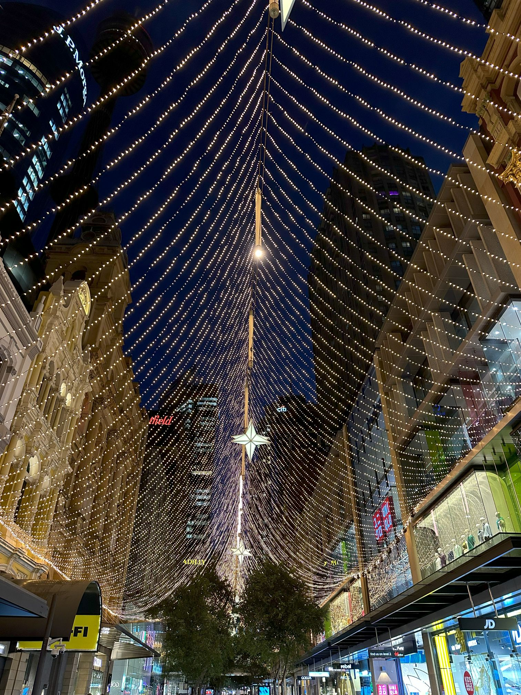

+++
author = "Sathyajith Bhat"
categories = ["Life"]
tags = ["weekly-notes", "gaming"]
places = "Sydney"
type = "post"
series = ["Weekly notes"]
url = "/2023/12/24/weekly-notes-51-2023/"
title = "Weekly notes 51/2023"
date = 2023-12-24T12:00:00Z
summary = "Week 51 summary - the lul week."
images = ["/2023/12/24/weekly-notes-51-2023/thumb-pitt-street-mall.jpg"]
+++

_Thumbnail image: Christmas lighting at [Pitt Street Mall](https://www.sydney.com/destinations/sydney/sydney-city/city-centre/attractions/pitt-street-mall)._ 

We're coming in on the year-end. Unfortunately, at the Trade Desk, we don't have a winter shutdown, like what we had at Adobe. Regardless, with many people on leave, hopefully, it'll be a quiet week.

### What's been happening

* Jo will be off for the week, but I will be working (and on-call). Thankfully, our on-call schedule is for work hours only.
* We've been going on walks for the past few days now (weather permitting). Yesterday, we did [South Head Trail](https://www.nationalparks.nsw.gov.au/things-to-do/walking-tracks/south-head-heritage-trail) - a small 1km loop trail. We took the ferry from Circular Quay to Watsons Bay, and from there went walking. Overall, it was a nice walk and the pleasant weather made it easier to do.

    

    * We also went over to the Christmas Market at Martin Place. There were a bunch of stalls for different things (food, clothing etc). We had some nice food, walked around for a bit, and came back.

    
    
    

* I've been building my Ball Lightning Sorcerer and I think I'm close to finishing it, a lot faster than I thought I would. I face-rolled Ashava solo in World Tier 4 in less than 2 minutes 😂.

    

    * I'll probably head back to Baldur's Gate 3 and progress further there. Meanwhile, I also picked up [Dorfromantik](https://store.steampowered.com/app/1455840/Dorfromantik/), [Unrailed](https://store.steampowered.com/app/1016920/Unrailed/), and might pick up another game or two (contemplating [Dave the Diver](https://store.steampowered.com/app/1868140/DAVE_THE_DIVER/) or [Anno 1800](https://store.steampowered.com/app/916440/Anno_1800/)).

### Music of the Week

While not the usual music, Tom BetGeorge does some amazing light shows during various festivals.  Check out the [2023 Christmas Light show](https://www.youtube.com/watch?v=Gq65KaxVrGk) and this time, it includes a little bit of synchronization with fireworks! 



### Link of the week

I am building a certificate validation system at work, and while I was doing my research, I came across this [article](https://blog.bityard.net/articles/2023/December/filling-in-the-gaps-httpstls-certificates) about TLS certificates. I think it's a great read for people who want to understand more about how certificates work.

### Subscribe to my posts

Till next week. If you enjoyed reading this post, please consider sharing it via the links below and subscribing to the blog. You can subscribe via email using [Substack](https://sathyabhat.substack.com/). If you prefer RSS/news readers, you can [click here](https://sathyabh.at/index.xml) for the feed link. If you prefer to follow only my weekly notes, here's [the RSS feed](https://sathyabh.at/series/weekly-notes/index.xml) for the Weekly Notes series. 