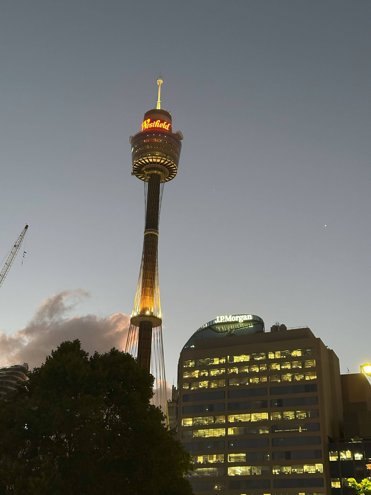

+++
author = "Sathyajith Bhat"
categories = ["Life"]
tags = ["weekly-notes", "gaming"]
places = "Sydney"
type = "post"
series = ["Weekly notes"]
url = "/weekly-notes-51-2024/"
title = "Weekly notes 51/2024"
date = 2024-12-20T12:00:00Z
summary = "Week 51 summary - parting thoughts for the year."
images = ["/weekly-notes-51-2024/thumb-westfield-tower.jpg"]
+++

_Thumbnail image: Sydney Tower, also known as Westfield Tower, is an observation and telecommunications tower that is the tallest structure in Sydney._

### What's been happening

It's been a slow week. Almost everyone at work has almost checked out, waiting for the holidays - same for me! I'm looking forward to our trip to New Zealand. I wrapped up my gym training for the year this week, going three times this week and achieving several personal bests on my training! It's only been a few weeks (Swarm says I have an 8-week streak at the gym), but I can feel a huge improvement in my fitness levels, and for the next year, I hope to be better.

I've been playing a lot more Path of Exile 2. I still think there are lots of rough edges and many things Grinding Gear Games can do to improve an already impressive game. My main problem comes from the difficulty spikes - as there's no level scaling (i.e., the monsters are set to specific levels and do not get stronger as you level up), there are lots of cases where you can enter an area and find yourself at a massive disadvantage if you're not at the level the game expects you to be, or massively overkill due to having gone beyond the expected level. The game also doesn't corral you into specific areas since you get dropped in a big act and you can go wherever the map has visibility of - and as a result, you get these huge difficulty spikes. Not to mention many of the bosses glitched out, dealing excessive damage or making the fight a cakewalk. It'll be interesting to see how Grinding Gear Games will handle this.

Before we left Sydney, Jo wanted to head over to St Mary's Cathedral to take some photos of the Cathedral and the Christmas tree. The Cathedral also hosts light projections retelling Charles Dickens' A Christmas Carol. The Cathedral was quite crowded, but we managed to weave in, watch a playthrough of the story, and then move back to grab some photos of the Christmas tree at the Cathedral.









### What I ate

[Toppi, Martin Place, Sydney CBD](https://maps.app.goo.gl/WiXR7iwxgguuWvuy9): We went to this Italian restaurant because I was quite _hangry_ and this was the closest that was enroute to St Mary's Cathedral that was open. We ordered Arancini to share and Blue Swimmer Crab for myself while Jo had the Lamb ravioli. The food was really good, enjoyed the pasta but the service was a bit lacking. I did notice they were severely understaffed, so hopefully they'll sort it out soon.









### Music of the Week

Couple of weeks ago, we got an email that the concert "As We Speak" featuring Béla Fleck, Zakir Hussain, Edgar Meyer and Rakesh Chaurasia scheduled for January 2025 was cancelled. I wondered what happened, but figured it would have been some logistics issue. Last week, we found out that Zakir Hussain had been seriously unwell and passed away. RIP Ustad.

In honour, reposting NPR's Tiny Desk Concert from Shakti. No words can describe [how awesome this](https://www.youtube.com/watch?v=Cx8AaSvH4EQ) is.



### Link of the week

I've been subscribed to [Pradyum's newsletter](https://pradfit.substack.com/) for a while now and his recent post that talks about best [theoretical option vs best doable option](https://pradfit.substack.com/p/theoretical-vs-doable-options-dealing) resonated well.

> For any area of health you want to work on: Training, Nutrition, Sleep, Daily Activity etc, there are tons of options you can choose from. Most of them are great theoretical options, but may not be practical given one’s schedules and lifestyles.
> The folks who succeeded with their health in 2024 were the ones who were shrugging off the best theoretical options in favour of the best doable options.

While the newsletter talks from a fitness point of view, I think it's worth applying to any field of life. Highly recommend reading the [full post](https://pradfit.substack.com/p/theoretical-vs-doable-options-dealing)!

I also wrote a post collecting the various Wrapped/year in review pictures from various services and published them [to a separate post](/wrap-up-of-wrap-ups-2024/), as I have done for [the previous years](/tags/year-in-review/).

My next two notes are likely to not published or will focus on my New Zealand trip. Here's wishing you a Merry Christmas and Happy New Year!

### Subscribe to my posts

Till next week. If you enjoyed reading this post, please consider sharing it via the links below and subscribing to the blog. You can subscribe via email using [Substack](https://sathyabhat.substack.com/). If you prefer RSS/news readers, you can [click here](https://sathyabh.at/index.xml) for the feed link. If you prefer to follow only my weekly notes, here's [the RSS feed](https://sathyabh.at/series/weekly-notes/index.xml) for the Weekly Notes series.
