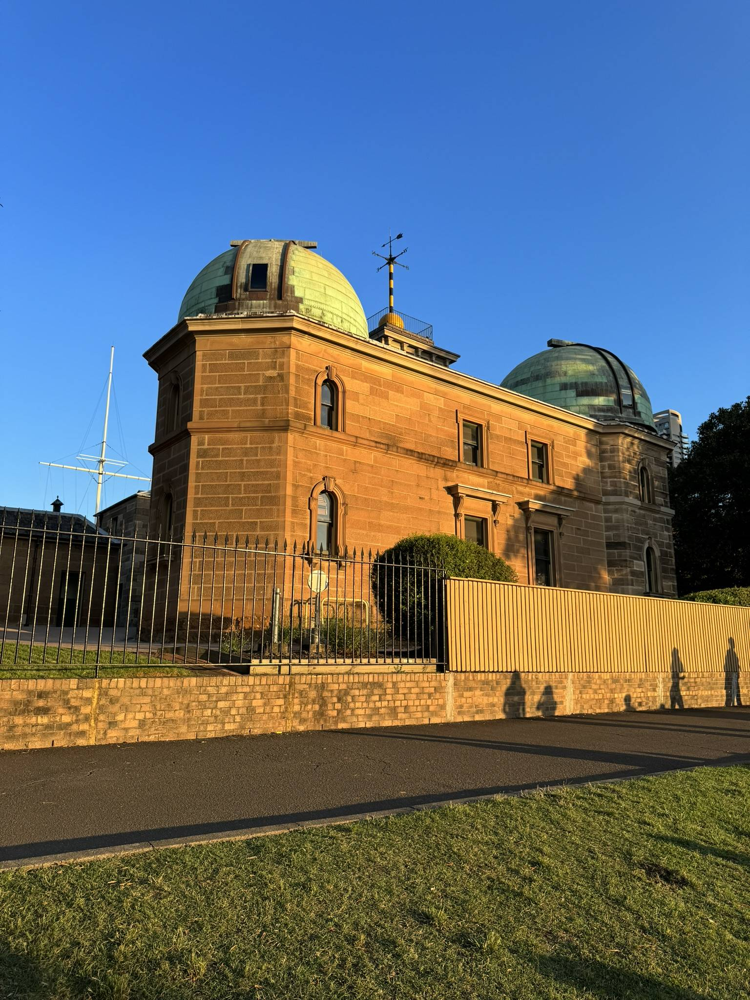

+++
author = "Sathyajith Bhat"
categories = ["Life"]
tags = ["weekly-notes", "gaming"]
places = "Sydney"
type = "post"
series = ["Weekly notes"]
url = "/2023/12/31/weekly-notes-52-2023/"
title = "Weekly notes 52/2023"
date = 2023-12-31T18:00:00Z
summary = "Week 52 summary - bringing in the new year."
images = ["/2023/12/31/weekly-notes-52-2023/thumb-sydney-observatory.jpg"]
+++

_Thumbnail image: The Sydney Observatory is a heritage-listed meteorological station and observatory located on Observatory Hill in the City of Sydney._ 

It's the last week of the year 2023. When I started writing my weekly notes back in [January](/2023/01/21/weekly-notes-03-2023/), I wanted to make a habit of writing them, but didn't think I'd write 49 editions of the weekly notes. Here we are now. In many ways, the weekly notes have been a good way to reminisce about what Jo and I did the past week, and these notes made it easy to compile my look back at the [2023 post](/a-look-back-at-2023/). Most of us do a lot of what seems to be insignificant things, I have found writing about them makes you realize they aren't that insignificant and add up quite a bit. Here's to more writing!

### What's been happening

* I enrolled in a sleep study to check for possible sleep apnea. The sleep study involved me sleeping overnight with a sleep-measuring device. The device collects a lot of data about respiratory rate, Oxygen levels, airflow levels etc overnight. The hardest part was setting up the device as there are a lot of electrodes to be attached and having to carry the device which is quite bulky as it is battery-backed. I won't know the results of the study till much later, but that sleep with the device was one of the worst quality sleeps that I've ever had, and I wonder how much that would skew the results. 

  

* We walked over to the Sydney Observatory to catch the sunset from one of the vantage points. It was pretty crowded but well worth the walk!

  

  

  

* I did end up buying Dave the Diver. It's been a nice game, plenty of laughs and gags. Not quite what I'd call cozy though - the aggressive fishes can be quite annoying especially since you can only target at a 60-degree arc on each side. The restaurant management seems to get a bit better to handle once you hire more people. I look forward to playing the game more.

  

  

  

  
    
* Finally, we welcomed the New Year's at home, having a couple of beers. Initially, we planned to head out to Darling Harbour to check out the 9 pm fireworks show but by 7 pm itself notices were being posted about the vantage points being at capacity, so we decided to remain at home and watch the fireworks show. 

### Music of the Week

What else but [Auld Lang Syne](https://en.wikipedia.org/wiki/Auld_Lang_Syne) to welcome the New Year?



### Link of the week

Shameless self-plug to my two blog posts recapping the past year:

* Collecting all the year-in-reviews and lookbacks from various services [for 2023](/2023/12/30/wrap-up-of-wrap-ups-2023)
* [A Look Back at 2023](/a-look-back-at-2023/)

### Subscribe to my posts

Till next week. If you enjoyed reading this post, please consider sharing it via the links below and subscribing to the blog. You can subscribe via email using [Substack](https://sathyabhat.substack.com/). If you prefer RSS/news readers, you can [click here](https://sathyabh.at/index.xml) for the feed link. If you prefer to follow only my weekly notes, here's [the RSS feed](https://sathyabh.at/series/weekly-notes/index.xml) for the Weekly Notes series. 